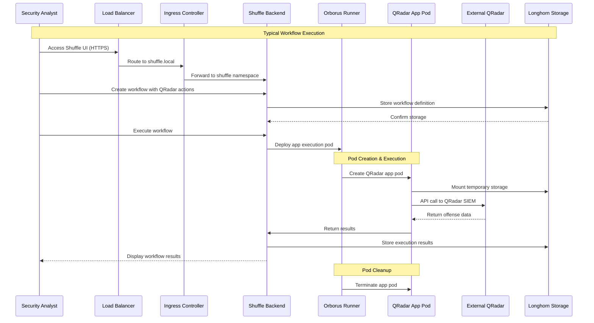
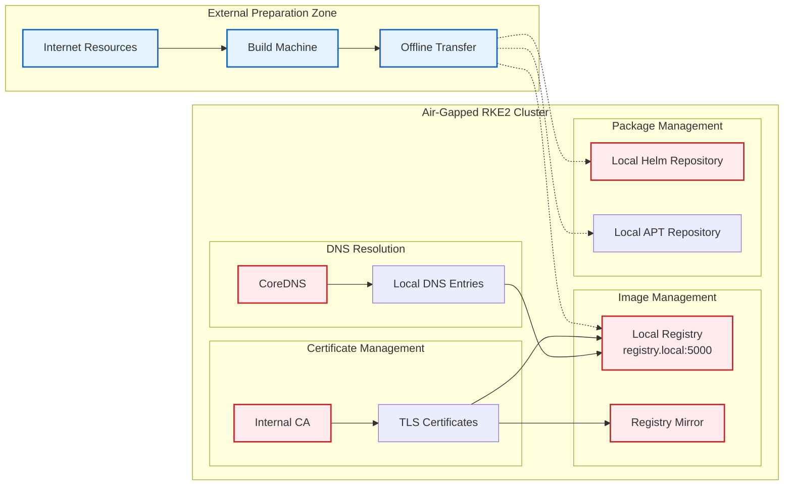

# Claude Code Projects Overview

## Repository Structure

The Claude folder contains multiple Kubernetes-based security and infrastructure projects designed for air-gapped deployments on RKE2 clusters.

### New Organized Structure
```
Claude/
├── CLAUDE.md                    # Project instructions
├── misp/                       # MISP Platform
│   ├── container-images-main-misp/  # Container images
│   └── misp-main/              # Production Helm chart
├── projekte/                   # Main projects directory
│   ├── k8s-deployments/       # Kubernetes deployments
│   │   ├── buildah-ci/        # CI/CD pipelines
│   │   ├── buildah/           # Buildah configurations
│   │   ├── ingress-nginx/     # Ingress controller
│   │   ├── longhorn/          # Storage solution
│   │   ├── misp-deployment-test/  # MISP test deployment
│   │   └── shuffle-deployment/    # Shuffle platform
│   └── shuffle-apps/          # SOAR applications
└── aws_s3_app.txt            # S3 application notes
```

### Project Categories

#### 🛡️ Security Platforms
- **[[MISP-Deployment]]** - Malware Information Sharing Platform for threat intelligence
- **[[Shuffle-Apps]]** - Security Orchestration and Automated Response workflows
- **[[Keycloak-IAM]]** - Identity and Access Management with OIDC/SAML

#### 🏗️ Infrastructure
- **[[Kubernetes-Deployments]]** - K8s resource definitions and deployment patterns
- **[[Buildah-CICD]]** - Container build pipelines for air-gapped environments
- **[[Longhorn-Storage]]** - Distributed storage solution for Kubernetes
- **[[Ingress-Nginx]]** - Load balancing and ingress management
- **[[Python-Package-Server]]** - Private PyPI mirror for offline Python packages

#### 📊 Observability
- **[[Monitoring-Stack]]** - Grafana, Loki, and Promtail for logs and visualization
- **[[Prometheus-Metrics]]** - Time-series metrics collection and alerting

## RKE2 Cluster Architecture

### Complete Platform Overview

```mermaid
graph TB
    subgraph "External Access Layer"
        LB[External Load Balancer]
        DNS[DNS Resolution]
        USERS[Security Analysts]
        API_CLIENTS[API Clients]
    end
    
    subgraph "RKE2 Kubernetes Cluster"
        subgraph "Control Plane Nodes"
            CP1[Control Plane 1<br/>etcd + kube-apiserver]
            CP2[Control Plane 2<br/>etcd + kube-apiserver]
            CP3[Control Plane 3<br/>etcd + kube-apiserver]
        end
        
        subgraph "Worker Nodes"
            W1[Worker Node 1<br/>containerd + kubelet]
            W2[Worker Node 2<br/>containerd + kubelet]
            W3[Worker Node 3<br/>containerd + kubelet]
        end
        
        subgraph "Ingress Layer - nginx-ingress namespace"
            NGINX_CTRL[Nginx Ingress Controller]
            NGINX_SVC[LoadBalancer Service]
        end
        
        subgraph "Security Platforms"
            subgraph "misp-prod namespace"
                MISP_PROD[MISP Production]
                MISP_DB[MariaDB]
                MISP_REDIS[Redis]
                MISP_PVC[Longhorn PVC]
            end
            
            subgraph "shuffle namespace"
                SHUFFLE_FE[Shuffle Frontend]
                SHUFFLE_BE[Shuffle Backend]
                SHUFFLE_ORBORUS[Orborus Runner]
                SHUFFLE_DB[OpenSearch]
                SHUFFLE_PVC[Longhorn PVC]
                
                subgraph "App Execution Pods"
                    HTTP_APP[HTTP App Pod]
                    QRADAR_APP[QRadar App Pod]
                    S3_APP[AWS S3 App Pod]
                    TEST_APP[Test App Pod]
                end
            end
        end
        
        subgraph "Infrastructure Services"
            subgraph "longhorn-system namespace"
                LH_MGR[Longhorn Manager]
                LH_ENGINE[Longhorn Engine]
                LH_UI[Longhorn UI]
                LH_CSI[CSI Driver]
            end
            
            subgraph "tekton-pipelines namespace"
                TEKTON_CTRL[Tekton Controller]
                TEKTON_WEBHOOK[Tekton Webhook]
                BUILD_PODS[Build Pods]
            end
            
            subgraph "registry namespace"
                REGISTRY[Container Registry]
                REGISTRY_PVC[Registry Storage]
            end
            
            subgraph "keycloak namespace"
                KEYCLOAK[Keycloak IAM]
                KEYCLOAK_DB[PostgreSQL]
                KEYCLOAK_PVC[Keycloak Storage]
            end
            
            subgraph "monitoring namespace"
                GRAFANA[Grafana Dashboard]
                LOKI[Loki Log Database]
                PROMTAIL[Promtail Agents]
            end
            
            subgraph "prometheus namespace"
                PROMETHEUS[Prometheus Server]
                ALERTMANAGER[Alert Manager]
                KSM[Kube-State-Metrics]
            end
            
            subgraph "pypip namespace"
                PYPI_SERVER[PyPI Package Server]
                PYPI_PVC[Package Storage]
            end
        end
        
        subgraph "Storage Layer"
            LH_STORAGE_1[Longhorn Storage Node 1]
            LH_STORAGE_2[Longhorn Storage Node 2]
            LH_STORAGE_3[Longhorn Storage Node 3]
        end
    end
    
    subgraph "External Systems"
        QRADAR[IBM QRadar SIEM]
        AWS_S3[AWS S3 / MinIO]
        EXTERNAL_APIs[External APIs]
    end
    
    %% External connections
    USERS --> DNS
    API_CLIENTS --> DNS
    DNS --> LB
    LB --> NGINX_SVC
    
    %% Ingress routing
    NGINX_SVC --> NGINX_CTRL
    NGINX_CTRL --> MISP_PROD
    NGINX_CTRL --> SHUFFLE_FE
    NGINX_CTRL --> LH_UI
    NGINX_CTRL --> REGISTRY
    NGINX_CTRL --> KEYCLOAK
    NGINX_CTRL --> GRAFANA
    NGINX_CTRL --> PYPI_SERVER
    
    %% Application connections
    MISP_PROD --> MISP_DB
    MISP_PROD --> MISP_REDIS
    MISP_PROD --> MISP_PVC
    
    SHUFFLE_FE --> SHUFFLE_BE
    SHUFFLE_BE --> SHUFFLE_DB
    SHUFFLE_BE --> SHUFFLE_ORBORUS
    SHUFFLE_ORBORUS --> HTTP_APP
    SHUFFLE_ORBORUS --> QRADAR_APP
    SHUFFLE_ORBORUS --> S3_APP
    SHUFFLE_ORBORUS --> TEST_APP
    
    %% App external connections
    QRADAR_APP -.-> QRADAR
    S3_APP -.-> AWS_S3
    HTTP_APP -.-> EXTERNAL_APIs
    
    %% Storage connections
    MISP_PVC --> LH_ENGINE
    SHUFFLE_PVC --> LH_ENGINE
    REGISTRY_PVC --> LH_ENGINE
    LH_ENGINE --> LH_MGR
    LH_MGR --> LH_STORAGE_1
    LH_MGR --> LH_STORAGE_2
    LH_MGR --> LH_STORAGE_3
    
    %% CI/CD Pipeline
    BUILD_PODS --> REGISTRY
    BUILD_PODS --> PYPI_SERVER
    TEKTON_CTRL --> BUILD_PODS
    
    %% Authentication integration
    MISP_PROD --> KEYCLOAK
    SHUFFLE_FE --> KEYCLOAK
    GRAFANA --> KEYCLOAK
    
    %% Monitoring integration
    GRAFANA --> LOKI
    GRAFANA --> PROMETHEUS
    PROMTAIL --> LOKI
    PROMETHEUS --> ALERTMANAGER
    PROMETHEUS --> KSM
    
    %% Storage connections for new components
    KEYCLOAK_PVC --> LH_ENGINE
    PYPI_PVC --> LH_ENGINE
    
    %% Node placement
    CP1 --> W1
    CP2 --> W2
    CP3 --> W3
    
    %% Styling
    classDef controlPlane fill:#e1f5fe,stroke:#01579b,stroke-width:2px
    classDef worker fill:#f3e5f5,stroke:#4a148c,stroke-width:2px
    classDef security fill:#e8f5e8,stroke:#1b5e20,stroke-width:2px
    classDef infrastructure fill:#fff3e0,stroke:#e65100,stroke-width:2px
    classDef storage fill:#fce4ec,stroke:#880e4f,stroke-width:2px
    classDef external fill:#f0f0f0,stroke:#424242,stroke-width:2px
    
    class CP1,CP2,CP3 controlPlane
    class W1,W2,W3 worker
    class MISP_PROD,SHUFFLE_FE,SHUFFLE_BE,HTTP_APP,QRADAR_APP,KEYCLOAK security
    class NGINX_CTRL,LH_MGR,TEKTON_CTRL,REGISTRY,PYPI_SERVER infrastructure
    class LH_STORAGE_1,LH_STORAGE_2,LH_STORAGE_3,MISP_PVC,SHUFFLE_PVC,KEYCLOAK_PVC,PYPI_PVC storage
    class QRADAR,AWS_S3,EXTERNAL_APIs external
    class GRAFANA,LOKI,PROMTAIL,PROMETHEUS,ALERTMANAGER,KSM infrastructure
```


### Network Flow and Data Paths


### Air-Gap Architecture Principles


## Deployment Patterns

### Helm-based Multi-Tier Deployment
- **Foundation Layer**: Longhorn storage, Ingress-nginx
- **Platform Layer**: Container registry, CI/CD pipelines, PyPI server
- **Security Layer**: Keycloak IAM, MISP, Shuffle SOAR
- **Observability Layer**: Prometheus, Grafana, Loki monitoring stack
- **Integration Layer**: Service mesh ready, centralized authentication

## Common Technologies

| Component | Technology | Purpose |
|-----------|------------|---------|
| Container Runtime | containerd | Container execution |
| Orchestration | RKE2/K3s | Kubernetes distribution |
| Storage | Longhorn | Distributed block storage |
| Ingress | nginx-ingress | Load balancing |
| CI/CD | Buildah/Tekton | Container builds |
| Identity | Keycloak | Authentication & authorization |
| Monitoring | Prometheus/Grafana | Metrics & visualization |
| Logging | Loki/Promtail | Log aggregation & analysis |
| Packages | PyPI Server | Python package management |

## Security Configuration

### Pod Security Standards
- Non-root containers where possible
- Read-only root filesystems
- Capability dropping (ALL)
- Security contexts enforced

### Network Policies
- Ingress/egress traffic control
- Namespace isolation
- Service mesh integration ready

## Getting Started

1. **Prerequisites**: RKE2 cluster with Longhorn storage
2. **Base Setup**: Deploy ingress-nginx and Longhorn
3. **Application Layer**: Deploy MISP, Shuffle, or custom apps
4. **Monitoring**: Configure observability stack

## Troubleshooting

### Common Issues
- Permission errors → Check init containers and security contexts
- Storage issues → Verify Longhorn configuration
- Network connectivity → Review service definitions and ingress

### Debug Commands
```bash
# Pod status
kubectl get pods -n <namespace>

# Logs
kubectl logs -f deployment/<name> -n <namespace>

# Storage
kubectl get pvc -n <namespace>

# Services
kubectl get svc,endpoints -n <namespace>
```

## Related Documentation
- [[Kubernetes-Operations]]
- [[Security-Hardening]]
- [[Air-Gap-Deployment-Guide]]