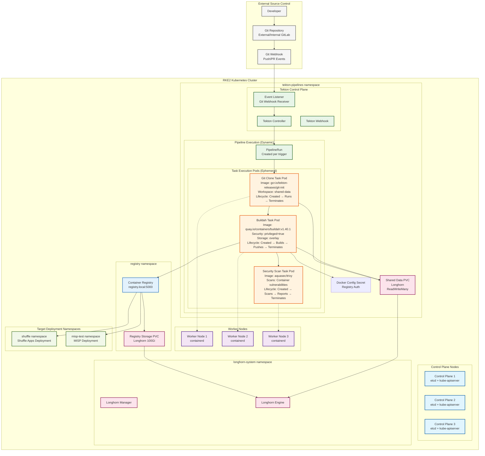
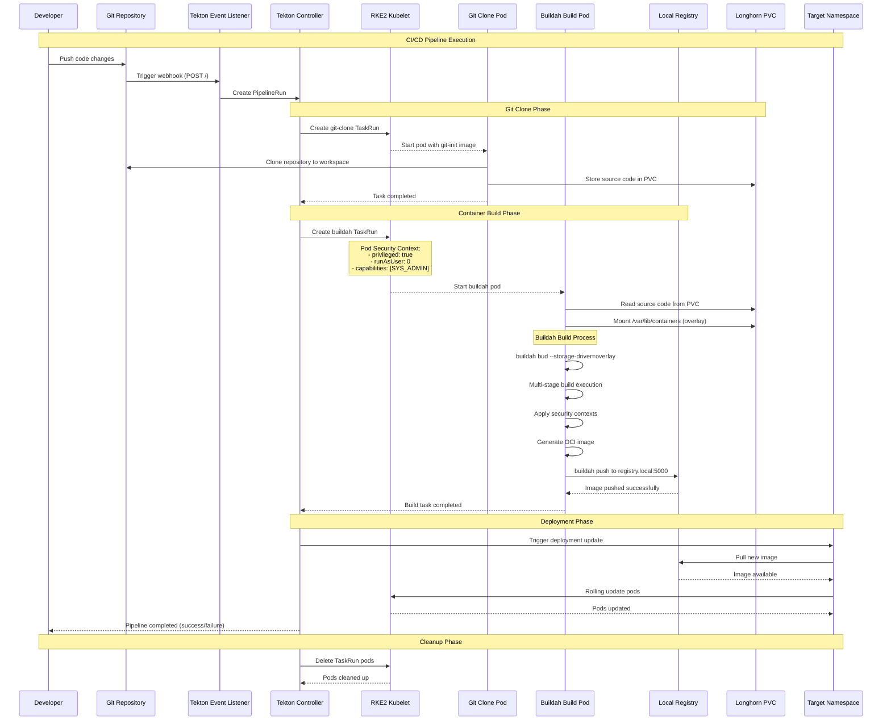
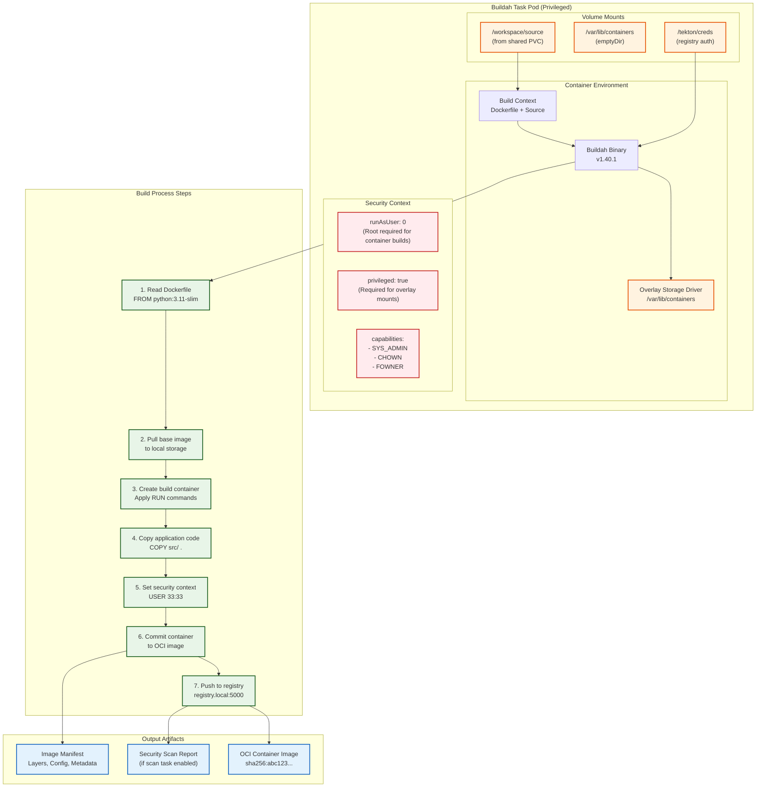

# Buildah CI/CD - Container Build Automation

## Overview

Tekton-based CI/CD pipeline using Buildah for secure, rootless container builds in air-gapped Kubernetes environments. Designed for building security applications and custom container images without Docker daemon dependencies.

## Architecture

### Tekton CI/CD Pipeline in RKE2 Cluster


### Buildah Task Execution Flow in RKE2


### Buildah Container Build Architecture


## File Structure

### Buildah CI Directory Structure

#### Primary Location (`projekte/k8s-deployments/buildah-ci/`)
```
buildah-ci/
├── buidah-task.yaml           # Core Buildah task definition
├── buildah-pipeline.yaml     # Complete CI/CD pipeline  
├── buildah-pr.yaml           # Pull request builds
├── buildah-pr-incluster.yaml # In-cluster PR builds
├── docker-config.yaml        # Registry authentication
├── registry-conf.yaml        # Registry configuration
├── docker-registry-2.3.0.tgz # Registry Helm chart
├── flake8.zip               # Python linting tools
└── qradar_app/              # QRadar app build context
    └── 1.0.0/
        ├── Dockerfile
        ├── api.yml
        ├── requirements.txt
        └── src/app.py
```

#### Duplicate Location (`projekte/k8s-deployments/buildah/`)
```
buildah/
└── [Same structure as buildah-ci - appears to be a duplicate]
```

**Note**: The repository contains both `buildah-ci/` and `buildah/` directories with identical content. Consider consolidating to avoid maintenance overhead.

## Core Task Definition

### Buildah Task Specification
```yaml
# buidah-task.yaml
apiVersion: tekton.dev/v1
kind: Task
metadata:
  name: buildah
  labels:
    app.kubernetes.io/version: "0.9"
  annotations:
    tekton.dev/categories: Image Build
    tekton.dev/pipelines.minVersion: "0.50.0"
    tekton.dev/tags: image-build
    tekton.dev/platforms: "linux/amd64,linux/s390x,linux/ppc64le,linux/arm64"
```

### Key Parameters
```yaml
params:
  - name: IMAGE
    description: Reference of the image buildah will produce
  - name: BUILDER_IMAGE
    description: The location of the buildah builder image
    default: quay.io/containers/buildah:v1.40.1
  - name: STORAGE_DRIVER
    description: Set buildah storage driver
    default: overlay
  - name: DOCKERFILE
    description: Path to the Dockerfile to build
    default: ./Dockerfile
  - name: CONTEXT
    description: Path to the directory to use as context
    default: .
  - name: TLSVERIFY
    description: Verify TLS on registry endpoint
    default: "true"
  - name: FORMAT
    description: Container format (oci or docker)
    default: "oci"
```

### Workspace Configuration
```yaml
workspaces:
  - name: source              # Source code workspace
  - name: sslcertdir          # SSL certificates (optional)
    optional: true
  - name: registries-conf     # Registry configuration (optional)
    optional: true  
  - name: dockerconfig        # Docker/Podman auth config (optional)
    optional: true
```

## Build Process

### Build Script Logic
```bash
# Core build script from buildah task
BUILD_ARGS=()
for buildarg in "$@"; do
  BUILD_ARGS+=("--build-arg=$buildarg")
done

# SSL certificate handling
[ "$(workspaces.sslcertdir.bound)" = "true" ] && \
  CERT_DIR_FLAG="--cert-dir=$(workspaces.sslcertdir.path)"

# Docker config handling  
[ "$(workspaces.dockerconfig.bound)" = "true" ] && \
  DOCKER_CONFIG="$(workspaces.dockerconfig.path)" && \
  export DOCKER_CONFIG

# Registry auth file
if [ "$(workspaces.dockerconfig.bound)" = "true" ]; then
  export REGISTRY_AUTH_FILE=$(workspaces.dockerconfig.path)/config.json
fi

# Custom registry configuration
if [ "$(workspaces.registries-conf.bound)" = "true" ]; then
  cp $(workspaces.registries-conf.path)/000-shortnames.conf \
     /etc/containers/registries.conf.d/000-shortnames.conf
fi

# Build the image
buildah ${CERT_DIR_FLAG} "--storage-driver=${PARAM_STORAGE_DRIVER}" bud \
  "${BUILD_ARGS[@]}" ${PARAM_BUILD_EXTRA_ARGS} \
  "--format=${PARAM_FORMAT}" "--tls-verify=${PARAM_TLSVERIFY}" \
  -f "${PARAM_DOCKERFILE}" -t "${PARAM_IMAGE}" "${PARAM_CONTEXT}"

# Push to registry (if not skipped)
[ "${PARAM_SKIP_PUSH}" = "true" ] && echo "Push skipped" && exit 0
buildah ${CERT_DIR_FLAG} "--storage-driver=${PARAM_STORAGE_DRIVER}" push \
  "--tls-verify=${PARAM_TLSVERIFY}" --digestfile /tmp/image-digest \
  ${PARAM_PUSH_EXTRA_ARGS} "${PARAM_IMAGE}" "docker://${PARAM_IMAGE}"
```

### Security Context
```yaml
securityContext:
  privileged: true  # Required for container builds

volumeMounts:
  - name: varlibcontainers
    mountPath: /var/lib/containers

volumes:
  - name: varlibcontainers
    emptyDir: {}
```

## Pipeline Configuration

### Complete CI/CD Pipeline
```yaml
# buildah-pipeline.yaml (conceptual structure)
apiVersion: tekton.dev/v1
kind: Pipeline
metadata:
  name: buildah-pipeline
spec:
  params:
    - name: git-url
      type: string
    - name: git-revision
      type: string
      default: main
    - name: image-reference
      type: string
    - name: registry-secret
      type: string
      default: registry-auth
  
  workspaces:
    - name: shared-data
    - name: docker-credentials
  
  tasks:
    - name: fetch-source
      taskRef:
        name: git-clone
      workspaces:
        - name: output
          workspace: shared-data
      params:
        - name: url
          value: $(params.git-url)
        - name: revision
          value: $(params.git-revision)
    
    - name: build-image
      taskRef:
        name: buildah
      runAfter:
        - fetch-source
      workspaces:
        - name: source
          workspace: shared-data
        - name: dockerconfig
          workspace: docker-credentials
      params:
        - name: IMAGE
          value: $(params.image-reference)
        - name: TLSVERIFY
          value: "false"  # For internal registries
```

### Pull Request Builds
```yaml
# buildah-pr.yaml
apiVersion: tekton.dev/v1
kind: Pipeline
metadata:
  name: pr-build-pipeline
spec:
  params:
    - name: pr-url
    - name: pr-sha
    - name: target-branch
  tasks:
    - name: pr-fetch
      taskRef:
        name: git-clone
      params:
        - name: url
          value: $(params.pr-url)
        - name: revision
          value: $(params.pr-sha)
    - name: lint-check
      taskRef:
        name: flake8-lint
      runAfter:
        - pr-fetch
    - name: security-scan
      taskRef:
        name: container-scan
      runAfter:
        - pr-fetch
    - name: build-test
      taskRef:
        name: buildah
      runAfter:
        - lint-check
        - security-scan
      params:
        - name: SKIP_PUSH
          value: "true"  # Don't push PR builds
```

## Registry Configuration

### Docker Registry Config
```yaml
# docker-config.yaml
apiVersion: v1
kind: Secret
metadata:
  name: registry-auth
type: kubernetes.io/dockerconfigjson
data:
  .dockerconfigjson: |
    {
      "auths": {
        "registry.local:5000": {
          "username": "admin",
          "password": "password",
          "auth": "YWRtaW46cGFzc3dvcmQ="
        }
      }
    }
```

### Registry Configuration
```yaml
# registry-conf.yaml
apiVersion: v1
kind: ConfigMap
metadata:
  name: registries-conf
data:
  000-shortnames.conf: |
    [registries.search]
    registries = ['registry.local:5000', 'docker.io']
    
    [registries.insecure]
    registries = ['registry.local:5000']
    
    [registries.block]
    registries = []
    
    [[registry]]
    prefix = "docker.io"
    location = "registry.local:5000"
    
    [[registry.mirror]]
    location = "registry.local:5000"
    insecure = true
```

## Air-Gap Considerations

### Offline Image Management
```bash
# Pre-pull required images
buildah_images=(
  "quay.io/containers/buildah:v1.40.1"
  "registry.redhat.io/ubi8/ubi:latest" 
  "python:3.11-slim"
)

# Save for offline transport
for image in "${buildah_images[@]}"; do
  podman pull "$image"
  podman save "$image" > "$(basename $image).tar"
done
```

### Internal Registry Setup
```bash
# Deploy internal registry
helm install registry oci://registry.local:5000/charts/docker-registry \
  --version 2.3.0 \
  --namespace registry \
  --create-namespace \
  --set persistence.enabled=true \
  --set persistence.storageClass=longhorn \
  --set persistence.size=100Gi
```

### Certificate Management
```yaml
# SSL certificates for registry
apiVersion: v1
kind: Secret
metadata:
  name: registry-certs
type: Opaque
data:
  ca.crt: LS0tLS1CRUdJTi... # Base64 encoded CA cert
  tls.crt: LS0tLS1CRUdJTi... # Base64 encoded cert
  tls.key: LS0tLS1CRUdJTi... # Base64 encoded key
```

## Security Hardening

### Pod Security Standards
```yaml
# Buildah task security constraints
apiVersion: v1
kind: SecurityContextConstraints
metadata:
  name: buildah-scc
allowHostDirVolumePlugin: false
allowHostIPC: false
allowHostNetwork: false
allowHostPID: false
allowHostPorts: false
allowPrivilegeEscalation: true  # Required for buildah
allowPrivilegedContainer: true  # Required for container builds
allowedCapabilities:
- SETUID
- SETGID
- CHOWN
- DAC_OVERRIDE
- FOWNER
runAsUser:
  type: RunAsAny
seLinuxContext:
  type: RunAsAny
volumes:
- emptyDir
- secret
- configMap
- persistentVolumeClaim
```

### Network Policies
```yaml
apiVersion: networking.k8s.io/v1
kind: NetworkPolicy
metadata:
  name: buildah-pipeline-policy
spec:
  podSelector:
    matchLabels:
      tekton.dev/pipeline: buildah-pipeline
  policyTypes:
  - Ingress
  - Egress
  ingress:
  - from:
    - namespaceSelector:
        matchLabels:
          name: tekton-pipelines
  egress:
  - to: []
    ports:
    - protocol: TCP
      port: 5000  # Registry access
    - protocol: TCP  
      port: 443   # Git/HTTPS
    - protocol: TCP
      port: 80    # HTTP
```

### RBAC Configuration
```yaml
apiVersion: rbac.authorization.k8s.io/v1
kind: Role
metadata:
  name: buildah-pipeline-role
rules:
- apiGroups: [""]
  resources: ["pods", "services", "configmaps", "secrets"]
  verbs: ["get", "list", "create", "update", "patch", "delete"]
- apiGroups: ["apps"]
  resources: ["deployments"]
  verbs: ["get", "list", "create", "update", "patch"]
---
apiVersion: rbac.authorization.k8s.io/v1
kind: RoleBinding
metadata:
  name: buildah-pipeline-binding
subjects:
- kind: ServiceAccount
  name: buildah-pipeline-sa
roleRef:
  kind: Role
  name: buildah-pipeline-role
  apiGroup: rbac.authorization.k8s.io
```

## QRadar App Build Example

### Application Structure
```
qradar_app/1.0.0/
├── Dockerfile              # Multi-stage build
├── api.yml                # Shuffle app definition
├── requirements.txt       # Python dependencies
└── src/
    └── app.py            # QRadar integration logic
```

### Dockerfile Analysis
```dockerfile
# Multi-stage build for security
FROM python:3.11-slim as builder
WORKDIR /app
COPY requirements.txt .
RUN pip wheel --no-cache-dir --no-deps --wheel-dir /wheels -r requirements.txt

FROM python:3.11-slim
RUN groupadd -r qradar && useradd -r -g qradar qradar
WORKDIR /app
COPY --from=builder /wheels /wheels
RUN pip install --no-cache /wheels/*
COPY --chown=qradar:qradar src/ .
USER qradar
EXPOSE 5001
CMD ["python", "app.py"]
```

### Build Parameters
```yaml
# Task parameters for QRadar app (from buildah-ci directory)
apiVersion: tekton.dev/v1
kind: TaskRun
metadata:
  name: qradar-app-build
spec:
  taskRef:
    name: buildah
  params:
    - name: IMAGE
      value: registry.local:5000/shuffle/qradar:1.0.0
    - name: CONTEXT
      value: projekte/k8s-deployments/buildah-ci/qradar_app/1.0.0
    - name: DOCKERFILE
      value: projekte/k8s-deployments/buildah-ci/qradar_app/1.0.0/Dockerfile
    - name: TLSVERIFY
      value: "false"
    - name: FORMAT
      value: "oci"
```

### Build from Shuffle Apps
```yaml
# Task parameters for Shuffle app builds
apiVersion: tekton.dev/v1
kind: TaskRun
metadata:
  name: shuffle-http-app-build
spec:
  taskRef:
    name: buildah
  params:
    - name: IMAGE
      value: registry.local:5000/shuffle/http:1.4.0
    - name: CONTEXT
      value: projekte/shuffle-apps/http
    - name: DOCKERFILE
      value: projekte/shuffle-apps/http/Dockerfile
    - name: TLSVERIFY
      value: "false"
    - name: FORMAT
      value: "oci"
```

## Monitoring & Observability

### Pipeline Monitoring
```yaml
# ServiceMonitor for Tekton metrics
apiVersion: monitoring.coreos.com/v1
kind: ServiceMonitor
metadata:
  name: tekton-pipelines
spec:
  selector:
    matchLabels:
      app.kubernetes.io/name: tekton-pipelines
  endpoints:
  - port: metrics
    interval: 30s
    path: /metrics
```

### Build Notifications
```yaml
# Notification task for pipeline results
apiVersion: tekton.dev/v1
kind: Task
metadata:
  name: send-notification
spec:
  params:
    - name: status
    - name: message
    - name: webhook-url
  steps:
    - name: notify
      image: curlimages/curl
      script: |
        curl -X POST $(params.webhook-url) \
          -H "Content-Type: application/json" \
          -d '{"status": "$(params.status)", "message": "$(params.message)"}'
```

## Troubleshooting

### Common Build Issues
```bash
# Debug buildah task
kubectl logs -f taskrun/buildah-build-xxx -c step-build-and-push

# Check storage driver issues
kubectl describe taskrun/buildah-build-xxx

# Registry connectivity test
kubectl run debug --image=curlimages/curl -it --rm -- \
  curl -v https://registry.local:5000/v2/
```

### Debug Commands
```bash
# List pipeline runs
tkn pipelinerun list

# Get pipeline run logs
tkn pipelinerun logs buildah-pipeline-run-xxx

# Describe failed task
tkn taskrun describe --last

# Check workspace mounts
kubectl get pvc -l tekton.dev/pipeline=buildah-pipeline
```

### Performance Optimization
```yaml
# Resource optimization for builds
spec:
  steps:
    - name: build-and-push
      resources:
        requests:
          memory: 1Gi
          cpu: 500m
        limits:
          memory: 4Gi
          cpu: 2
      env:
        - name: BUILDAH_LAYERS
          value: "true"  # Enable layer caching
```

## Related Documentation
- [[Kubernetes-Deployments]]
- [[Container-Registry-Setup]]
- [[Security-Hardening]]