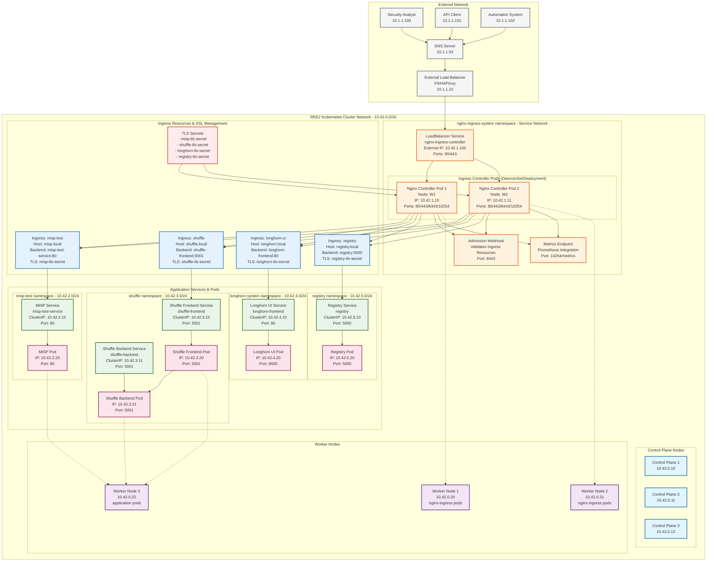
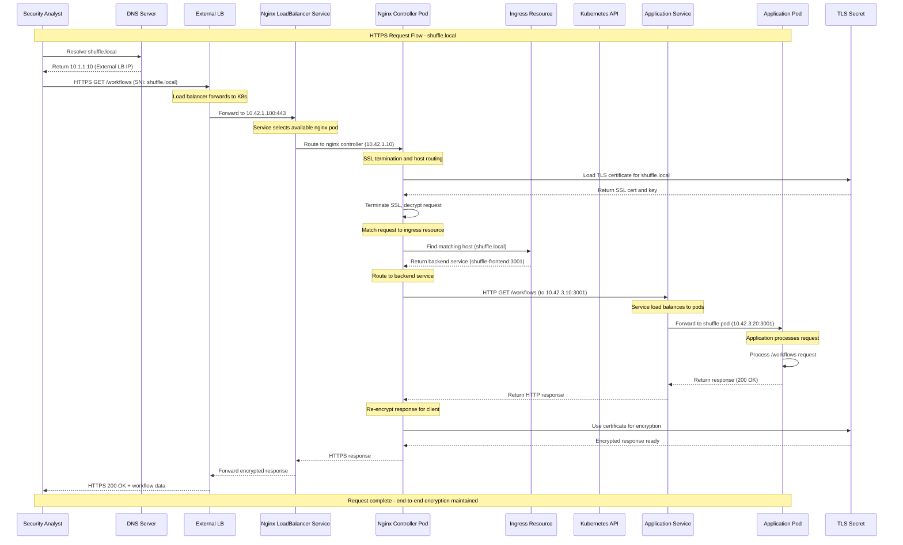
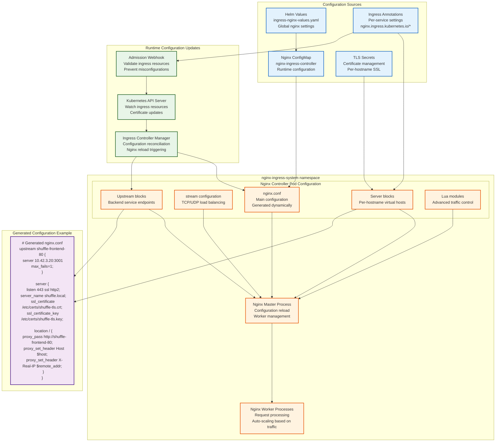

# Ingress-Nginx - Load Balancer & Ingress Controller

## Overview

Nginx-based Kubernetes ingress controller providing load balancing, SSL termination, and traffic routing for applications in air-gapped RKE2 environments. Handles external access to MISP, Shuffle, Longhorn UI, and other services.

## Architecture

### RKE2 Ingress Traffic Flow Architecture


### Ingress Request Processing Flow in RKE2


### Nginx Configuration Management in RKE2


## File Structure

### Ingress Configuration Files Structure
```
projekte/k8s-deployments/ingress-nginx/
├── README.md                    # Deployment guide
├── deployment-guide.md         # Detailed deployment guide
├── helm-deployment-commands.sh # Automated deployment script
├── ingress-nginx-deployment.yaml # Direct deployment manifest
├── ingress-nginx-values.yaml   # Helm values configuration
├── sample-ingress.yaml         # Sample ingress resource
└── test-ingress.yaml          # Test ingress resource
```

**Note**: This is the centralized location for all ingress-nginx configurations under the new organized structure.

## Configuration

### Helm Values Configuration
```yaml
# ingress-nginx-values.yaml
controller:
  # Resource allocation
  resources:
    limits:
      cpu: 1000m
      memory: 512Mi
    requests:
      cpu: 100m
      memory: 128Mi
  
  # Replica configuration
  replicaCount: 2
  
  # Service configuration
  service:
    type: LoadBalancer
    externalTrafficPolicy: Local
    loadBalancerIP: ""  # Set for static IP
    
  # Node selector for placement
  nodeSelector:
    kubernetes.io/os: linux
    
  # Tolerations for node taints
  tolerations: []
  
  # Affinity rules
  affinity:
    podAntiAffinity:
      preferredDuringSchedulingIgnoredDuringExecution:
      - weight: 100
        podAffinityTerm:
          labelSelector:
            matchExpressions:
            - key: app.kubernetes.io/name
              operator: In
              values:
              - ingress-nginx
          topologyKey: kubernetes.io/hostname
  
  # ConfigMap settings
  config:
    # SSL configuration
    ssl-protocols: "TLSv1.2 TLSv1.3"
    ssl-ciphers: "ECDHE-ECDSA-AES256-GCM-SHA384:ECDHE-RSA-AES256-GCM-SHA384:ECDHE-ECDSA-CHACHA20-POLY1305:ECDHE-RSA-CHACHA20-POLY1305:ECDHE-ECDSA-AES128-GCM-SHA256:ECDHE-RSA-AES128-GCM-SHA256"
    
    # Client body size
    client-max-body-size: "100m"
    
    # Proxy settings
    proxy-body-size: "100m"
    proxy-read-timeout: "60"
    proxy-send-timeout: "60"
    
    # Keep-alive settings
    keep-alive: "75"
    keep-alive-requests: "100"
    
    # Worker processes
    worker-processes: "auto"
    worker-connections: "16384"
    
    # Logging
    log-format-json: "true"
    access-log-path: "/var/log/nginx/access.log"
    error-log-path: "/var/log/nginx/error.log"
    
    # Security headers
    add-headers: "ingress-nginx/security-headers"
    
    # Rate limiting
    limit-req-status-code: "429"
    
    # Compression
    enable-brotli: "true"
    gzip-level: "6"
    
    # Real IP configuration
    use-forwarded-headers: "true"
    compute-full-forwarded-for: "true"
    
  # Metrics configuration
  metrics:
    enabled: true
    serviceMonitor:
      enabled: true
      namespace: monitoring
      interval: 30s
      
  # Admission webhook
  admissionWebhooks:
    enabled: true
    failurePolicy: Fail
    port: 8443
    
  # Health checks
  livenessProbe:
    httpGet:
      path: "/healthz"
      port: 10254
      scheme: HTTP
    initialDelaySeconds: 10
    periodSeconds: 10
    timeoutSeconds: 1
    successThreshold: 1
    failureThreshold: 5
    
  readinessProbe:
    httpGet:
      path: "/healthz"
      port: 10254
      scheme: HTTP
    initialDelaySeconds: 10
    periodSeconds: 10
    timeoutSeconds: 1
    successThreshold: 1
    failureThreshold: 3

# Default backend
defaultBackend:
  enabled: true
  image:
    registry: registry.local:5000
    image: nginx/nginx-unprivileged
    tag: "1.25-alpine"
  resources:
    limits:
      cpu: 10m
      memory: 20Mi
    requests:
      cpu: 10m
      memory: 20Mi
```

### Security Headers ConfigMap
```yaml
apiVersion: v1
kind: ConfigMap
metadata:
  name: security-headers
  namespace: ingress-nginx
data:
  X-Frame-Options: "SAMEORIGIN"
  X-Content-Type-Options: "nosniff"
  X-XSS-Protection: "1; mode=block"
  Referrer-Policy: "strict-origin-when-cross-origin"
  Content-Security-Policy: "default-src 'self'; script-src 'self' 'unsafe-inline' 'unsafe-eval'; style-src 'self' 'unsafe-inline'; img-src 'self' data:; font-src 'self'; connect-src 'self'; frame-ancestors 'self'"
  Strict-Transport-Security: "max-age=31536000; includeSubDomains"
  Permissions-Policy: "geolocation=(), microphone=(), camera=()"
```

## Ingress Resources

### MISP Ingress
```yaml
# misp-ingress.yaml
apiVersion: networking.k8s.io/v1
kind: Ingress
metadata:
  name: misp-ingress
  namespace: misp
  annotations:
    nginx.ingress.kubernetes.io/ssl-redirect: "false"
    nginx.ingress.kubernetes.io/proxy-body-size: "50m"
    nginx.ingress.kubernetes.io/proxy-read-timeout: "300"
    nginx.ingress.kubernetes.io/proxy-send-timeout: "300"
    nginx.ingress.kubernetes.io/backend-protocol: "HTTP"
spec:
  ingressClassName: nginx
  rules:
  - host: misp.local
    http:
      paths:
      - path: /
        pathType: Prefix
        backend:
          service:
            name: misp-service
            port:
              number: 80
  tls:
  - hosts:
    - misp.local
    secretName: misp-tls-secret
```

### Shuffle Ingress
```yaml
# shuffle-ingress.yaml
apiVersion: networking.k8s.io/v1
kind: Ingress
metadata:
  name: shuffle-ingress
  namespace: shuffle
  annotations:
    nginx.ingress.kubernetes.io/ssl-redirect: "false"
    nginx.ingress.kubernetes.io/proxy-body-size: "100m"
    nginx.ingress.kubernetes.io/websocket-services: "shuffle-backend"
    nginx.ingress.kubernetes.io/upstream-hash-by: "$request_uri"
spec:
  ingressClassName: nginx
  rules:
  - host: shuffle.local
    http:
      paths:
      - path: /api
        pathType: Prefix
        backend:
          service:
            name: shuffle-backend
            port:
              number: 5001
      - path: /
        pathType: Prefix
        backend:
          service:
            name: shuffle-frontend
            port:
              number: 3000
  tls:
  - hosts:
    - shuffle.local
    secretName: shuffle-tls-secret
```

### Longhorn UI Ingress
```yaml
# longhorn-ingress.yaml
apiVersion: networking.k8s.io/v1
kind: Ingress
metadata:
  name: longhorn-ingress
  namespace: longhorn-system
  annotations:
    nginx.ingress.kubernetes.io/ssl-redirect: "false"
    nginx.ingress.kubernetes.io/auth-type: basic
    nginx.ingress.kubernetes.io/auth-secret: longhorn-auth
    nginx.ingress.kubernetes.io/auth-realm: "Longhorn Storage Dashboard"
    nginx.ingress.kubernetes.io/proxy-body-size: "10m"
spec:
  ingressClassName: nginx
  rules:
  - host: longhorn.local
    http:
      paths:
      - path: /
        pathType: Prefix
        backend:
          service:
            name: longhorn-frontend
            port:
              number: 80
  tls:
  - hosts:
    - longhorn.local
    secretName: longhorn-tls-secret
```

### Container Registry Ingress
```yaml
# registry-ingress.yaml
apiVersion: networking.k8s.io/v1
kind: Ingress
metadata:
  name: registry-ingress
  namespace: registry
  annotations:
    nginx.ingress.kubernetes.io/ssl-redirect: "false"
    nginx.ingress.kubernetes.io/proxy-body-size: "1000m"
    nginx.ingress.kubernetes.io/proxy-read-timeout: "900"
    nginx.ingress.kubernetes.io/proxy-send-timeout: "900"
    nginx.ingress.kubernetes.io/client-body-buffer-size: "1m"
spec:
  ingressClassName: nginx
  rules:
  - host: registry.local
    http:
      paths:
      - path: /
        pathType: Prefix
        backend:
          service:
            name: registry-service
            port:
              number: 5000
  tls:
  - hosts:
    - registry.local
    secretName: registry-tls-secret
```

## SSL/TLS Configuration

### Certificate Generation
```bash
#!/bin/bash
# generate-certs.sh

# Generate CA private key
openssl genrsa -out ca-key.pem 4096

# Generate CA certificate
openssl req -new -x509 -days 3650 -key ca-key.pem -sha256 -out ca.pem -subj \
  "/C=US/ST=CA/L=SF/O=Local/OU=IT/CN=Local CA"

# Generate server private key
openssl genrsa -out server-key.pem 4096

# Generate certificate signing request
openssl req -subj "/C=US/ST=CA/L=SF/O=Local/OU=IT/CN=*.local" \
  -sha256 -new -key server-key.pem -out server.csr

# Create extensions file
echo "subjectAltName = DNS:*.local,DNS:localhost,IP:127.0.0.1" > extfile.cnf

# Generate server certificate
openssl x509 -req -days 365 -in server.csr -CA ca.pem -CAkey ca-key.pem \
  -out server-cert.pem -extfile extfile.cnf -CAcreateserial

# Create Kubernetes TLS secret
kubectl create secret tls local-tls-secret \
  --cert=server-cert.pem \
  --key=server-key.pem \
  --namespace=ingress-nginx
```

### Wildcard Certificate Secret
```yaml
apiVersion: v1
kind: Secret
metadata:
  name: wildcard-local-tls
  namespace: ingress-nginx
type: kubernetes.io/tls
data:
  tls.crt: LS0tLS1CRUdJTi... # Base64 encoded certificate
  tls.key: LS0tLS1CRUdJTi... # Base64 encoded private key
```

## Deployment

### Helm Installation
```bash
#!/bin/bash
# deploy-ingress-nginx.sh

set -e

NAMESPACE="ingress-nginx"
CHART_VERSION="4.11.3"
RELEASE_NAME="ingress-nginx"
CONFIG_DIR="projekte/k8s-deployments/ingress-nginx"

echo "Deploying ingress-nginx ${CHART_VERSION} to ${NAMESPACE}"

# Navigate to configuration directory
cd $CONFIG_DIR

# Add ingress-nginx repository
helm repo add ingress-nginx https://kubernetes.github.io/ingress-nginx
helm repo update

# Create namespace
kubectl create namespace $NAMESPACE --dry-run=client -o yaml | kubectl apply -f -

# Deploy security headers ConfigMap
kubectl apply -f - <<EOF
apiVersion: v1
kind: ConfigMap
metadata:
  name: security-headers
  namespace: $NAMESPACE
data:
  X-Frame-Options: "SAMEORIGIN"
  X-Content-Type-Options: "nosniff"
  X-XSS-Protection: "1; mode=block"
  Referrer-Policy: "strict-origin-when-cross-origin"
  Strict-Transport-Security: "max-age=31536000; includeSubDomains"
EOF

# Deploy ingress-nginx with correct values path
helm upgrade --install $RELEASE_NAME ingress-nginx/ingress-nginx \
    --namespace $NAMESPACE \
    --values ingress-nginx-values.yaml \
    --version $CHART_VERSION \
    --wait

# Verify deployment
echo "Verifying ingress-nginx deployment..."
kubectl get pods -n $NAMESPACE
kubectl get svc -n $NAMESPACE

# Check ingress class
kubectl get ingressclass

# Apply sample ingress resources
echo "Applying sample ingress configurations..."
kubectl apply -f sample-ingress.yaml
kubectl apply -f test-ingress.yaml

echo "Ingress-nginx deployment complete!"
echo "Configuration files available in: $CONFIG_DIR"
```

### Manual Deployment (Air-Gap)
```yaml
# ingress-nginx-deployment.yaml
apiVersion: apps/v1
kind: Deployment
metadata:
  name: nginx-ingress-controller
  namespace: ingress-nginx
spec:
  replicas: 2
  selector:
    matchLabels:
      app.kubernetes.io/name: ingress-nginx
  template:
    metadata:
      labels:
        app.kubernetes.io/name: ingress-nginx
    spec:
      serviceAccountName: nginx-ingress-serviceaccount
      containers:
      - name: nginx-ingress-controller
        image: registry.local:5000/ingress-nginx/controller:v1.11.2
        args:
          - /nginx-ingress-controller
          - --configmap=$(POD_NAMESPACE)/nginx-configuration
          - --tcp-services-configmap=$(POD_NAMESPACE)/tcp-services
          - --udp-services-configmap=$(POD_NAMESPACE)/udp-services
          - --publish-service=$(POD_NAMESPACE)/ingress-nginx
          - --annotations-prefix=nginx.ingress.kubernetes.io
        securityContext:
          allowPrivilegeEscalation: true
          capabilities:
            drop:
            - ALL
            add:
            - NET_BIND_SERVICE
          runAsUser: 101
        env:
        - name: POD_NAME
          valueFrom:
            fieldRef:
              fieldPath: metadata.name
        - name: POD_NAMESPACE
          valueFrom:
            fieldRef:
              fieldPath: metadata.namespace
        ports:
        - name: http
          containerPort: 80
        - name: https
          containerPort: 443
        livenessProbe:
          httpGet:
            path: /healthz
            port: 10254
            scheme: HTTP
          initialDelaySeconds: 10
          periodSeconds: 10
          timeoutSeconds: 1
          successThreshold: 1
          failureThreshold: 5
        readinessProbe:
          httpGet:
            path: /healthz
            port: 10254
            scheme: HTTP
          initialDelaySeconds: 10
          periodSeconds: 10
          timeoutSeconds: 1
          successThreshold: 1
          failureThreshold: 3
        resources:
          limits:
            cpu: 1000m
            memory: 512Mi
          requests:
            cpu: 100m
            memory: 128Mi
```

## Load Balancing Strategies

### Session Affinity
```yaml
# Session-based routing
metadata:
  annotations:
    nginx.ingress.kubernetes.io/affinity: "cookie"
    nginx.ingress.kubernetes.io/affinity-mode: "sticky"
    nginx.ingress.kubernetes.io/session-cookie-name: "route"
    nginx.ingress.kubernetes.io/session-cookie-max-age: "86400"
```

### Load Balancing Algorithms
```yaml
# Upstream hashing
metadata:
  annotations:
    nginx.ingress.kubernetes.io/upstream-hash-by: "$remote_addr"
    
# Least connections
metadata:
  annotations:
    nginx.ingress.kubernetes.io/load-balance: "least_conn"
```

### Health Checks
```yaml
# Custom health checks
metadata:
  annotations:
    nginx.ingress.kubernetes.io/server-snippet: |
      location /health {
        access_log off;
        return 200 "healthy\n";
        add_header Content-Type text/plain;
      }
```

## Monitoring & Observability

### Prometheus Metrics
```yaml
# ServiceMonitor for Prometheus
apiVersion: monitoring.coreos.com/v1
kind: ServiceMonitor
metadata:
  name: nginx-ingress
  namespace: monitoring
spec:
  selector:
    matchLabels:
      app.kubernetes.io/name: ingress-nginx
  endpoints:
  - port: metrics
    interval: 30s
    path: /metrics
```

### Grafana Dashboard
```yaml
# Ingress-nginx dashboard ConfigMap
apiVersion: v1
kind: ConfigMap
metadata:
  name: nginx-ingress-dashboard
  namespace: monitoring
  labels:
    grafana_dashboard: "1"
data:
  nginx-ingress.json: |
    {
      "dashboard": {
        "id": 9614,
        "title": "NGINX Ingress controller",
        "tags": ["kubernetes", "ingress", "nginx"],
        "panels": [
          {
            "title": "Request Rate",
            "type": "graph",
            "targets": [
              {
                "expr": "rate(nginx_ingress_controller_requests_total[5m])"
              }
            ]
          }
        ]
      }
    }
```

### Log Configuration
```yaml
# Fluent Bit configuration for nginx logs
apiVersion: v1
kind: ConfigMap
metadata:
  name: fluent-bit-nginx-config
data:
  nginx.conf: |
    [INPUT]
        Name tail
        Path /var/log/nginx/access.log
        Parser nginx_json
        Tag nginx.access
        
    [INPUT]
        Name tail
        Path /var/log/nginx/error.log
        Parser nginx_error
        Tag nginx.error
        
    [OUTPUT]
        Name opensearch
        Match nginx.*
        Host opensearch.logging.svc.cluster.local
        Port 9200
        Index nginx-logs
```

## Security Hardening

### Network Policies
```yaml
apiVersion: networking.k8s.io/v1
kind: NetworkPolicy
metadata:
  name: ingress-nginx-policy
  namespace: ingress-nginx
spec:
  podSelector:
    matchLabels:
      app.kubernetes.io/name: ingress-nginx
  policyTypes:
  - Ingress
  - Egress
  ingress:
  - from: []  # Allow from any (ingress traffic)
    ports:
    - protocol: TCP
      port: 80
    - protocol: TCP
      port: 443
  - from:
    - namespaceSelector:
        matchLabels:
          name: kube-system
    ports:
    - protocol: TCP
      port: 8443  # Admission webhook
  egress:
  - to:
    - podSelector: {}  # Allow to any pod in namespace
  - to: []  # Allow to backend services
    ports:
    - protocol: TCP
      port: 80
    - protocol: TCP
      port: 443
    - protocol: TCP
      port: 5000  # Registry
    - protocol: TCP
      port: 3000  # Frontend services
    - protocol: TCP
      port: 5001  # Backend services
```

### Pod Security Policy
```yaml
apiVersion: policy/v1beta1
kind: PodSecurityPolicy
metadata:
  name: nginx-ingress-psp
spec:
  privileged: false
  allowPrivilegeEscalation: true  # Required for NET_BIND_SERVICE
  runAsUser:
    rule: MustRunAs
    ranges:
    - min: 101
      max: 101
  seLinux:
    rule: RunAsAny
  fsGroup:
    rule: RunAsAny
  volumes:
  - secret
  - configMap
  - emptyDir
  - projected
  allowedCapabilities:
  - NET_BIND_SERVICE
  requiredDropCapabilities:
  - ALL
```

### Rate Limiting
```yaml
# Global rate limiting
apiVersion: v1
kind: ConfigMap
metadata:
  name: nginx-configuration
  namespace: ingress-nginx
data:
  # Rate limiting
  limit-rate-after: "1024"
  limit-rate: "1024"
  
  # Connection limiting
  limit-connections: "20"
  
  # Request rate limiting
  http-snippet: |
    limit_req_zone $binary_remote_addr zone=global:10m rate=10r/s;
    limit_req zone=global burst=20 nodelay;
```

## Troubleshooting

### Common Issues

#### Controller Not Starting
```bash
# Check controller logs
kubectl logs -f deployment/nginx-ingress-controller -n ingress-nginx

# Check admission webhook
kubectl get validatingwebhookconfiguration
kubectl get mutatingwebhookconfiguration

# Verify RBAC permissions
kubectl auth can-i create ingresses --as=system:serviceaccount:ingress-nginx:nginx-ingress-serviceaccount
```

#### SSL Certificate Issues
```bash
# Check certificate secrets
kubectl get secrets -n ingress-nginx
kubectl describe secret local-tls-secret -n ingress-nginx

# Test certificate validity
openssl x509 -in certificate.crt -text -noout

# Check ingress annotations
kubectl describe ingress app-ingress -n namespace
```

#### Backend Connection Failures
```bash
# Check service endpoints
kubectl get endpoints -n app-namespace
kubectl describe service app-service -n app-namespace

# Test backend connectivity
kubectl run debug --image=busybox -it --rm -- \
  wget -qO- http://service-name.namespace:port/health

# Check ingress backend configuration
kubectl get ingress app-ingress -o yaml
```

### Debug Commands
```bash
# Check ingress controller status
kubectl get pods -n ingress-nginx
kubectl get svc -n ingress-nginx

# View nginx configuration
kubectl exec -n ingress-nginx nginx-ingress-controller-xxx -- cat /etc/nginx/nginx.conf

# Test ingress routing
curl -H "Host: app.local" http://ingress-ip/

# Check metrics endpoint
curl http://controller-ip:10254/metrics

# Validate ingress resource
kubectl get ingress --all-namespaces
kubectl describe ingress app-ingress -n namespace
```

### Performance Troubleshooting
```bash
# Check resource usage
kubectl top pods -n ingress-nginx

# Monitor request rates
kubectl exec -n ingress-nginx controller-pod -- \
  curl -s localhost:10254/metrics | grep nginx_ingress_controller_requests_total

# Check upstream response times
kubectl logs -f deployment/nginx-ingress-controller -n ingress-nginx | \
  grep "upstream_response_time"
```

## Integration Points

### Application Integration
- **MISP**: SSL termination, file upload handling
- **Shuffle**: WebSocket support, API routing
- **Longhorn**: Authentication, dashboard access
- **Registry**: Large file uploads, SSL termination

### Monitoring Integration
- **Prometheus**: Metrics collection and alerting
- **Grafana**: Dashboard visualization
- **Logging Stack**: Access and error log forwarding

## Related Documentation
- [[Kubernetes-Deployments]]
- [[Security-Hardening]]
- [[SSL-Certificate-Management]]
- [[Load-Balancing-Strategies]]