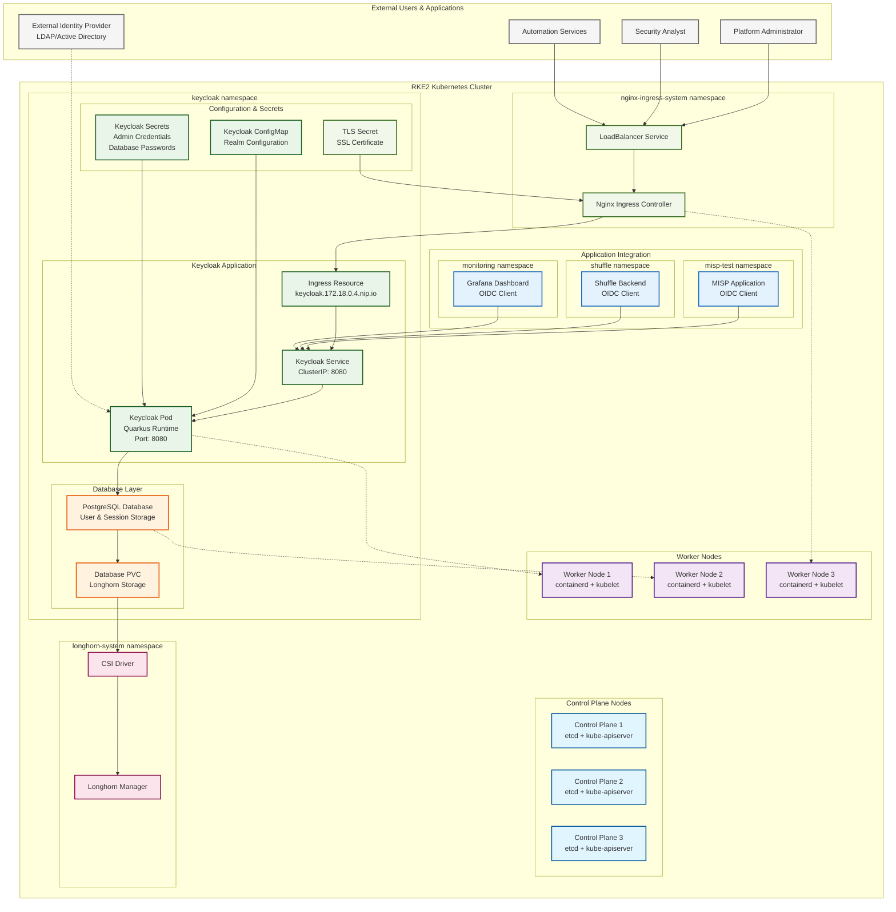
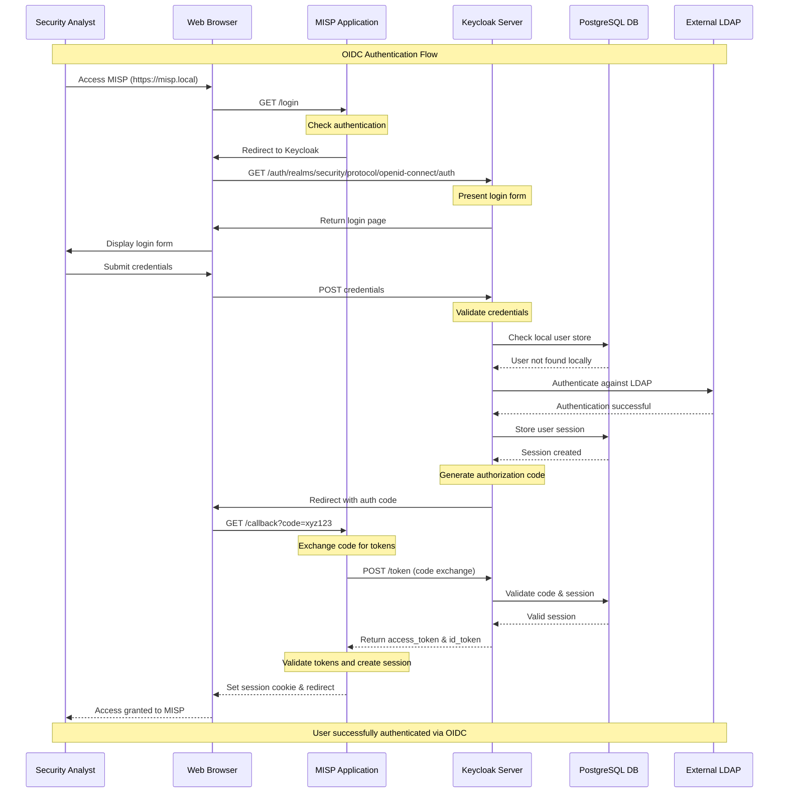

# Keycloak Identity and Access Management

## Overview

Keycloak is an open-source identity and access management solution providing authentication, authorization, and user management for the security platform ecosystem. Deployed on RKE2 for centralized identity services across MISP, Shuffle, and other applications.

## Architecture

### Keycloak Identity Management in RKE2 Cluster


### OIDC Authentication Flow


## File Structure

### Keycloak Deployment Structure
```
projekte/k8s-deployments/keycloak/
├── keycloak-24.7.7.tgz         # Keycloak Helm chart v24.7.7
├── keycloak-modules.zip        # Custom Keycloak modules/extensions  
└── keycloak-values.yaml        # Helm values configuration
```

## Configuration

### Core Keycloak Values
```yaml
# keycloak-values.yaml
auth:
  adminUser: admin
  adminPassword: Hallo123  # Change for production

extraEnvVars:
  - name: KEYCLOAK_LOG_LEVEL
    value: DEBUG
  - name: KEYCLOAK_EXTRA_ARGS
    value: --import-realm

# Storage configuration
global:
  defaultStorageClass: standard
  storageClass: standard

# Service configuration
service:
  type: ClusterIP

# Ingress configuration
ingress:
  enabled: true
  ingressClassName: nginx
  hostname: keycloak.172.18.0.4.nip.io
  path: /
  pathType: Prefix
  tls: false
  annotations:
    cert-manager.io/cluster-issuer: selfsigned
  extraTls:
    - hosts:
        - keycloak.172.18.0.4.nip.io
      secretName: keycloak.172.18.0.4.nip.io-tls

# Proxy configuration for edge termination
proxy: edge

# Health checks
startupProbe:
  enabled: true
  failureThreshold: 30
  periodSeconds: 10
```

### Database Integration
```yaml
# Database configuration (typically separate)
postgresql:
  enabled: true
  auth:
    postgresPassword: "keycloak-db-password"
    username: "keycloak"
    password: "keycloak-user-password"
    database: "keycloak"
  primary:
    persistence:
      enabled: true
      storageClass: "longhorn"
      size: 8Gi
    resources:
      limits:
        memory: 512Mi
        cpu: 500m
      requests:
        memory: 256Mi
        cpu: 250m
```

## Deployment Commands

### Installation
```bash
# Navigate to keycloak directory
cd projekte/k8s-deployments/keycloak/

# Install Keycloak with Helm chart
helm install keycloak ./keycloak-24.7.7.tgz \
  --namespace keycloak \
  --create-namespace \
  --values keycloak-values.yaml

# Verify deployment
kubectl get pods -n keycloak
kubectl get svc,ingress -n keycloak
```

### Upgrade
```bash
# Upgrade Keycloak deployment
cd projekte/k8s-deployments/keycloak/
helm upgrade keycloak ./keycloak-24.7.7.tgz \
  --namespace keycloak \
  --values keycloak-values.yaml

# Check upgrade status
helm status keycloak -n keycloak
kubectl rollout status deployment/keycloak -n keycloak
```

### Access & Management
```bash
# Port forward for local access
kubectl port-forward -n keycloak service/keycloak 8080:8080

# Access admin console
# URL: http://localhost:8080/admin
# Username: admin
# Password: Hallo123

# Check logs
kubectl logs -f deployment/keycloak -n keycloak
```

## Realm Configuration

### Security Platform Realm
```json
{
  "realm": "security-platform",
  "enabled": true,
  "sslRequired": "external",
  "registrationAllowed": false,
  "loginWithEmailAllowed": true,
  "duplicateEmailsAllowed": false,
  "resetPasswordAllowed": true,
  "editUsernameAllowed": false,
  "bruteForceProtected": true,
  "maxFailureWaitSeconds": 900,
  "accessTokenLifespan": 3600,
  "ssoSessionMaxLifespan": 36000
}
```

### OIDC Client Configurations

#### MISP Client
```json
{
  "clientId": "misp-platform",
  "name": "MISP Threat Intelligence Platform",
  "enabled": true,
  "clientAuthenticatorType": "client-secret",
  "secret": "misp-client-secret-change-me",
  "redirectUris": [
    "https://misp.local/users/login",
    "https://misp.local/oauth/callback"
  ],
  "webOrigins": [
    "https://misp.local"
  ],
  "protocol": "openid-connect",
  "publicClient": false,
  "bearerOnly": false,
  "standardFlowEnabled": true,
  "implicitFlowEnabled": false,
  "directAccessGrantsEnabled": true,
  "serviceAccountsEnabled": false
}
```

#### Shuffle Client
```json
{
  "clientId": "shuffle-soar",
  "name": "Shuffle SOAR Platform", 
  "enabled": true,
  "clientAuthenticatorType": "client-secret",
  "secret": "shuffle-client-secret-change-me",
  "redirectUris": [
    "https://shuffle.local/api/v1/auth/callback",
    "https://shuffle.local/login"
  ],
  "webOrigins": [
    "https://shuffle.local"
  ],
  "protocol": "openid-connect",
  "publicClient": false,
  "standardFlowEnabled": true,
  "implicitFlowEnabled": false,
  "directAccessGrantsEnabled": true
}
```

## Security Configuration

### Authentication Settings
```yaml
# Keycloak security hardening
securityContext:
  runAsUser: 1001
  runAsGroup: 1001
  runAsNonRoot: true
  fsGroup: 1001

containerSecurityContext:
  runAsUser: 1001
  runAsGroup: 1001
  runAsNonRoot: true
  allowPrivilegeEscalation: false
  readOnlyRootFilesystem: false
  capabilities:
    drop: [ALL]

# Resource limits
resources:
  limits:
    memory: 1Gi
    cpu: 1000m
  requests:
    memory: 512Mi
    cpu: 250m
```

### Network Security
```yaml
# Network policy for Keycloak
apiVersion: networking.k8s.io/v1
kind: NetworkPolicy
metadata:
  name: keycloak-netpol
  namespace: keycloak
spec:
  podSelector:
    matchLabels:
      app.kubernetes.io/name: keycloak
  policyTypes:
    - Ingress
    - Egress
  ingress:
    - from:
        - namespaceSelector:
            matchLabels:
              name: nginx-ingress-system
      ports:
        - protocol: TCP
          port: 8080
    - from:
        - namespaceSelector:
            matchLabels:
              name: misp-test
        - namespaceSelector:
            matchLabels:
              name: shuffle
        - namespaceSelector:
            matchLabels:
              name: monitoring
  egress:
    - to: []
      ports:
        - protocol: TCP
          port: 5432  # PostgreSQL
        - protocol: TCP
          port: 389   # LDAP
        - protocol: TCP
          port: 636   # LDAPS
        - protocol: TCP
          port: 53    # DNS
        - protocol: UDP
          port: 53    # DNS
```

## Identity Federation

### LDAP Integration
```json
{
  "componentName": "ldap-provider",
  "providerId": "ldap",
  "providerType": "org.keycloak.storage.UserStorageProvider",
  "config": {
    "enabled": ["true"],
    "priority": ["1"],
    "fullSyncPeriod": ["604800"],
    "changedSyncPeriod": ["86400"],
    "cachePolicy": ["DEFAULT"],
    "batchSizeForSync": ["1000"],
    "editMode": ["READ_ONLY"],
    "syncRegistrations": ["false"],
    "vendor": ["other"],
    "usernameLDAPAttribute": ["uid"],
    "rdnLDAPAttribute": ["uid"],
    "uuidLDAPAttribute": ["entryUUID"],
    "userObjectClasses": ["inetOrgPerson, organizationalPerson"],
    "connectionUrl": ["ldap://ldap.company.local:389"],
    "usersDn": ["ou=users,dc=company,dc=local"],
    "authType": ["simple"],
    "bindDn": ["cn=keycloak,ou=service,dc=company,dc=local"],
    "bindCredential": ["ldap-bind-password"],
    "searchScope": ["1"],
    "trustEmail": ["true"],
    "useTruststoreSpi": ["ldapsOnly"],
    "connectionPooling": ["true"],
    "pagination": ["true"]
  }
}
```

### SAML Federation
```json
{
  "alias": "corporate-saml",
  "displayName": "Corporate SAML Provider",
  "providerId": "saml",
  "enabled": true,
  "config": {
    "singleSignOnServiceUrl": "https://idp.company.local/saml/sso",
    "singleLogoutServiceUrl": "https://idp.company.local/saml/logout",
    "backchannelSupported": "true",
    "nameIDPolicyFormat": "urn:oasis:names:tc:SAML:2.0:nameid-format:persistent",
    "postBindingAuthnRequest": "true",
    "postBindingResponse": "true",
    "postBindingLogout": "true",
    "wantAuthnRequestsSigned": "true",
    "wantAssertionsSigned": "true",
    "signatureAlgorithm": "RSA_SHA256",
    "xmlSigKeyInfoKeyNameTransformer": "KEY_ID"
  }
}
```

## User Management

### Role Definitions
```json
{
  "roles": {
    "realm": [
      {
        "name": "security-admin",
        "description": "Full access to all security platforms",
        "composite": true,
        "composites": {
          "client": {
            "misp-platform": ["admin"],
            "shuffle-soar": ["admin"],
            "grafana": ["admin"]
          }
        }
      },
      {
        "name": "security-analyst",
        "description": "Read-write access to security platforms",
        "composite": true,
        "composites": {
          "client": {
            "misp-platform": ["user"],
            "shuffle-soar": ["user"],
            "grafana": ["editor"]
          }
        }
      },
      {
        "name": "security-viewer", 
        "description": "Read-only access to security platforms",
        "composite": true,
        "composites": {
          "client": {
            "misp-platform": ["viewer"],
            "shuffle-soar": ["viewer"],
            "grafana": ["viewer"]
          }
        }
      }
    ]
  }
}
```

### Group Management
```json
{
  "groups": [
    {
      "name": "Security Administrators",
      "path": "/Security Administrators",
      "realmRoles": ["security-admin"],
      "attributes": {
        "department": ["Security Operations"],
        "clearance-level": ["high"]
      }
    },
    {
      "name": "SOC Analysts",
      "path": "/SOC Analysts", 
      "realmRoles": ["security-analyst"],
      "attributes": {
        "department": ["Security Operations"],
        "clearance-level": ["medium"]
      }
    },
    {
      "name": "Security Viewers",
      "path": "/Security Viewers",
      "realmRoles": ["security-viewer"],
      "attributes": {
        "department": ["IT Operations"],
        "clearance-level": ["low"]
      }
    }
  ]
}
```

## Monitoring & Observability

### Metrics Configuration
```yaml
# ServiceMonitor for Prometheus
apiVersion: monitoring.coreos.com/v1
kind: ServiceMonitor
metadata:
  name: keycloak-metrics
  namespace: keycloak
spec:
  selector:
    matchLabels:
      app.kubernetes.io/name: keycloak
  endpoints:
    - port: http
      interval: 30s
      path: /metrics
      honorLabels: true
```

### Health Checks
```yaml
# Health check configuration
livenessProbe:
  httpGet:
    path: /health/live
    port: 8080
  initialDelaySeconds: 60
  periodSeconds: 30

readinessProbe:
  httpGet:
    path: /health/ready
    port: 8080
  initialDelaySeconds: 30
  periodSeconds: 10
```

### Logging Configuration
```yaml
# Keycloak logging settings
extraEnvVars:
  - name: QUARKUS_LOG_LEVEL
    value: INFO
  - name: QUARKUS_LOG_CONSOLE_JSON
    value: "true"
  - name: QUARKUS_LOG_FILE_ENABLE
    value: "true"
  - name: QUARKUS_LOG_FILE_PATH
    value: "/opt/keycloak/logs/keycloak.log"
```

## Backup & Recovery

### Database Backup
```bash
# PostgreSQL backup script
#!/bin/bash
NAMESPACE="keycloak"
DB_POD=$(kubectl get pods -n $NAMESPACE -l app.kubernetes.io/name=postgresql -o jsonpath='{.items[0].metadata.name}')

# Create backup
kubectl exec -n $NAMESPACE $DB_POD -- pg_dump -U keycloak keycloak > keycloak-backup-$(date +%Y%m%d-%H%M%S).sql

# Restore backup
kubectl exec -i -n $NAMESPACE $DB_POD -- psql -U keycloak keycloak < keycloak-backup-20241127-120000.sql
```

### Configuration Backup
```bash
# Export realm configuration
kubectl port-forward -n keycloak service/keycloak 8080:8080 &
PF_PID=$!

# Use Keycloak admin CLI or API to export realm
curl -X GET "http://localhost:8080/admin/realms/security-platform" \
  -H "Authorization: Bearer $ADMIN_TOKEN" > realm-export.json

kill $PF_PID
```

## Troubleshooting

### Common Issues

#### Startup Problems
```bash
# Check pod status and events
kubectl get pods -n keycloak
kubectl describe pod keycloak-xxx -n keycloak

# Check logs
kubectl logs -f deployment/keycloak -n keycloak

# Check database connectivity
kubectl exec -it deployment/keycloak -n keycloak -- \
  curl -f http://postgresql:5432 || echo "Database unreachable"
```

#### Authentication Issues
```bash
# Check realm configuration
kubectl exec -it deployment/keycloak -n keycloak -- \
  /opt/keycloak/bin/kcadm.sh get realms/security-platform

# Verify client configurations  
kubectl exec -it deployment/keycloak -n keycloak -- \
  /opt/keycloak/bin/kcadm.sh get clients -r security-platform

# Check user authentication
kubectl logs -f deployment/keycloak -n keycloak | grep "Authentication"
```

#### Network Connectivity
```bash
# Test ingress connectivity
curl -I https://keycloak.172.18.0.4.nip.io/

# Test from application namespace
kubectl run test-pod --image=curlimages/curl -it --rm -- \
  curl -v http://keycloak.keycloak:8080/auth/realms/security-platform
```

### Performance Tuning

#### JVM Settings
```yaml
# JVM optimization for Keycloak
extraEnvVars:
  - name: JAVA_OPTS_APPEND
    value: >-
      -Xms512m -Xmx1g
      -XX:+UseG1GC
      -XX:MaxGCPauseMillis=100
      -XX:+UseStringDeduplication
      -Djava.net.preferIPv4Stack=true
```

#### Database Connection Pool
```yaml
# Database connection optimization
extraEnvVars:
  - name: KC_DB_POOL_INITIAL_SIZE
    value: "5"
  - name: KC_DB_POOL_MIN_SIZE 
    value: "5"
  - name: KC_DB_POOL_MAX_SIZE
    value: "20"
```

## Integration Examples

### MISP OIDC Configuration
```php
// MISP app/Config/config.php
$config['Security']['auth'][] = 'OidcAuth.Oidc';
$config['OidcAuth']['provider_url'] = 'https://keycloak.172.18.0.4.nip.io/auth/realms/security-platform';
$config['OidcAuth']['client_id'] = 'misp-platform';
$config['OidcAuth']['client_secret'] = 'misp-client-secret-change-me';
$config['OidcAuth']['redirect_uri'] = 'https://misp.local/users/login';
$config['OidcAuth']['authentication_method'] = 'client_secret_post';
$config['OidcAuth']['code_challenge_method'] = 'S256';
```

### Shuffle OIDC Integration
```go
// Shuffle backend OIDC configuration
type OIDCConfig struct {
    ClientID     string `json:"client_id" yaml:"client_id"`
    ClientSecret string `json:"client_secret" yaml:"client_secret"`
    RedirectURL  string `json:"redirect_url" yaml:"redirect_url"`
    IssuerURL    string `json:"issuer_url" yaml:"issuer_url"`
    Scopes       []string `json:"scopes" yaml:"scopes"`
}

var oidcConfig = OIDCConfig{
    ClientID:     "shuffle-soar",
    ClientSecret: "shuffle-client-secret-change-me", 
    RedirectURL:  "https://shuffle.local/api/v1/auth/callback",
    IssuerURL:    "https://keycloak.172.18.0.4.nip.io/auth/realms/security-platform",
    Scopes:       []string{"openid", "email", "profile"},
}
```

## Related Documentation
- [[Kubernetes-Deployments]]
- [[Security-Hardening]]
- [[MISP-Deployment]]
- [[Shuffle-Apps]]