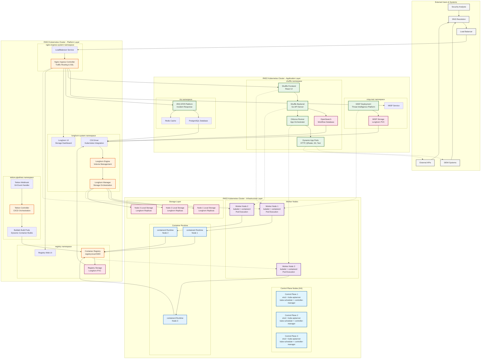
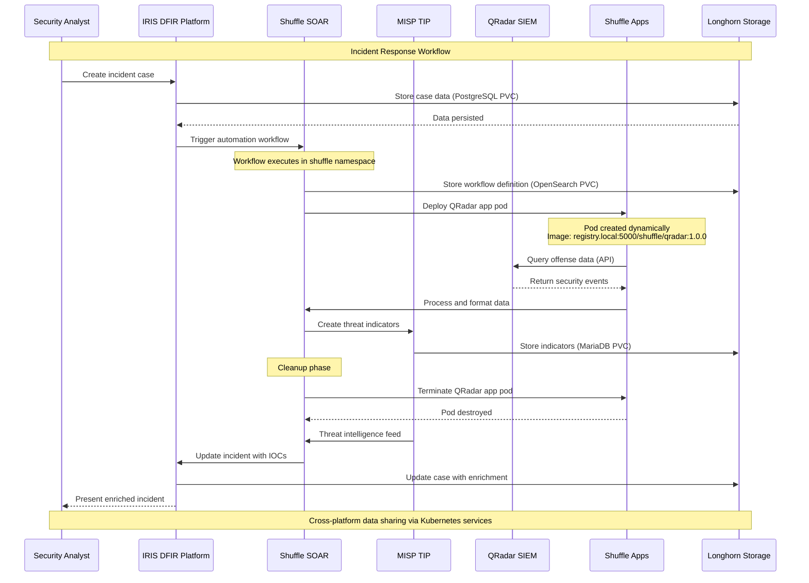

# Kubernetes Deployments - Infrastructure as Code

## Overview

Comprehensive Kubernetes deployment configurations for air-gapped environments, focusing on security platforms and supporting infrastructure on RKE2 clusters.

## Architecture

### RKE2 Multi-Tier Deployment Architecture


## Directory Structure

### Project Layout
```
projekte/k8s-deployments/
├── README.md                   # Deployment overview
├── buildah-ci/                # Container build pipelines (primary)
│   ├── buidah-task.yaml       # Tekton task definitions
│   ├── buildah-pipeline.yaml  # CI/CD pipeline
│   ├── buildah-pr.yaml       # Pull request builds
│   ├── docker-registry-2.3.0.tgz # Registry Helm chart
│   └── registry-conf.yaml    # Registry configuration
├── buildah/                   # Buildah configurations (duplicate)
│   └── [same structure as buildah-ci]
├── ingress-nginx/             # Ingress controller deployment
│   ├── README.md
│   ├── deployment-guide.md
│   ├── ingress-nginx-values.yaml
│   └── sample-ingress.yaml
├── longhorn/                  # Storage solution
│   └── values.yaml
├── misp-deployment-test/      # MISP test deployment
│   ├── Chart.yaml
│   ├── values.yaml
│   ├── docker/               # Container variants
│   └── templates/
├── shuffle-deployment/        # Shuffle platform deployment
│   ├── shuffle-values.yaml   # Helm values
│   ├── iris-values.yaml     # IRIS integration
│   └── longhorn-ingress.yaml # Storage ingress
└── [Additional configurations]
```

## Shuffle Platform Deployment

### Core Components
```yaml
# shuffle-values.yaml structure
shuffle:
  frontend:
    image: registry.local:5000/shuffle/frontend:1.4.0
    replicas: 2
    
  backend:
    image: registry.local:5000/shuffle/backend:1.4.0
    database:
      type: opensearch
      
  orborus:
    image: registry.local:5000/shuffle/orborus:1.4.0
    containerRuntime: kubernetes
```

### Storage Configuration
```yaml
# Longhorn integration
persistence:
  enabled: true
  storageClass: longhorn
  size: 20Gi
  accessMode: ReadWriteOnce

# Database persistence
database:
  persistence:
    enabled: true
    storageClass: longhorn
    size: 10Gi
```

### Network Configuration
```yaml
# Ingress configuration
ingress:
  enabled: true
  className: nginx
  annotations:
    nginx.ingress.kubernetes.io/ssl-redirect: "false"
    nginx.ingress.kubernetes.io/proxy-body-size: "100m"
  hosts:
    - host: shuffle.local
      paths:
        - path: /
          pathType: Prefix
```

## IRIS Integration

### IRIS DFIR Platform
```yaml
# iris-values.yaml
iris:
  app:
    image: registry.local:5000/iris/app:2.4.7
    database:
      type: postgresql
      host: iris-postgresql
      
  postgresql:
    enabled: true
    persistence:
      storageClass: longhorn
      size: 5Gi
      
  redis:
    enabled: true
    master:
      persistence:
        storageClass: longhorn
        size: 1Gi
```

### Security Platform Integration Flow in RKE2


### Namespace-Level Security Architecture
```mermaid
graph TB
    subgraph "RKE2 Cluster Security Boundaries"
        subgraph "misp-test namespace"
            MISP_PODS[MISP Pods<br/>Security Context: runAsUser 33<br/>Network Policy: Restricted]
        end
        
        subgraph "shuffle namespace"
            SHUFFLE_PODS[Shuffle Pods<br/>Security Context: runAsNonRoot<br/>Network Policy: App execution allowed]
            SHUFFLE_APPS_PODS[Dynamic App Pods<br/>Security Context: Isolated<br/>Network Policy: Egress to external systems]
        end
        
        subgraph "iris namespace"
            IRIS_PODS[IRIS Pods<br/>Security Context: runAsNonRoot<br/>Network Policy: Database access only]
        end
        
        subgraph "tekton-pipelines namespace"
            BUILD_PODS[Build Pods<br/>Security Context: privileged (buildah)<br/>Network Policy: Registry access only]
        end
        
        subgraph "nginx-ingress-system namespace"
            NGINX_PODS[Nginx Pods<br/>Security Context: Limited privileges<br/>Network Policy: All ingress traffic]
        end
        
        subgraph "longhorn-system namespace"
            STORAGE_PODS[Storage Pods<br/>Security Context: Host access required<br/>Network Policy: Node-level storage]
        end
        
        subgraph "registry namespace"
            REGISTRY_PODS[Registry Pods<br/>Security Context: runAsNonRoot<br/>Network Policy: Pull/push access]
        end
    end
    
    subgraph "Cross-Namespace Communication"
        RBAC[RBAC Policies<br/>Service Accounts<br/>Role Bindings]
        NP[Network Policies<br/>Ingress/Egress Rules]
        PSS[Pod Security Standards<br/>Admission Controller]
    end
    
    MISP_PODS --> RBAC
    SHUFFLE_PODS --> RBAC
    IRIS_PODS --> RBAC
    BUILD_PODS --> RBAC
    
    MISP_PODS --> NP
    SHUFFLE_PODS --> NP
    SHUFFLE_APPS_PODS --> NP
    IRIS_PODS --> NP
    
    RBAC --> PSS
    NP --> PSS
    
    classDef application fill:#e8f5e8,stroke:#1b5e20,stroke-width:2px
    classDef platform fill:#fff3e0,stroke:#e65100,stroke-width:2px
    classDef security fill:#ffebee,stroke:#c62828,stroke-width:2px
    
    class MISP_PODS,SHUFFLE_PODS,IRIS_PODS application
    class BUILD_PODS,NGINX_PODS,STORAGE_PODS,REGISTRY_PODS platform
    class RBAC,NP,PSS security
```

## CI/CD Pipeline Configuration

### Buildah Task Definition
```yaml
# buildah-task.yaml
apiVersion: tekton.dev/v1beta1
kind: Task
metadata:
  name: buildah-build
spec:
  params:
    - name: IMAGE
      description: Reference of the image buildah will produce
    - name: BUILDER_IMAGE
      description: The location of the buildah builder image
      default: quay.io/buildah/stable:v1.32.0
    - name: STORAGE_DRIVER
      description: Set buildah storage driver
      default: overlay
    - name: DOCKERFILE
      description: Path to the Dockerfile to build
      default: ./Dockerfile
    - name: CONTEXT
      description: Path to the build context
      default: .
    - name: TLSVERIFY
      description: Verify the TLS on the registry endpoint
      default: "false"
    - name: FORMAT
      description: The format of the built container
      default: "oci"
```

### Pipeline Definition
```yaml
# buildah-pipeline.yaml
apiVersion: tekton.dev/v1beta1
kind: Pipeline
metadata:
  name: build-and-deploy
spec:
  params:
    - name: git-url
      type: string
    - name: git-revision
      type: string
      default: main
    - name: image-reference
      type: string
  tasks:
    - name: fetch-source
      taskRef:
        name: git-clone
      params:
        - name: url
          value: $(params.git-url)
        - name: revision
          value: $(params.git-revision)
    - name: build-image
      taskRef:
        name: buildah-build
      runAfter:
        - fetch-source
      params:
        - name: IMAGE
          value: $(params.image-reference)
```

### Registry Configuration
```yaml
# registry-conf.yaml
apiVersion: v1
kind: ConfigMap
metadata:
  name: registry-config
data:
  config.yml: |
    version: 0.1
    log:
      fields:
        service: registry
    storage:
      filesystem:
        rootdirectory: /var/lib/registry
    http:
      addr: :5000
    health:
      storagedriver:
        enabled: true
        interval: 10s
        threshold: 3
```

## Security Hardening

### Pod Security Standards
```yaml
# Default pod security context
securityContext:
  runAsUser: 65534
  runAsGroup: 65534
  runAsNonRoot: true
  fsGroup: 65534
  seccompProfile:
    type: RuntimeDefault

# Container security context  
containerSecurityContext:
  runAsUser: 65534
  runAsGroup: 65534
  runAsNonRoot: true
  allowPrivilegeEscalation: false
  readOnlyRootFilesystem: true
  capabilities:
    drop: [ALL]
```

### Network Policies
```yaml
apiVersion: networking.k8s.io/v1
kind: NetworkPolicy
metadata:
  name: default-deny-all
spec:
  podSelector: {}
  policyTypes:
  - Ingress
  - Egress
---
apiVersion: networking.k8s.io/v1
kind: NetworkPolicy
metadata:
  name: allow-shuffle-communication
spec:
  podSelector:
    matchLabels:
      app: shuffle
  policyTypes:
  - Ingress
  - Egress
  ingress:
  - from:
    - podSelector:
        matchLabels:
          app: shuffle
  egress:
  - to:
    - podSelector:
        matchLabels:
          app: shuffle
```

### RBAC Configuration
```yaml
apiVersion: rbac.authorization.k8s.io/v1
kind: Role
metadata:
  name: shuffle-role
rules:
- apiGroups: [""]
  resources: ["pods", "pods/log", "services", "configmaps", "secrets"]
  verbs: ["get", "list", "watch", "create", "update", "patch", "delete"]
- apiGroups: ["apps"]
  resources: ["deployments", "replicasets"]
  verbs: ["get", "list", "watch", "create", "update", "patch", "delete"]
```

## Air-Gap Considerations

### Image Registry Setup
```bash
# Setup local registry
docker run -d \
  --restart=always \
  --name registry \
  -v /opt/registry:/var/lib/registry \
  -p 5000:5000 \
  registry:2

# Configure registry mirror
cat > /etc/rancher/k3s/registries.yaml << EOF
mirrors:
  docker.io:
    endpoint:
      - "http://registry.local:5000"
configs:
  "registry.local:5000":
    tls:
      insecure_skip_verify: true
EOF
```

### Image Management
```bash
# Pull images for offline use
docker pull ghcr.io/shuffle/shuffle-frontend:1.4.0
docker pull ghcr.io/shuffle/shuffle-backend:1.4.0
docker pull ghcr.io/shuffle/shuffle-orborus:1.4.0

# Tag and push to local registry
docker tag ghcr.io/shuffle/shuffle-frontend:1.4.0 registry.local:5000/shuffle/frontend:1.4.0
docker push registry.local:5000/shuffle/frontend:1.4.0
```

### Helm Chart Offline
```bash
# Package charts for offline use
helm package shuffle/
helm repo index . --url http://charts.local

# Install from local repository
helm repo add local http://charts.local
helm install shuffle local/shuffle --values values-airgap.yaml
```

## Monitoring & Observability

### Prometheus Configuration
```yaml
prometheus:
  enabled: true
  serviceMonitor:
    enabled: true
    interval: 30s
    scrapeTimeout: 10s
    
grafana:
  enabled: true
  dashboards:
    enabled: true
  persistence:
    enabled: true
    storageClass: longhorn
    size: 2Gi
```

### Logging Stack
```yaml
# Fluent Bit configuration
fluentbit:
  enabled: true
  input:
    systemd:
      enabled: true
  filter:
    kubernetes:
      enabled: true
  output:
    opensearch:
      enabled: true
      host: opensearch.logging.svc.cluster.local
```

## Backup & Recovery

### Velero Configuration
```yaml
velero:
  configuration:
    provider: aws
    backupStorageLocation:
      bucket: k8s-backups
      config:
        region: us-east-1
        s3Url: http://minio.storage:9000
        s3ForcePathStyle: true
        
  credentials:
    secretContents:
      cloud: |
        [default]
        aws_access_key_id = minio_access_key
        aws_secret_access_key = minio_secret_key
```

### Backup Schedules
```yaml
apiVersion: velero.io/v1
kind: Schedule
metadata:
  name: daily-backup
spec:
  schedule: "0 2 * * *"  # 2 AM daily
  template:
    includedNamespaces:
    - shuffle
    - misp
    - iris
    ttl: 720h  # 30 days
```

## Resource Management

### Resource Quotas
```yaml
apiVersion: v1
kind: ResourceQuota
metadata:
  name: compute-quota
spec:
  hard:
    requests.cpu: "20"
    requests.memory: 40Gi
    limits.cpu: "40"
    limits.memory: 80Gi
    persistentvolumeclaims: "20"
```

### Limit Ranges
```yaml
apiVersion: v1
kind: LimitRange
metadata:
  name: default-limits
spec:
  limits:
  - default:
      cpu: 500m
      memory: 512Mi
    defaultRequest:
      cpu: 100m
      memory: 128Mi
    type: Container
```

## Deployment Commands

### Initial Setup
```bash
# Navigate to deployments directory
cd projekte/k8s-deployments/

# Install ingress controller
helm upgrade --install ingress-nginx ingress-nginx/ingress-nginx \
  --namespace ingress-nginx --create-namespace \
  --values ingress-nginx/ingress-nginx-values.yaml

# Install Longhorn storage
helm upgrade --install longhorn longhorn/longhorn \
  --namespace longhorn-system --create-namespace \
  --values longhorn/values.yaml

# Deploy Shuffle platform
cd shuffle-deployment/
helm upgrade --install shuffle ./shuffle \
  --namespace shuffle --create-namespace \
  --values shuffle-values.yaml
```

### Application Deployment
```bash
# Deploy IRIS (from shuffle-deployment directory)
cd projekte/k8s-deployments/shuffle-deployment/
helm upgrade --install iris ./iris \
  --namespace iris --create-namespace \
  --values iris-values.yaml

# Deploy MISP Test
cd ../misp-deployment-test/
helm upgrade --install misp-test . \
  --namespace misp-test --create-namespace \
  --values values.yaml

# Deploy MISP Production  
cd ../../../misp/misp-main/
helm upgrade --install misp-prod . \
  --namespace misp-prod --create-namespace \
  --values values.yaml
```

### CI/CD Pipeline
```bash
# Navigate to buildah CI directory
cd projekte/k8s-deployments/buildah-ci/

# Apply Tekton resources
kubectl apply -f buidah-task.yaml
kubectl apply -f buildah-pipeline.yaml

# Create pipeline run
tkn pipeline start build-and-deploy \
  --param git-url=https://git.local/repo.git \
  --param image-reference=registry.local:5000/app:latest
  
# Build specific QRadar app
tkn task start buildah \
  --param IMAGE=registry.local:5000/shuffle/qradar:1.0.0 \
  --param CONTEXT=qradar_app/1.0.0 \
  --workspace name=source,claimName=build-workspace
```

## Troubleshooting

### Common Issues
1. **Image pull errors**: Verify registry configuration
2. **Storage issues**: Check Longhorn node status
3. **Network connectivity**: Review network policies
4. **Resource constraints**: Monitor resource usage

### Debug Commands
```bash
# Check cluster status
kubectl get nodes
kubectl get pods --all-namespaces

# Verify ingress
kubectl get ingress --all-namespaces
kubectl describe ingress shuffle -n shuffle

# Storage debugging
kubectl get pvc --all-namespaces
kubectl describe storageclass longhorn

# Network troubleshooting
kubectl get networkpolicies --all-namespaces
kubectl run debug --image=busybox -it --rm -- /bin/sh
```

## Related Documentation
- [[MISP-Deployment]]
- [[Shuffle-Apps]]
- [[Buildah-CICD]]
- [[Longhorn-Storage]]
- [[Ingress-Nginx]]