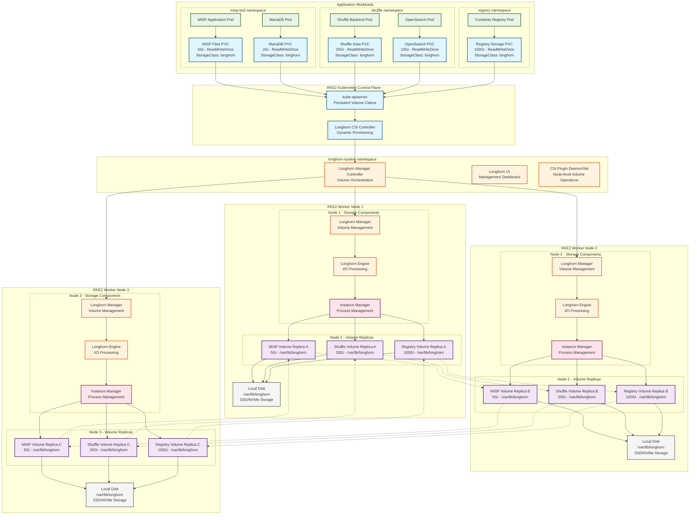
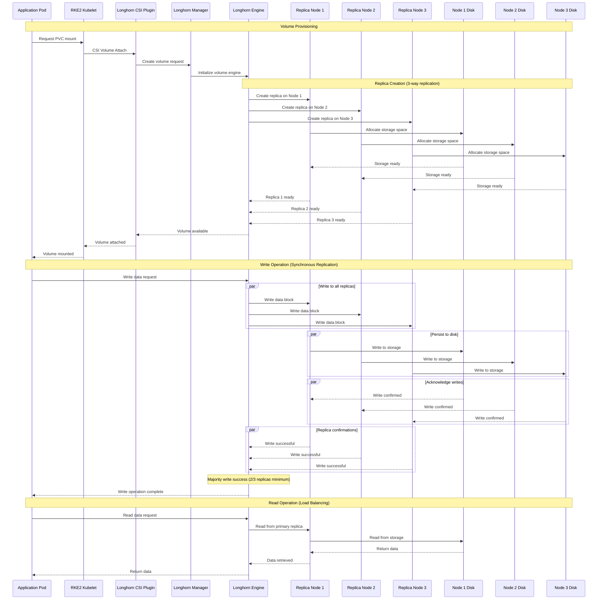

# Longhorn Storage - Distributed Block Storage

## Overview

Longhorn is a cloud-native distributed block storage system for Kubernetes, providing persistent storage for stateful applications in air-gapped RKE2 environments. It offers enterprise-grade features like snapshots, backups, and high availability.

## Architecture

### Longhorn Distributed Storage in RKE2 Cluster


### Longhorn Volume I/O Flow and Replication


### Longhorn High Availability and Disaster Recovery
```mermaid
graph TB
    subgraph "Healthy State - All Nodes Online"
        subgraph "Volume A (3 Replicas)"
            VOL_A[Volume A Engine<br/>Node 1 (Primary)]
            REP_A1[Replica A1<br/>Node 1 - Healthy]
            REP_A2[Replica A2<br/>Node 2 - Healthy]
            REP_A3[Replica A3<br/>Node 3 - Healthy]
        end
    end
    
    subgraph "Node Failure Scenario - Node 2 Offline"
        subgraph "Volume A (2/3 Replicas)"
            VOL_A_FAIL[Volume A Engine<br/>Node 1 (Primary)]
            REP_A1_FAIL[Replica A1<br/>Node 1 - Healthy]
            REP_A2_FAIL[Replica A2<br/>Node 2 - FAILED]
            REP_A3_FAIL[Replica A3<br/>Node 3 - Healthy]
        end
        
        DEGRADED_STATE["⚠️ Volume State: Degraded<br/>Available Replicas: 2/3<br/>Read/Write: Operational<br/>Data Protection: Reduced"]
    end
    
    subgraph "Auto-Recovery - New Node Added"
        subgraph "Volume A (3 Replicas Rebuilt)"
            VOL_A_RECOVER[Volume A Engine<br/>Node 1 (Primary)]
            REP_A1_RECOVER[Replica A1<br/>Node 1 - Healthy]
            REP_A2_RECOVER[Replica A2<br/>Node 4 - Rebuilding]
            REP_A3_RECOVER[Replica A3<br/>Node 3 - Healthy]
        end
        
        REBUILD_STATE["🔄 Volume State: Rebuilding<br/>Available Replicas: 2/3 → 3/3<br/>Background Sync: Active<br/>Performance: Temporary Impact"]
    end
    
    subgraph "Snapshot & Backup Strategy"
        SNAPSHOT["📸 Volume Snapshots<br/>Frequency: Every 6 hours<br/>Retention: 7 days<br/>Purpose: Point-in-time recovery"]
        
        BACKUP["💾 Off-cluster Backup<br/>Destination: S3/NFS<br/>Frequency: Daily<br/>Encryption: AES-256"]
        
        RESTORE["🔄 Disaster Recovery<br/>RTO: 15 minutes<br/>RPO: 6 hours<br/>Automation: Available"]
    end
    
    %% Healthy state connections
    VOL_A --> REP_A1
    VOL_A --> REP_A2
    VOL_A --> REP_A3
    
    %% Failure state connections
    VOL_A_FAIL --> REP_A1_FAIL
    VOL_A_FAIL -.x REP_A2_FAIL
    VOL_A_FAIL --> REP_A3_FAIL
    VOL_A_FAIL --> DEGRADED_STATE
    
    %% Recovery state connections
    VOL_A_RECOVER --> REP_A1_RECOVER
    VOL_A_RECOVER --> REP_A2_RECOVER
    VOL_A_RECOVER --> REP_A3_RECOVER
    VOL_A_RECOVER --> REBUILD_STATE
    
    %% Backup and recovery flow
    REP_A1 --> SNAPSHOT
    SNAPSHOT --> BACKUP
    BACKUP --> RESTORE
    
    %% Styling
    classDef healthy fill:#e8f5e8,stroke:#1b5e20,stroke-width:2px
    classDef degraded fill:#fff3e0,stroke:#e65100,stroke-width:2px
    classDef failed fill:#ffebee,stroke:#c62828,stroke-width:2px
    classDef recovery fill:#e3f2fd,stroke:#1565c0,stroke-width:2px
    classDef backup fill:#f3e5f5,stroke:#4a148c,stroke-width:2px
    
    class VOL_A,REP_A1,REP_A2,REP_A3,REP_A1_RECOVER,REP_A3_RECOVER healthy
    class VOL_A_FAIL,REP_A1_FAIL,REP_A3_FAIL,DEGRADED_STATE degraded
    class REP_A2_FAIL failed
    class VOL_A_RECOVER,REP_A2_RECOVER,REBUILD_STATE recovery
    class SNAPSHOT,BACKUP,RESTORE backup
```

## File Structure

### Longhorn Configuration Structure
```
projekte/k8s-deployments/longhorn/
└── values.yaml                # Longhorn Helm values configuration

projekte/k8s-deployments/shuffle-deployment/
├── longhorn-ingress.yaml      # Longhorn UI ingress (note: typo in longhron-ingress.yaml)
└── longhorn-values.yaml       # Shuffle-specific Longhorn values
```

**Note**: The current structure shows Longhorn configuration distributed across multiple locations. Consider centralizing under `projekte/k8s-deployments/longhorn/` for consistency.

### Ingress Configuration
```
apps/
├── longhorn-ingress.yaml     # Longhorn UI ingress
├── longhorn-values.yaml      # Deployment values
└── longhron-ingress.yaml    # Alternative ingress config (typo in original)
```

## Configuration

### Core Longhorn Values
```yaml
# values.yaml
longhorn:
  defaultSettings:
    # Storage path on nodes
    defaultDataPath: /var/lib/longhorn
    
    # Replica count for volumes
    defaultReplicaCount: 3
    
    # Guaranteed engine manager CPU
    guaranteedEngineManagerCPU: 12
    
    # Guaranteed replica manager CPU  
    guaranteedReplicaManagerCPU: 12
    
    # Create default disk automatically
    createDefaultDiskLabeledNodes: true
    
    # Default data locality
    defaultDataLocality: disabled
    
    # Replica soft anti-affinity
    replicaSoftAntiAffinity: false
    
    # Auto salvage
    autoSalvage: true
    
    # Auto delete pod with volume
    autoDeletePodWhenVolumeDetachedUnexpectedly: true
    
    # Disable scheduling on cordoned nodes
    disableSchedulingOnCordonedNode: true
    
    # Replica zone soft anti-affinity
    replicaZoneSoftAntiAffinity: true
    
    # Volume attachment recovery policy
    volumeAttachmentRecoveryPolicy: wait
    
    # Node down pod deletion policy
    nodeDownPodDeletionPolicy: delete-both-statefulset-and-deployment-pod
    
    # Allow node drain with last healthy replica
    allowNodeDrainWithLastHealthyReplica: false
    
    # MKfs ext4 parameters
    mkfsExt4Parameters: -O ^64bit,^metadata_csum
    
    # Disable replica rebuild
    disableReplicaRebuild: false
    
    # Replica replenishment wait interval
    replicaReplenishmentWaitInterval: 600
    
    # Concurrent replica rebuild per node limit
    concurrentReplicaRebuildPerNodeLimit: 5
    
    # Disable revision counter
    disableRevisionCounter: true
    
    # System managed pod image pull policy
    systemManagedPodsImagePullPolicy: if-not-present
    
    # Allow volume creation with degraded availability
    allowVolumeCreationWithDegradedAvailability: true
    
    # Auto cleanup system generated snapshot
    autoCleanupSystemGeneratedSnapshot: true
    
    # Concurrent automatic engine upgrade per node limit
    concurrentAutomaticEngineUpgradePerNodeLimit: 3
    
    # Backing image cleanup wait interval
    backingImageCleanupWaitInterval: 60
    
    # Backing image recovery wait interval
    backingImageRecoveryWaitInterval: 300
    
    # Guaranteed engine CPU
    guaranteedEngineCPU: 0.25
    
    # Guaranteed replica CPU
    guaranteedReplicaCPU: 0.25
    
    # Kubernetes cluster autoscaler enabled
    kubernetesClusterAutoscalerEnabled: false
    
    # Orphan auto deletion
    orphanAutoDeletion: true
    
    # Storage network
    storageNetwork: ""
    
    # Recurring successful jobs history limit
    recurringSuccessfulJobsHistoryLimit: 1
    
    # Recurring failed jobs history limit  
    recurringFailedJobsHistoryLimit: 1
    
    # Support bundle failed history limit
    supportBundleFailedHistoryLimit: 1
    
    # Deletion confirmation flag
    deletingConfirmationFlag: true
    
    # Engine replica timeout
    engineReplicaTimeout: 8
    
    # Snapshot data integrity immediate check after finishing
    snapshotDataIntegrityImmediateCheckAfterSnapshotCreation: false
    
    # Snapshot data integrity cronjob
    snapshotDataIntegrityCronjob: "0 0 */7 * *"
    
    # Remove snapshots during filesystem trim
    removeSnapshotsDuringFilesystemTrim: false
    
    # Fast replica rebuild enabled
    fastReplicaRebuildEnabled: false
    
    # Replica file sync http client timeout
    replicaFileSyncHttpClientTimeout: 30
```

### Storage Class Configuration
```yaml
# Default StorageClass
apiVersion: storage.k8s.io/v1
kind: StorageClass
metadata:
  name: longhorn
  annotations:
    storageclass.kubernetes.io/is-default-class: "true"
provisioner: driver.longhorn.io
allowVolumeExpansion: true
reclaimPolicy: Delete
volumeBindingMode: Immediate
parameters:
  numberOfReplicas: "3"
  staleReplicaTimeout: "2880"  # 48 hours
  fromBackup: ""
  diskSelector: ""
  nodeSelector: ""
  recurringJobSelector: ""
```

### High-Performance Storage Class
```yaml
apiVersion: storage.k8s.io/v1
kind: StorageClass
metadata:
  name: longhorn-fast
provisioner: driver.longhorn.io
allowVolumeExpansion: true
parameters:
  numberOfReplicas: "2"
  dataLocality: "best-effort"
  diskSelector: "ssd"
  nodeSelector: "storage=fast"
```

## Node Preparation

### Node Setup Script
```bash
#!/bin/bash
# prepare-node-longhorn.sh

# Install required packages
apt-get update
apt-get install -y open-iscsi util-linux

# Enable and start iscsid
systemctl enable iscsid
systemctl start iscsid

# Check if multipathd is running and disable if needed
if systemctl is-active --quiet multipathd; then
    echo "Disabling multipathd for Longhorn compatibility"
    systemctl disable multipathd
    systemctl stop multipathd
fi

# Create Longhorn data directory
mkdir -p /var/lib/longhorn
chmod 755 /var/lib/longhorn

# Verify kernel modules
modprobe dm_crypt
modprobe dm_snapshot
modprobe dm_mirror
modprobe dm_thin_pool

# Add modules to load at boot
cat >> /etc/modules-load.d/longhorn.conf << EOF
dm_crypt
dm_snapshot  
dm_mirror
dm_thin_pool
EOF

# Check disk requirements
echo "Checking disk space..."
df -h /var/lib/longhorn

# Verify block device availability
lsblk

echo "Node preparation complete for Longhorn"
```

### Node Labeling
```bash
# Label nodes for storage tiers
kubectl label nodes node-1 storage=fast
kubectl label nodes node-2 storage=fast  
kubectl label nodes node-3 storage=standard

# Label nodes with disk types
kubectl label nodes node-1 disk=ssd
kubectl label nodes node-2 disk=ssd
kubectl label nodes node-3 disk=hdd
```

## Deployment

### Automated Deployment Script  
```bash
#!/bin/bash
# deploy-longhorn-rke2.sh

set -e

NAMESPACE="longhorn-system"
CHART_VERSION="1.7.1"
RELEASE_NAME="longhorn"
CONFIG_DIR="projekte/k8s-deployments/longhorn"

echo "Deploying Longhorn ${CHART_VERSION} to ${NAMESPACE}"

# Navigate to configuration directory
cd $CONFIG_DIR

# Verify nodes are ready
echo "Checking node readiness..."
kubectl get nodes

# Check node requirements
echo "Verifying Longhorn requirements..."
for node in $(kubectl get nodes -o jsonpath='{.items[*].metadata.name}'); do
    echo "Checking node: $node"
    kubectl debug node/$node --image=busybox -it --rm -- \
        sh -c 'which iscsiadm && ls /sys/class/iscsi_host'
done

# Add Longhorn repository
helm repo add longhorn https://charts.longhorn.io
helm repo update

# Create namespace
kubectl create namespace $NAMESPACE --dry-run=client -o yaml | kubectl apply -f -

# Deploy Longhorn with updated values path
helm upgrade --install $RELEASE_NAME longhorn/longhorn \
    --namespace $NAMESPACE \
    --values values.yaml \
    --version $CHART_VERSION \
    --wait

# Verify deployment
echo "Verifying Longhorn deployment..."
kubectl get pods -n $NAMESPACE
kubectl get storageclass

# Create default storage class if not exists
kubectl patch storageclass longhorn \
    -p '{"metadata": {"annotations":{"storageclass.kubernetes.io/is-default-class":"true"}}}'

echo "Longhorn deployment complete!"
echo "Access UI: kubectl port-forward -n $NAMESPACE svc/longhorn-frontend 8080:80"

# Optional: Deploy ingress for UI access
echo "Deploying Longhorn UI ingress..."
cd ../shuffle-deployment/
kubectl apply -f longhorn-ingress.yaml
```

## UI Access Configuration

### Ingress Configuration
```yaml
# longhorn-ingress.yaml
apiVersion: networking.k8s.io/v1
kind: Ingress
metadata:
  name: longhorn-ingress
  namespace: longhorn-system
  annotations:
    nginx.ingress.kubernetes.io/ssl-redirect: "false"
    nginx.ingress.kubernetes.io/auth-type: basic
    nginx.ingress.kubernetes.io/auth-secret: longhorn-auth
    nginx.ingress.kubernetes.io/auth-realm: "Longhorn Storage"
spec:
  ingressClassName: nginx
  rules:
  - host: longhorn.local
    http:
      paths:
      - path: /
        pathType: Prefix
        backend:
          service:
            name: longhorn-frontend
            port:
              number: 80
```

### Authentication Secret
```yaml
apiVersion: v1
kind: Secret
metadata:
  name: longhorn-auth
  namespace: longhorn-system
type: Opaque
data:
  auth: YWRtaW46JGFwcjEkSDY1dnUxZS4kRC9IM3F4b0dVSXFlM3BkWW9PZTcw  # admin:admin123
```

## Backup Configuration

### S3 Backup Setup
```yaml
# Backup target configuration
apiVersion: v1
kind: Secret
metadata:
  name: minio-backup-secret
  namespace: longhorn-system
type: Opaque
data:
  AWS_ACCESS_KEY_ID: YWRtaW4=        # admin
  AWS_SECRET_ACCESS_KEY: cGFzc3dvcmQ=  # password
  AWS_ENDPOINTS: aHR0cDovL21pbmlvLnN0b3JhZ2U6OTAwMA==  # http://minio.storage:9000
```

### Recurring Backup Job
```yaml
apiVersion: longhorn.io/v1beta1
kind: RecurringJob
metadata:
  name: daily-backup
  namespace: longhorn-system
spec:
  cron: "0 2 * * *"  # 2 AM daily
  task: backup
  groups:
  - default
  retain: 7  # Keep 7 days
  concurrency: 2
```

## Volume Snapshots

### VolumeSnapshotClass
```yaml
apiVersion: snapshot.storage.k8s.io/v1
kind: VolumeSnapshotClass
metadata:
  name: longhorn-snapshot-vsc
driver: driver.longhorn.io
deletionPolicy: Delete
parameters:
  type: snap
```

### Snapshot Creation
```yaml
apiVersion: snapshot.storage.k8s.io/v1
kind: VolumeSnapshot
metadata:
  name: misp-data-snapshot
  namespace: misp
spec:
  volumeSnapshotClassName: longhorn-snapshot-vsc
  source:
    persistentVolumeClaimName: misp-data
```

## Monitoring

### ServiceMonitor for Prometheus
```yaml
apiVersion: monitoring.coreos.com/v1
kind: ServiceMonitor
metadata:
  name: longhorn-prometheus-servicemonitor
  namespace: longhorn-system
spec:
  selector:
    matchLabels:
      app: longhorn-manager
  endpoints:
  - port: manager
    interval: 30s
    path: /metrics
```

### Grafana Dashboard
```yaml
# Dashboard ConfigMap
apiVersion: v1
kind: ConfigMap
metadata:
  name: longhorn-dashboard
  namespace: monitoring
  labels:
    grafana_dashboard: "1"
data:
  longhorn.json: |
    {
      "dashboard": {
        "id": null,
        "title": "Longhorn Dashboard",
        "panels": [
          {
            "title": "Volume Usage",
            "type": "stat",
            "targets": [
              {
                "expr": "longhorn_volume_usage_bytes"
              }
            ]
          }
        ]
      }
    }
```

## Disaster Recovery

### Volume Backup and Restore
```bash
# Create backup
kubectl apply -f - <<EOF
apiVersion: longhorn.io/v1beta2
kind: Backup
metadata:
  name: misp-data-backup
  namespace: longhorn-system
spec:
  volumeName: pvc-misp-data
EOF

# Restore from backup
kubectl apply -f - <<EOF
apiVersion: v1
kind: PersistentVolumeClaim
metadata:
  name: misp-data-restored
  namespace: misp
spec:
  accessModes:
  - ReadWriteOnce
  resources:
    requests:
      storage: 5Gi
  storageClassName: longhorn
  dataSource:
    name: backup://backup-name
    kind: Backup
    apiGroup: longhorn.io
EOF
```

### Node Recovery
```bash
# Drain node for maintenance
kubectl drain node-1 --ignore-daemonsets --delete-emptydir-data

# Add replacement node
kubectl label nodes node-4 storage=standard
kubectl label nodes node-4 disk=ssd

# Verify replica redistribution
kubectl get volumes -n longhorn-system
```

## Performance Tuning

### Node-Level Optimizations
```bash
# I/O scheduler optimization
echo mq-deadline > /sys/block/sda/queue/scheduler

# File system optimization
mount -o noatime,nodiratime /dev/sdb1 /var/lib/longhorn

# Kernel parameters
echo 'vm.dirty_ratio = 5' >> /etc/sysctl.conf
echo 'vm.dirty_background_ratio = 2' >> /etc/sysctl.conf
sysctl -p
```

### Longhorn Performance Settings
```yaml
# High-performance configuration
longhorn:
  defaultSettings:
    # Faster rebuild
    concurrentReplicaRebuildPerNodeLimit: 10
    
    # Reduced replica timeout  
    engineReplicaTimeout: 4
    
    # Faster sync
    replicaFileSyncHttpClientTimeout: 10
    
    # Enable fast rebuild
    fastReplicaRebuildEnabled: true
    
    # Guaranteed resources
    guaranteedEngineCPU: 0.5
    guaranteedReplicaCPU: 0.5
```

## Security Hardening

### Network Policies
```yaml
apiVersion: networking.k8s.io/v1
kind: NetworkPolicy
metadata:
  name: longhorn-network-policy
  namespace: longhorn-system
spec:
  podSelector: {}
  policyTypes:
  - Ingress
  - Egress
  ingress:
  - from:
    - namespaceSelector:
        matchLabels:
          name: kube-system
    - namespaceSelector:
        matchLabels:
          name: longhorn-system
  - from:
    - podSelector: {}
  egress:
  - to: []
```

### Pod Security Policy
```yaml
apiVersion: policy/v1beta1
kind: PodSecurityPolicy
metadata:
  name: longhorn-psp
spec:
  privileged: true  # Required for storage operations
  allowPrivilegeEscalation: true
  hostNetwork: false
  hostIPC: false
  hostPID: false
  runAsUser:
    rule: RunAsAny
  seLinux:
    rule: RunAsAny
  volumes:
  - secret
  - configMap
  - emptyDir
  - hostPath
  - projected
```

## Troubleshooting

### Common Issues

#### Volume Attachment Failures
```bash
# Check volume status
kubectl get volumes -n longhorn-system
kubectl describe volume pvc-xxx -n longhorn-system

# Check engine and replica status
kubectl get engines -n longhorn-system
kubectl get replicas -n longhorn-system
```

#### Storage Performance Issues  
```bash
# Check node disk usage
kubectl top nodes
df -h /var/lib/longhorn

# Monitor I/O
iostat -x 1

# Check replica distribution
kubectl get replicas -n longhorn-system -o wide
```

#### Network Connectivity
```bash
# Test inter-node communication
kubectl exec -n longhorn-system manager-pod -- \
  nc -zv other-node-ip 8500

# Check iscsi connectivity
kubectl exec -n longhorn-system engine-pod -- \
  iscsiadm -m discovery -t sendtargets -p target-ip:3260
```

### Debug Commands
```bash
# Longhorn manager logs
kubectl logs -f daemonset/longhorn-manager -n longhorn-system

# CSI plugin logs  
kubectl logs -f daemonset/longhorn-csi-plugin -n longhorn-system

# Check volume state
curl -s http://longhorn-ui-ip/v1/volumes | jq .

# Support bundle generation
kubectl create -f https://raw.githubusercontent.com/longhorn/longhorn/master/deploy/longhorn-support-bundle.yaml
```

## Integration Points

### Application Integration
- **MISP**: 5Gi primary storage for application data
- **Shuffle**: 20Gi for workflow storage and databases  
- **Databases**: High-IOPS storage for MariaDB, PostgreSQL
- **Container Registry**: Large volume for image storage

### Backup Integration
- **MinIO S3**: Primary backup target
- **NFS**: Secondary backup for air-gapped environments
- **Velero**: Kubernetes-native backup integration

## Related Documentation
- [[Kubernetes-Deployments]]
- [[MISP-Deployment]]
- [[Shuffle-Apps]]
- [[Storage-Performance-Tuning]]