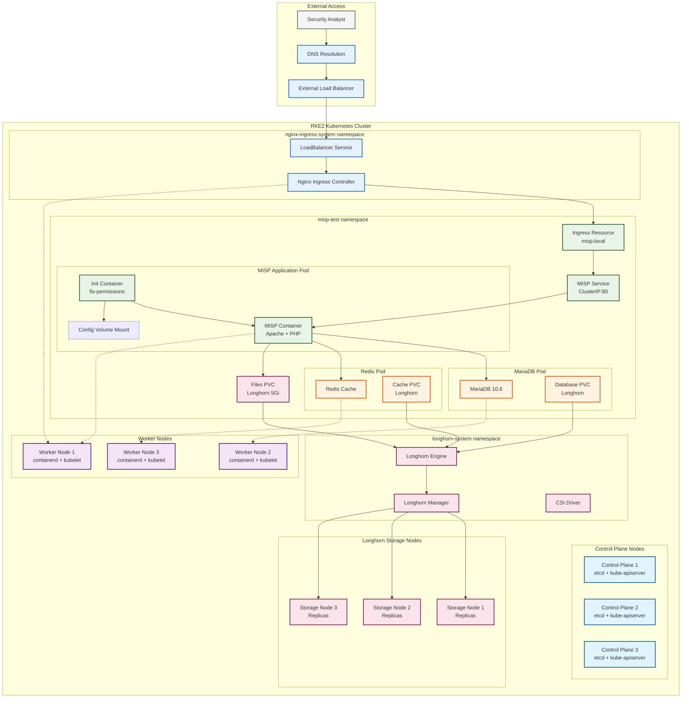
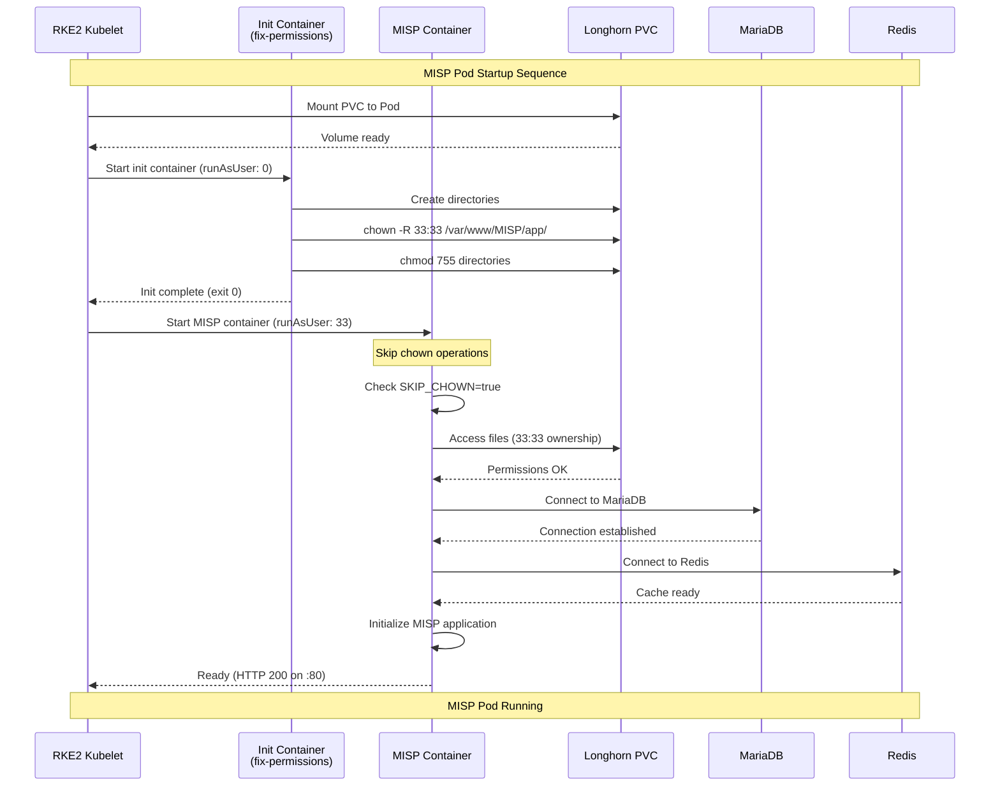
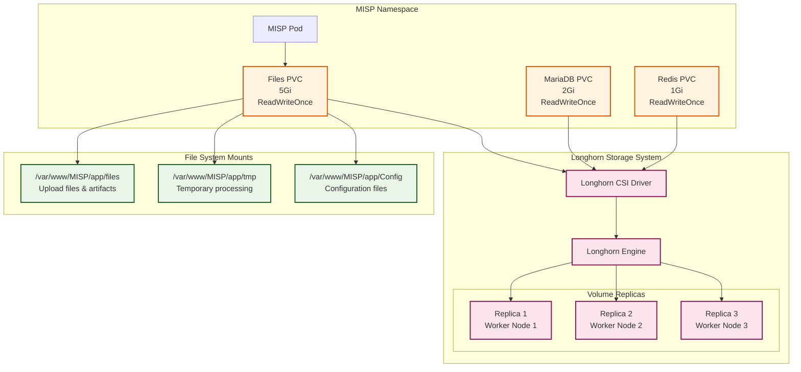

# MISP Deployment - Malware Information Sharing Platform

## Overview

MISP (Malware Information Sharing Platform) is a threat intelligence sharing platform deployed on RKE2 for collaborative threat analysis and incident response.

### Deployment Variants

#### Production Deployment (`misp/misp-main/`)
- Full-featured MISP with enterprise security
- Vault integration for secrets management
- OIDC authentication via Keycloak
- Advanced logging and monitoring

#### Test Deployment (`projekte/k8s-deployments/misp-deployment-test/`)
- Lightweight version for testing/development
- Simplified security contexts
- Basic authentication
- Local storage focus

#### Container Images (`misp/container-images-main-misp/`)
- Custom MISP container builds
- Multi-stage Dockerfile configurations
- Security-hardened base images
- Helper scripts for deployment

## Architecture

### RKE2 Cluster MISP Deployment


### MISP Container Initialization Flow


### Storage Architecture in RKE2


## File Structure

### Test Deployment
```
projekte/k8s-deployments/misp-deployment-test/
├── Chart.yaml                 # Helm chart metadata
├── values.yaml               # Default configuration
├── values-fix-permissions.yaml  # Permission fixes
├── templates/
│   ├── deployment.yaml       # Main MISP deployment
│   ├── service.yaml          # Service definition
│   ├── ingress.yaml          # Ingress configuration
│   ├── pvc.yaml             # Persistent volume claims
│   ├── secret.yaml          # Basic secrets
│   └── _helpers.tpl         # Template helpers
├── README.md                # Deployment guide
├── docker/                  # Container build variants
│   ├── Dockerfile.*         # Multiple Dockerfile variants
│   ├── entrypoint-*.sh     # Entry point scripts
│   └── build-*.sh          # Build automation
└── scripts/
    ├── deploy.sh           # Deployment script
    ├── check-storage.sh    # Storage verification
    └── force-cleanup.sh    # Cleanup script
```

### Production Deployment
```
misp/misp-main/
├── Chart.yaml              # Production Helm chart
├── values.yaml            # Production configuration
├── community-values.yaml  # Community edition config
├── templates/
│   ├── deployment.yaml    # Production deployment
│   ├── extra-certs.yaml  # Certificate management
│   ├── networkpolicy.yaml # Network security
│   ├── secret-vault.yaml # HashiCorp Vault integration
│   └── hpa.yaml          # Horizontal pod autoscaling
├── CHANGELOG.md           # Release notes
├── TESTS.md              # Testing procedures
└── README.md             # Production deployment guide
```

### Container Images
```
misp/container-images-main-misp/misp/
├── core/
│   ├── Dockerfile            # Multi-stage production build
│   └── files/
│       ├── entrypoint.sh    # Main entry point
│       ├── configure_misp.sh # MISP configuration
│       ├── utilities.sh     # Helper utilities
│       └── etc/             # Configuration files
└── helper_scripts/
    ├── misp-docker.sh       # Docker build helper
    └── misp-kaniko.sh       # Kaniko build helper
```

## Configuration

### Key Values (`values.yaml`)

#### MISP Configuration
```yaml
misp:
  image:
    repository: registry.gitlab.com/jupiter8595746/container-images/misp
    tag: "2.4.214"
    pullPolicy: IfNotPresent
  
  config:
    admin:
      email: admin@misp.local
      password: "admin123"  # Change for production
      orgName: "Test Organization"
    
    baseUrl: "http://misp.local"
    
    security:
      saltKey: "test-salt-key-change-me"
      enableCSP: false
      disableSSLRedirect: true
```

#### Security Context
```yaml
misp:
  securityContext:
    runAsUser: 33      # www-data
    runAsGroup: 33
    fsGroup: 33
    runAsNonRoot: true

  containerSecurityContext:
    runAsUser: 33
    runAsGroup: 33
    runAsNonRoot: true
    allowPrivilegeEscalation: false
    readOnlyRootFilesystem: false
    capabilities:
      drop: [ALL]
```

#### Storage Configuration
```yaml
misp:
  persistence:
    enabled: true
    storageClass: "longhorn"
    accessMode: ReadWriteOnce
    size: 5Gi
```

### Dependencies

#### MariaDB (Database)
```yaml
mariadb:
  enabled: true
  auth:
    rootPassword: "rootpassword"
    username: "misp"
    password: "misppassword"
    database: "misp"
  primary:
    persistence:
      storageClass: "longhorn"
      size: 2Gi
```

#### Redis (Cache)
```yaml
redis:
  enabled: true
  auth:
    enabled: false  # Simplified for testing
  master:
    persistence:
      enabled: true
      storageClass: "longhorn"
      size: 1Gi
```

## Permission Handling

### Problem
MISP container tries to `chown` files on mounted volumes, causing "Operation not permitted" errors in restrictive Kubernetes environments.

### Solution: Init Container Pattern
```yaml
initContainers:
  fixPermissions:
    enabled: true
    image:
      repository: busybox
      tag: "1.35"
    securityContext:
      runAsUser: 0          # Root for chown operations
      runAsNonRoot: false
      capabilities:
        add: [CHOWN, FOWNER]
    command:
      - /bin/sh
      - -c
      - |
        mkdir -p /var/www/MISP/app/{files,tmp,Config}
        chown -R 33:33 /var/www/MISP/app/{files,tmp,Config}
        chmod 755 /var/www/MISP/app/{files,tmp,Config}
```

### Environment Variables
```yaml
env:
  - name: SKIP_CHOWN
    value: "true"
  - name: SKIP_CHMOD
    value: "true" 
  - name: MISP_SKIP_OWNERSHIP
    value: "true"
```

## Deployment Commands

### Installation
```bash
# Navigate to test deployment directory
cd projekte/k8s-deployments/misp-deployment-test/

# Basic installation
helm install misp-test . -n misp-test --create-namespace

# With permission fixes
helm install misp-test . -n misp-test --create-namespace \
  --values values.yaml --values values-fix-permissions.yaml

# Custom domain
helm install misp-test . -n misp-test --create-namespace \
  --set ingress.hosts[0].host=misp.your-domain.com \
  --set misp.config.baseUrl=https://misp.your-domain.com

# Production deployment (from different location)
cd ../../../misp/misp-main/
helm install misp-prod . -n misp-prod --create-namespace \
  --values values.yaml
```

### Upgrade
```bash
# Apply configuration changes (test deployment)
cd projekte/k8s-deployments/misp-deployment-test/
helm upgrade misp-test . -n misp-test

# Upgrade with new values
helm upgrade misp-test . -n misp-test --values new-values.yaml

# Production deployment upgrade
cd ../../../misp/misp-main/
helm upgrade misp-prod . -n misp-prod --values values.yaml
```

### Access
```bash
# Port forwarding for testing
kubectl port-forward -n misp-test service/misp-test 8080:80

# Check deployment status
kubectl get pods,svc,ingress -n misp-test

# View logs
kubectl logs -f deployment/misp-test -n misp-test
```

## Troubleshooting

### Common Issues

#### Permission Errors
```bash
# Symptoms
chown: changing ownership of '/var/www/MISP/app/Config': Operation not permitted

# Solution
helm upgrade misp-test . -n misp-test --values values-fix-permissions.yaml
```

#### Pod Stuck in Init
```bash
# Check init container logs
kubectl logs misp-test-xxx -c wait-for-dependencies -n misp-test
kubectl logs misp-test-xxx -c fix-permissions -n misp-test

# Verify dependencies
kubectl get pods -l app.kubernetes.io/name=mariadb -n misp-test
kubectl get pods -l app.kubernetes.io/name=redis -n misp-test
```

#### Storage Issues
```bash
# Check PVC status
kubectl get pvc -n misp-test
kubectl describe pvc misp-test-data -n misp-test

# Verify Longhorn
kubectl get pods -n longhorn-system
```

### Debug Commands
```bash
# Exec into MISP container
kubectl exec -it deployment/misp-test -n misp-test -- /bin/bash

# Check file permissions
kubectl exec -it deployment/misp-test -n misp-test -- \
  ls -la /var/www/MISP/app/

# Database connectivity test
kubectl exec -it deployment/misp-test -n misp-test -- \
  mysql -h misp-test-mariadb -u misp -pmisppassword misp
```

## Security Considerations

### Test Environment
- Default passwords (change for production)
- TLS optional/disabled
- Simplified security contexts
- No advanced authentication

### Production Requirements
- Strong passwords and secrets management
- TLS/HTTPS enforcement
- OIDC integration
- Network policies
- Regular security updates

## Integration Points

### Data Sources
- Log ingestion from SIEM systems
- Threat feed integration
- API-based data sharing

### Outputs
- STIX/TAXII feeds
- REST API for automation
- Export formats (JSON, XML, CSV)

## Monitoring

### Health Checks
```yaml
livenessProbe:
  httpGet:
    path: /
    port: 8080
  initialDelaySeconds: 60

readinessProbe:
  httpGet:
    path: /
    port: 8080
  initialDelaySeconds: 30
```

### Metrics Collection
- Application logs via kubectl
- Database performance monitoring
- Storage utilization tracking

## Related Documentation
- [[Kubernetes-Deployments]]
- [[Longhorn-Storage]]
- [[Security-Hardening]]