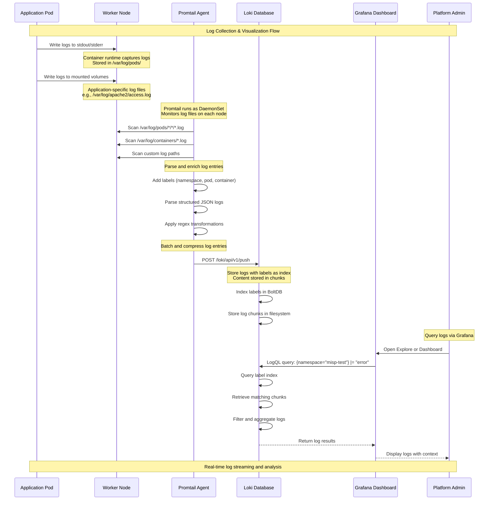

# Monitoring Stack - Observability Platform

## Overview

Comprehensive monitoring and observability stack for the security platform ecosystem, providing metrics collection, log aggregation, visualization, and alerting. Built on Grafana, Loki, and Promtail for centralized monitoring of MISP, Shuffle, Keycloak, and infrastructure components.

## Architecture

### Monitoring Stack in RKE2 Cluster

```mermaid
graph TB
    subgraph "External Access"
        ADMIN[Platform Administrator]
        SRE[Site Reliability Engineer]
        ALERTS[Alert Notifications<br/>Email/Slack/PagerDuty]
    end
    
    subgraph "RKE2 Kubernetes Cluster"
        subgraph "Control Plane Nodes"
            CP1[Control Plane 1<br/>etcd + kube-apiserver]
            CP2[Control Plane 2<br/>etcd + kube-apiserver]
            CP3[Control Plane 3<br/>etcd + kube-apiserver]
        end
        
        subgraph "Worker Nodes"
            W1[Worker Node 1<br/>containerd + kubelet]
            W2[Worker Node 2<br/>containerd + kubelet]
            W3[Worker Node 3<br/>containerd + kubelet]
        end
        
        subgraph "nginx-ingress-system namespace"
            NGINX_CTRL[Nginx Ingress Controller]
        end
        
        subgraph "monitoring namespace"
            subgraph "Visualization Layer"
                GRAFANA[Grafana Dashboard<br/>Port: 3000<br/>Data Source: Loki + Prometheus]
                GRAFANA_PVC[Grafana Storage<br/>Longhorn PVC 1Gi]
                GRAFANA_INGRESS[Ingress Resource<br/>grafana.idp.kubermatic.sva.dev]
            end
            
            subgraph "Log Aggregation Layer"
                LOKI[Loki Log Database<br/>SingleBinary Mode<br/>Port: 3100]
                LOKI_PVC[Loki Storage<br/>Longhorn PVC 10Gi<br/>BoltDB + Filesystem]
            end
            
            subgraph "Log Collection Layer (DaemonSet)"
                PROMTAIL_1[Promtail Agent<br/>Node 1<br/>Log Shipper]
                PROMTAIL_2[Promtail Agent<br/>Node 2<br/>Log Shipper]
                PROMTAIL_3[Promtail Agent<br/>Node 3<br/>Log Shipper]
            end
        end
        
        subgraph "prometheus namespace"
            subgraph "Metrics Collection"
                PROMETHEUS[Prometheus Server<br/>Metrics Database<br/>Port: 9090]
                PROMETHEUS_PVC[Prometheus Storage<br/>TSDB + WAL]
                KSM[Kube-State-Metrics<br/>K8s Metrics Exporter]
            end
            
            subgraph "Service Discovery"
                SERVICE_MONITORS[ServiceMonitor CRDs<br/>Target Discovery]
                POD_MONITORS[PodMonitor CRDs<br/>Pod Scraping]
            end
        end
        
        subgraph "Application Namespaces - Log Sources"
            subgraph "misp-test namespace"
                MISP_LOGS[MISP Application Logs<br/>/var/log/apache2/<br/>/var/www/MISP/app/tmp/logs/]
            end
            
            subgraph "shuffle namespace"
                SHUFFLE_LOGS[Shuffle Backend Logs<br/>stdout/stderr<br/>JSON structured logs]
                SHUFFLE_APP_LOGS[App Execution Logs<br/>Dynamic pod logs]
            end
            
            subgraph "keycloak namespace"
                KEYCLOAK_LOGS[Keycloak Auth Logs<br/>Quarkus logging<br/>Authentication events]
            end
            
            subgraph "tekton-pipelines namespace"
                BUILD_LOGS[CI/CD Pipeline Logs<br/>Buildah task logs<br/>Build artifacts]
            end
        end
        
        subgraph "longhorn-system namespace"
            LONGHORN_MGR[Longhorn Manager]
            LONGHORN_CSI[CSI Driver]
        end
    end
    
    %% External access
    ADMIN --> NGINX_CTRL
    SRE --> NGINX_CTRL
    
    %% Grafana access
    NGINX_CTRL --> GRAFANA_INGRESS
    GRAFANA_INGRESS --> GRAFANA
    GRAFANA --> GRAFANA_PVC
    
    %% Data source connections
    GRAFANA --> LOKI
    GRAFANA --> PROMETHEUS
    
    %% Log collection flow
    PROMTAIL_1 --> LOKI
    PROMTAIL_2 --> LOKI
    PROMTAIL_3 --> LOKI
    LOKI --> LOKI_PVC
    
    %% Log sources
    PROMTAIL_1 --> MISP_LOGS
    PROMTAIL_1 --> SHUFFLE_LOGS
    PROMTAIL_2 --> KEYCLOAK_LOGS
    PROMTAIL_2 --> BUILD_LOGS
    PROMTAIL_3 --> SHUFFLE_APP_LOGS
    
    %% Metrics collection
    PROMETHEUS --> KSM
    PROMETHEUS --> SERVICE_MONITORS
    PROMETHEUS --> POD_MONITORS
    PROMETHEUS --> PROMETHEUS_PVC
    
    %% Storage backend
    GRAFANA_PVC --> LONGHORN_CSI
    LOKI_PVC --> LONGHORN_CSI
    PROMETHEUS_PVC --> LONGHORN_CSI
    LONGHORN_CSI --> LONGHORN_MGR
    
    %% Alerting
    GRAFANA -.-> ALERTS
    PROMETHEUS -.-> ALERTS
    
    %% Pod placement
    GRAFANA -.-> W1
    LOKI -.-> W2
    PROMETHEUS -.-> W3
    PROMTAIL_1 -.-> W1
    PROMTAIL_2 -.-> W2
    PROMTAIL_3 -.-> W3
    
    %% Styling
    classDef external fill:#f5f5f5,stroke:#616161,stroke-width:2px
    classDef controlPlane fill:#e1f5fe,stroke:#01579b,stroke-width:2px
    classDef worker fill:#f3e5f5,stroke:#4a148c,stroke-width:2px
    classDef monitoring fill:#e8f5e8,stroke:#1b5e20,stroke-width:2px
    classDef metrics fill:#fff3e0,stroke:#e65100,stroke-width:2px
    classDef logs fill:#e3f2fd,stroke:#1565c0,stroke-width:2px
    classDef storage fill:#fce4ec,stroke:#880e4f,stroke-width:2px
    classDef applications fill:#f1f8e9,stroke:#33691e,stroke-width:2px
    
    class ADMIN,SRE,ALERTS external
    class CP1,CP2,CP3 controlPlane
    class W1,W2,W3 worker
    class GRAFANA,GRAFANA_PVC,GRAFANA_INGRESS monitoring
    class PROMETHEUS,PROMETHEUS_PVC,KSM,SERVICE_MONITORS,POD_MONITORS metrics
    class LOKI,LOKI_PVC,PROMTAIL_1,PROMTAIL_2,PROMTAIL_3 logs
    class LONGHORN_MGR,LONGHORN_CSI storage
    class MISP_LOGS,SHUFFLE_LOGS,KEYCLOAK_LOGS,BUILD_LOGS,SHUFFLE_APP_LOGS applications
```


### Log Collection and Processing Flow


## File Structure

### Monitoring Configuration Structure
```
projekte/k8s-deployments/monitoring/
├── grafana/                          # Grafana visualization
│   ├── grafana-9.2.9.tgz            # Grafana Helm chart
│   ├── grafana-values.yaml          # Grafana configuration
│   ├── promtail-6.17.0.tgz          # Promtail Helm chart
│   └── promtail-values.yaml         # Promtail configuration
└── loki/                            # Loki log aggregation
    ├── loki-6.30.1.tgz              # Loki Helm chart
    └── loki-values.yaml             # Loki configuration

projekte/k8s-deployments/prometheus/  # Prometheus metrics
├── 315.json                         # Grafana dashboard JSON
├── kube-state-metrics-6.1.0.tgz     # KSM Helm chart
├── prometheus-27.24.0.tgz           # Prometheus Helm chart
└── promtail-values.yaml             # Additional Promtail config
```

## Configuration

### Grafana Configuration
```yaml
# grafana/grafana-values.yaml
# Ingress configuration
ingress:
  enabled: true
  ingressClassName: nginx
  path: /
  pathType: Prefix
  hosts:
    - grafana.idp.kubermatic.sva.dev
  tls:
    - secretName: grafana.idp.kubermatic.sva.dev-tls
      hosts:
        - grafana.idp.kubermatic.sva.dev

# Disable init container for security
initChownData:
  enabled: false

# Persistent storage
persistence:
  enabled: true
  storageClassName: longhorn
  accessModes:
    - ReadWriteOnce
  size: 1Gi
  finalizers:
    - kubernetes.io/pvc-protection

# Security context
securityContext:
  runAsUser: 472
  runAsGroup: 472
  fsGroup: 472

# Data sources configuration
datasources:
  datasources.yaml:
    apiVersion: 1
    datasources:
      - name: Loki
        type: loki
        url: http://loki:3100
        isDefault: true
      - name: Prometheus
        type: prometheus
        url: http://prometheus:9090
        isDefault: false
```

### Loki Configuration
```yaml
# loki/loki-values.yaml
# Deployment mode for small-scale setup
deploymentMode: SingleBinary

singleBinary:
  replicas: 1
  resources:
    limits:
      cpu: 100m
      memory: 256Mi
    requests:
      cpu: 50m
      memory: 128Mi

# Disable testing
test:
  enabled: false

# Core Loki configuration
loki:
  auth_enabled: false
  image:
    pullPolicy: IfNotPresent

  commonConfig:
    replication_factor: 1

  # Filesystem storage backend
  storage:
    type: filesystem
    filesystem:
      directory: /var/loki

  # Schema configuration
  schemaConfig:
    configs:
      - from: "2024-01-01"
        store: boltdb-shipper
        object_store: filesystem
        schema: v11
        index:
          prefix: index_
          period: 24h

  # Retention and limits
  compactor:
    retention_enabled: false

  limits_config:
    allow_structured_metadata: false
    volume_enabled: false

# Disable microservices (single binary mode)
backend:
  replicas: 0
read:
  replicas: 0
write:
  replicas: 0
ingester:
  replicas: 0
querier:
  replicas: 0
queryFrontend:
  replicas: 0
queryScheduler:
  replicas: 0
distributor:
  replicas: 0
compactor:
  replicas: 0
indexGateway:
  replicas: 0
bloomCompactor:
  replicas: 0
bloomGateway:
  replicas: 0

# Disable external components
minio:
  enabled: false
gateway:
  enabled: false

# Storage configuration
write:
  persistence:
    enabled: true
    accessModes:
      - ReadWriteOnce
    size: 10Gi
    storageClassName: standard

# Monitoring disabled for simplified setup
serviceMonitor:
  enabled: false
chunksCache:
  enabled: false
resultsCache:
  enabled: false
lokiCanary:
  enabled: false
```

### Promtail Configuration
```yaml
# grafana/promtail-values.yaml
# DaemonSet configuration
daemonset:
  enabled: true

# Configuration for log collection
config:
  logLevel: info
  serverPort: 3101
  
  clients:
    - url: http://loki:3100/loki/api/v1/push
      tenant_id: ""
      
  positions:
    filename: /tmp/positions.yaml
    
  scrape_configs:
    # Kubernetes pod logs
    - job_name: kubernetes-pods
      kubernetes_sd_configs:
        - role: pod
      pipeline_stages:
        - cri: {}
      relabel_configs:
        - source_labels:
            - __meta_kubernetes_pod_controller_name
          regex: ([0-9a-z-.]+?)(-[0-9a-f]{8,10})?
          target_label: __tmp_controller_name
        - source_labels:
            - __meta_kubernetes_pod_label_app_kubernetes_io_name
            - __meta_kubernetes_pod_label_app
            - __tmp_controller_name
            - __meta_kubernetes_pod_name
          regex: ^;*([^;]+)(;.*)?$
          target_label: app
        - source_labels:
            - __meta_kubernetes_pod_label_app_kubernetes_io_instance
            - __meta_kubernetes_pod_label_instance
          regex: ^;*([^;]+)(;.*)?$
          target_label: instance
        - source_labels:
            - __meta_kubernetes_pod_label_app_kubernetes_io_component
            - __meta_kubernetes_pod_label_component
          regex: ^;*([^;]+)(;.*)?$
          target_label: component
        - action: replace
          source_labels:
            - __meta_kubernetes_namespace
          target_label: namespace
        - action: replace
          source_labels:
            - __meta_kubernetes_pod_name
          target_label: pod
        - action: replace
          source_labels:
            - __meta_kubernetes_pod_container_name
          target_label: container
        - action: replace
          replacement: /var/log/pods/*$1/*.log
          separator: /
          source_labels:
            - __meta_kubernetes_pod_uid
            - __meta_kubernetes_pod_container_name
          target_label: __path__

# Resource configuration
resources:
  limits:
    cpu: 200m
    memory: 128Mi
  requests:
    cpu: 100m
    memory: 64Mi

# Security context
securityContext:
  runAsUser: 0
  runAsGroup: 0
  privileged: false
  allowPrivilegeEscalation: false
  readOnlyRootFilesystem: true
  capabilities:
    drop:
      - ALL

# Volume mounts for log access
volumeMounts:
  - name: varlog
    mountPath: /var/log
    readOnly: true
  - name: varlibdockercontainers
    mountPath: /var/lib/docker/containers
    readOnly: true

volumes:
  - name: varlog
    hostPath:
      path: /var/log
  - name: varlibdockercontainers
    hostPath:
      path: /var/lib/docker/containers
```

### Prometheus Configuration
```yaml
# prometheus/prometheus-values.yaml (conceptual)
prometheus:
  prometheusSpec:
    retention: 15d
    retentionSize: 50GB
    
    resources:
      limits:
        cpu: 2000m
        memory: 4Gi
      requests:
        cpu: 500m
        memory: 2Gi
    
    storageSpec:
      volumeClaimTemplate:
        spec:
          storageClassName: longhorn
          accessModes: ["ReadWriteOnce"]
          resources:
            requests:
              storage: 50Gi
    
    serviceMonitorSelectorNilUsesHelmValues: false
    serviceMonitorSelector: {}
    podMonitorSelector: {}

# Kube-state-metrics configuration
kubeStateMetrics:
  enabled: true
  
nodeExporter:
  enabled: true
  
grafana:
  enabled: false  # Using separate Grafana deployment
  
alertmanager:
  enabled: true
  alertmanagerSpec:
    storage:
      volumeClaimTemplate:
        spec:
          storageClassName: longhorn
          accessModes: ["ReadWriteOnce"]
          resources:
            requests:
              storage: 5Gi
```

## Deployment Commands

### Install Monitoring Stack
```bash
# Create monitoring namespace
kubectl create namespace monitoring

# Deploy Loki
cd projekte/k8s-deployments/monitoring/loki/
helm install loki ./loki-6.30.1.tgz \
  --namespace monitoring \
  --values loki-values.yaml

# Deploy Promtail
cd ../grafana/
helm install promtail ./promtail-6.17.0.tgz \
  --namespace monitoring \
  --values promtail-values.yaml

# Deploy Grafana
helm install grafana ./grafana-9.2.9.tgz \
  --namespace monitoring \
  --values grafana-values.yaml

# Verify deployments
kubectl get pods,svc,pvc -n monitoring
```

### Install Prometheus Stack
```bash
# Create prometheus namespace
kubectl create namespace prometheus

# Deploy Prometheus
cd projekte/k8s-deployments/prometheus/
helm install prometheus ./prometheus-27.24.0.tgz \
  --namespace prometheus \
  --values prometheus-values.yaml

# Deploy Kube-State-Metrics
helm install kube-state-metrics ./kube-state-metrics-6.1.0.tgz \
  --namespace prometheus

# Verify prometheus deployment
kubectl get pods,svc -n prometheus
```

### Access Monitoring Services
```bash
# Access Grafana (via ingress or port-forward)
kubectl port-forward -n monitoring service/grafana 3000:80

# Access Loki directly
kubectl port-forward -n monitoring service/loki 3100:3100

# Access Prometheus
kubectl port-forward -n prometheus service/prometheus 9090:9090

# Check service status
kubectl get ingress -n monitoring
```

## Dashboard Configuration

### Security Platform Dashboards

#### MISP Dashboard
```json
{
  "dashboard": {
    "title": "MISP Platform Monitoring",
    "tags": ["security", "misp"],
    "panels": [
      {
        "title": "MISP Request Rate",
        "type": "graph",
        "targets": [
          {
            "expr": "rate(nginx_ingress_controller_requests_total{service=\"misp-test-service\"}[5m])",
            "legendFormat": "Requests/sec"
          }
        ]
      },
      {
        "title": "MISP Error Logs",
        "type": "logs",
        "targets": [
          {
            "expr": "{namespace=\"misp-test\"} |= \"ERROR\"",
            "refId": "A"
          }
        ]
      },
      {
        "title": "Database Connections",
        "type": "stat", 
        "targets": [
          {
            "expr": "mysql_global_status_threads_connected{service=\"misp-test-mariadb\"}"
          }
        ]
      }
    ]
  }
}
```

#### Shuffle Dashboard
```json
{
  "dashboard": {
    "title": "Shuffle SOAR Platform",
    "tags": ["security", "shuffle", "soar"],
    "panels": [
      {
        "title": "Workflow Execution Rate",
        "type": "graph",
        "targets": [
          {
            "expr": "increase(shuffle_workflows_executed_total[1h])",
            "legendFormat": "Workflows/hour"
          }
        ]
      },
      {
        "title": "App Pod Creation",
        "type": "graph",
        "targets": [
          {
            "expr": "rate(kube_pod_created{namespace=\"shuffle\",pod=~\".*-app-.*\"}[5m])",
            "legendFormat": "App Pods/sec"
          }
        ]
      },
      {
        "title": "Shuffle Backend Logs",
        "type": "logs",
        "targets": [
          {
            "expr": "{namespace=\"shuffle\",container=\"shuffle-backend\"} |= \"level=error\"",
            "refId": "A"
          }
        ]
      }
    ]
  }
}
```

#### Infrastructure Dashboard  
```json
{
  "dashboard": {
    "title": "RKE2 Cluster Infrastructure",
    "tags": ["infrastructure", "kubernetes", "rke2"],
    "panels": [
      {
        "title": "Node CPU Usage",
        "type": "graph",
        "targets": [
          {
            "expr": "100 - (avg by (instance) (rate(node_cpu_seconds_total{mode=\"idle\"}[5m])) * 100)",
            "legendFormat": "{{instance}}"
          }
        ]
      },
      {
        "title": "Longhorn Volume Health",
        "type": "stat",
        "targets": [
          {
            "expr": "longhorn_volume_state",
            "legendFormat": "{{volume}} - {{state}}"
          }
        ]
      },
      {
        "title": "Ingress Controller Performance",
        "type": "graph", 
        "targets": [
          {
            "expr": "histogram_quantile(0.95, rate(nginx_ingress_controller_request_duration_seconds_bucket[5m]))",
            "legendFormat": "95th percentile"
          }
        ]
      }
    ]
  }
}
```

## Log Parsing and Queries

### LogQL Query Examples

#### Application Logs
```bash
# MISP application errors
{namespace="misp-test"} |= "ERROR" | json | line_format "{{.timestamp}} [{{.level}}] {{.message}}"

# Shuffle workflow execution logs
{namespace="shuffle",container="shuffle-backend"} |= "workflow" | json | level="info"

# Keycloak authentication events
{namespace="keycloak"} |= "Login" | regex "user=(?P<user>[\\w]+)" | line_format "User: {{.user}}"

# CI/CD pipeline build logs  
{namespace="tekton-pipelines"} |= "buildah" | json | line_format "[{{.container}}] {{.message}}"
```

#### Infrastructure Logs
```bash
# Nginx ingress access logs
{namespace="nginx-ingress-system"} | json | status >= 400

# Longhorn storage events
{namespace="longhorn-system"} |= "volume" | json | level="warning"

# Container registry operations
{namespace="registry"} |= "push\\|pull" | regex "(?P<operation>push|pull)" | line_format "{{.operation}}: {{.image}}"
```

#### Security-focused Queries
```bash
# Authentication failures across all services
{} |= "authentication failed" or "login failed" or "unauthorized"

# Privilege escalation attempts
{} |= "sudo" or "privilege" or "escalation" | json | line_format "Security Event: {{.message}}"

# Network policy violations
{namespace=~"misp-test|shuffle|keycloak"} |= "NetworkPolicy" | json | level="warning"
```

## Alerting Configuration

### Grafana Alerting Rules
```yaml
# grafana-alerts.yaml
apiVersion: v1
kind: ConfigMap
metadata:
  name: grafana-alerts
  namespace: monitoring
data:
  alert-rules.yaml: |
    groups:
      - name: security-platform-alerts
        rules:
          - alert: MISPHighErrorRate
            expr: rate(nginx_ingress_controller_requests_total{service="misp-test-service",status=~"5.."}[5m]) > 0.1
            for: 5m
            labels:
              severity: warning
              service: misp
            annotations:
              summary: "High error rate in MISP platform"
              description: "MISP is experiencing {{ $value }} errors per second"
          
          - alert: ShuffleWorkflowFailures
            expr: rate(shuffle_workflows_failed_total[10m]) > 0
            for: 2m
            labels:
              severity: critical
              service: shuffle
            annotations:
              summary: "Shuffle workflows are failing"
              description: "{{ $value }} workflows failed in the last 10 minutes"
          
          - alert: KeycloakDown
            expr: up{job="keycloak"} == 0
            for: 1m
            labels:
              severity: critical
              service: keycloak
            annotations:
              summary: "Keycloak is down"
              description: "Keycloak authentication service is not responding"
          
          - alert: LonghornVolumeUnhealthy
            expr: longhorn_volume_state{state!="attached"} > 0
            for: 5m
            labels:
              severity: warning
              service: storage
            annotations:
              summary: "Longhorn volume unhealthy"
              description: "Volume {{ $labels.volume }} is in {{ $labels.state }} state"
```

### Alert Channels
```yaml
# notification-channels.yaml
notification_channels:
  - name: slack-security-ops
    type: slack
    settings:
      url: https://hooks.slack.com/services/xxx/yyy/zzz
      channel: "#security-operations"
      username: Grafana
      title: "Security Platform Alert"
      text: "{{ range .Alerts }}{{ .Annotations.summary }}{{ end }}"
  
  - name: email-admins
    type: email
    settings:
      addresses: "admin@company.local,security@company.local"
      subject: "[ALERT] Security Platform - {{ .GroupLabels.alertname }}"
```

## Performance Optimization

### Loki Optimization
```yaml
# Loki performance tuning
loki:
  limits_config:
    ingestion_rate_mb: 10
    ingestion_burst_size_mb: 20
    max_concurrent_tail: 20
    max_query_parallelism: 32
    
  chunk_store_config:
    chunk_cache_config:
      redis:
        endpoint: redis:6379
        expiration: 1h
        
  query_scheduler:
    max_outstanding_requests_per_tenant: 100
```

### Prometheus Optimization
```yaml
# Prometheus performance settings
prometheus:
  prometheusSpec:
    scrapeInterval: 30s
    evaluationInterval: 30s
    
    query:
      maxConcurrency: 20
      timeout: 2m
      
    storage:
      tsdb:
        retention_time: 15d
        wal_compression: true
```

## Backup and Recovery

### Configuration Backup
```bash
#!/bin/bash
# backup-monitoring.sh

NAMESPACE="monitoring"
BACKUP_DIR="/backup/monitoring/$(date +%Y%m%d)"
mkdir -p $BACKUP_DIR

# Backup Grafana dashboards and data sources
kubectl exec -n $NAMESPACE $(kubectl get pod -n $NAMESPACE -l app.kubernetes.io/name=grafana -o jsonpath='{.items[0].metadata.name}') -- \
  sqlite3 /var/lib/grafana/grafana.db ".backup /tmp/grafana.db"

kubectl cp $NAMESPACE/$(kubectl get pod -n $NAMESPACE -l app.kubernetes.io/name=grafana -o jsonpath='{.items[0].metadata.name}'):/tmp/grafana.db \
  $BACKUP_DIR/grafana.db

# Export Grafana configuration
kubectl get configmaps -n $NAMESPACE -o yaml > $BACKUP_DIR/grafana-configmaps.yaml
kubectl get secrets -n $NAMESPACE -o yaml > $BACKUP_DIR/grafana-secrets.yaml

# Backup Loki configuration
kubectl get configmap loki -n $NAMESPACE -o yaml > $BACKUP_DIR/loki-config.yaml
```

### Data Recovery
```bash
#!/bin/bash
# restore-monitoring.sh

NAMESPACE="monitoring"
BACKUP_DIR="/backup/monitoring/20241127"

# Restore Grafana database
kubectl cp $BACKUP_DIR/grafana.db \
  $NAMESPACE/$(kubectl get pod -n $NAMESPACE -l app.kubernetes.io/name=grafana -o jsonpath='{.items[0].metadata.name}'):/tmp/grafana.db

kubectl exec -n $NAMESPACE $(kubectl get pod -n $NAMESPACE -l app.kubernetes.io/name=grafana -o jsonpath='{.items[0].metadata.name}') -- \
  sqlite3 /var/lib/grafana/grafana.db ".restore /tmp/grafana.db"

# Restart Grafana pod
kubectl rollout restart deployment/grafana -n $NAMESPACE
```

## Troubleshooting

### Common Issues

#### Log Collection Problems
```bash
# Check Promtail status
kubectl get pods -n monitoring -l app.kubernetes.io/name=promtail
kubectl logs -n monitoring daemonset/promtail

# Verify log paths
kubectl exec -n monitoring promtail-xxx -- ls -la /var/log/pods/

# Test Loki connectivity from Promtail
kubectl exec -n monitoring promtail-xxx -- \
  curl -v http://loki:3100/loki/api/v1/push
```

#### Grafana Connection Issues
```bash
# Check Grafana pod status
kubectl get pods -n monitoring -l app.kubernetes.io/name=grafana
kubectl describe pod grafana-xxx -n monitoring

# Test data source connectivity
kubectl exec -it -n monitoring grafana-xxx -- \
  curl -f http://loki:3100/ready

kubectl exec -it -n monitoring grafana-xxx -- \
  curl -f http://prometheus.prometheus:9090/-/ready
```

#### Performance Issues
```bash
# Check resource usage
kubectl top pods -n monitoring
kubectl top pods -n prometheus

# Analyze slow queries
kubectl logs -n monitoring loki-xxx | grep "slow query"

# Check storage performance
kubectl exec -n longhorn-system longhorn-manager-xxx -- \
  longhorn-manager volume list
```

## Security Considerations

### Network Security
```yaml
# Network policy for monitoring namespace
apiVersion: networking.k8s.io/v1
kind: NetworkPolicy
metadata:
  name: monitoring-netpol
  namespace: monitoring
spec:
  podSelector: {}
  policyTypes:
    - Ingress
    - Egress
  ingress:
    - from:
        - namespaceSelector:
            matchLabels:
              name: nginx-ingress-system
      ports:
        - protocol: TCP
          port: 3000  # Grafana
    - from:
        - namespaceSelector: {}
      ports:
        - protocol: TCP
          port: 3100  # Loki
        - protocol: TCP
          port: 3101  # Promtail
  egress:
    - to: []
      ports:
        - protocol: TCP
          port: 53    # DNS
        - protocol: UDP
          port: 53    # DNS
    - to:
        - namespaceSelector:
            matchLabels:
              name: prometheus
      ports:
        - protocol: TCP
          port: 9090  # Prometheus
```

### RBAC Configuration
```yaml
# ServiceAccount for monitoring
apiVersion: v1
kind: ServiceAccount
metadata:
  name: monitoring-sa
  namespace: monitoring
---
apiVersion: rbac.authorization.k8s.io/v1
kind: ClusterRole
metadata:
  name: monitoring-reader
rules:
  - apiGroups: [""]
    resources: ["pods", "services", "endpoints", "nodes", "namespaces"]
    verbs: ["get", "list", "watch"]
  - apiGroups: ["apps"]
    resources: ["deployments", "replicasets", "daemonsets", "statefulsets"]
    verbs: ["get", "list", "watch"]
  - apiGroups: ["extensions"]
    resources: ["ingresses"]
    verbs: ["get", "list", "watch"]
---
apiVersion: rbac.authorization.k8s.io/v1
kind: ClusterRoleBinding
metadata:
  name: monitoring-binding
roleRef:
  apiGroup: rbac.authorization.k8s.io
  kind: ClusterRole
  name: monitoring-reader
subjects:
  - kind: ServiceAccount
    name: monitoring-sa
    namespace: monitoring
```

## Related Documentation
- [[Kubernetes-Deployments]]
- [[Security-Hardening]]
- [[Longhorn-Storage]]
- [[Prometheus-Metrics]]