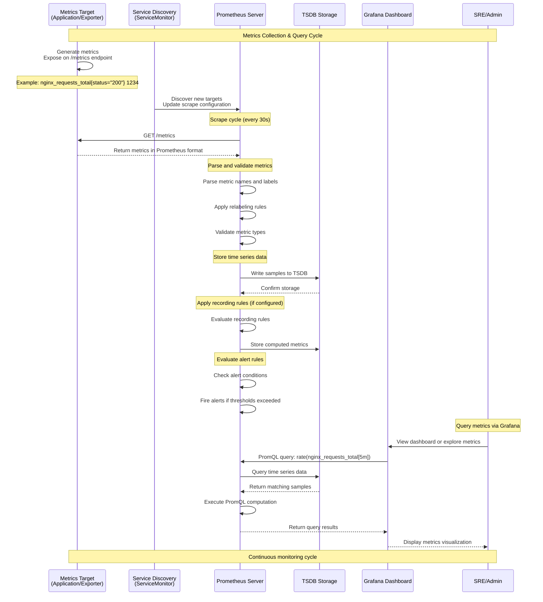

# Prometheus Metrics - Time Series Monitoring

## Overview

Prometheus-based metrics collection and monitoring system for the security platform ecosystem. Provides time-series data collection, alerting, and integration with Grafana for comprehensive infrastructure and application monitoring.

## Architecture

### Prometheus Metrics Collection in RKE2 Cluster

```mermaid
graph TB
    subgraph "External Monitoring Access"
        SRE[Site Reliability Engineer]
        MONITORING_TOOLS[External Monitoring Tools<br/>PagerDuty/Datadog]
        ALERT_MANAGER[Alert Manager<br/>Notification Gateway]
    end
    
    subgraph "RKE2 Kubernetes Cluster"
        subgraph "Control Plane Nodes"
            CP1[Control Plane 1<br/>etcd + kube-apiserver]
            CP2[Control Plane 2<br/>etcd + kube-apiserver] 
            CP3[Control Plane 3<br/>etcd + kube-apiserver]
            
            subgraph "Control Plane Metrics"
                ETCD_METRICS[etcd Metrics<br/>:2379/metrics]
                APISERVER_METRICS[kube-apiserver Metrics<br/>:6443/metrics]
                SCHEDULER_METRICS[kube-scheduler Metrics<br/>:10259/metrics]
                CONTROLLER_METRICS[kube-controller-manager<br/>:10257/metrics]
            end
        end
        
        subgraph "Worker Nodes"
            W1[Worker Node 1<br/>kubelet + containerd]
            W2[Worker Node 2<br/>kubelet + containerd]
            W3[Worker Node 3<br/>kubelet + containerd]
            
            subgraph "Node-level Metrics (DaemonSet)"
                NODE_EXP_1[Node Exporter<br/>Node 1 - :9100/metrics]
                NODE_EXP_2[Node Exporter<br/>Node 2 - :9100/metrics]
                NODE_EXP_3[Node Exporter<br/>Node 3 - :9100/metrics]
                CADVISOR_1[cAdvisor<br/>Node 1 - :4194/metrics]
                CADVISOR_2[cAdvisor<br/>Node 2 - :4194/metrics]
                CADVISOR_3[cAdvisor<br/>Node 3 - :4194/metrics]
            end
        end
        
        subgraph "prometheus namespace"
            subgraph "Metrics Collection Core"
                PROMETHEUS[Prometheus Server<br/>TSDB + Query Engine<br/>Port: 9090]
                PROMETHEUS_PVC[Prometheus Storage<br/>Longhorn PVC 50Gi<br/>Time Series Database]
                PROMETHEUS_CONFIG[Prometheus ConfigMap<br/>Scrape Configs<br/>Recording Rules<br/>Alert Rules]
            end
            
            subgraph "Service Discovery"
                KSM[Kube-State-Metrics<br/>K8s Object Metrics<br/>Port: 8080]
                SERVICE_MONITORS[ServiceMonitor CRDs<br/>Application Target Discovery]
                POD_MONITORS[PodMonitor CRDs<br/>Pod-level Target Discovery]
            end
            
            subgraph "Alerting"
                ALERTMANAGER[AlertManager<br/>Alert Routing & Notification<br/>Port: 9093]
                AM_CONFIG[AlertManager Config<br/>Routing Rules<br/>Notification Channels]
                AM_PVC[AlertManager Storage<br/>Longhorn PVC 5Gi]
            end
        end
        
        subgraph "Application Metrics Sources"
            subgraph "misp-test namespace"
                MISP_METRICS[MISP Application Metrics<br/>Apache mod_status<br/>PHP-FPM metrics<br/>MariaDB metrics]
            end
            
            subgraph "shuffle namespace" 
                SHUFFLE_METRICS[Shuffle Backend Metrics<br/>Go runtime metrics<br/>Workflow execution metrics<br/>App pod metrics]
            end
            
            subgraph "keycloak namespace"
                KEYCLOAK_METRICS[Keycloak Metrics<br/>Quarkus metrics<br/>Authentication metrics<br/>Database metrics]
            end
            
            subgraph "nginx-ingress-system namespace"
                NGINX_METRICS[Nginx Ingress Metrics<br/>Request rates<br/>Response times<br/>Error rates]
            end
            
            subgraph "longhorn-system namespace"
                LONGHORN_METRICS[Longhorn Storage Metrics<br/>Volume health<br/>I/O performance<br/>Replica status]
            end
            
            subgraph "tekton-pipelines namespace"
                TEKTON_METRICS[Tekton CI/CD Metrics<br/>Pipeline execution<br/>Task success rates<br/>Build duration]
            end
        end
        
        subgraph "monitoring namespace"
            GRAFANA[Grafana Dashboard<br/>Prometheus Data Source<br/>Visualization]
        end
    end
    
    %% External access
    SRE --> PROMETHEUS
    ALERTMANAGER --> ALERT_MANAGER
    ALERT_MANAGER --> MONITORING_TOOLS
    
    %% Prometheus data source connection
    GRAFANA --> PROMETHEUS
    
    %% Prometheus core connections
    PROMETHEUS --> PROMETHEUS_PVC
    PROMETHEUS --> PROMETHEUS_CONFIG
    PROMETHEUS --> ALERTMANAGER
    ALERTMANAGER --> AM_CONFIG
    ALERTMANAGER --> AM_PVC
    
    %% Service discovery
    PROMETHEUS --> SERVICE_MONITORS
    PROMETHEUS --> POD_MONITORS
    PROMETHEUS --> KSM
    
    %% Control plane scraping
    PROMETHEUS --> ETCD_METRICS
    PROMETHEUS --> APISERVER_METRICS
    PROMETHEUS --> SCHEDULER_METRICS
    PROMETHEUS --> CONTROLLER_METRICS
    
    %% Node-level scraping
    PROMETHEUS --> NODE_EXP_1
    PROMETHEUS --> NODE_EXP_2
    PROMETHEUS --> NODE_EXP_3
    PROMETHEUS --> CADVISOR_1
    PROMETHEUS --> CADVISOR_2
    PROMETHEUS --> CADVISOR_3
    
    %% Application metrics scraping
    PROMETHEUS --> MISP_METRICS
    PROMETHEUS --> SHUFFLE_METRICS
    PROMETHEUS --> KEYCLOAK_METRICS
    PROMETHEUS --> NGINX_METRICS
    PROMETHEUS --> LONGHORN_METRICS
    PROMETHEUS --> TEKTON_METRICS
    
    %% Node associations
    NODE_EXP_1 -.-> W1
    NODE_EXP_2 -.-> W2
    NODE_EXP_3 -.-> W3
    CADVISOR_1 -.-> W1
    CADVISOR_2 -.-> W2
    CADVISOR_3 -.-> W3
    
    %% Pod placement
    PROMETHEUS -.-> W1
    KSM -.-> W2
    ALERTMANAGER -.-> W3
    
    %% Styling
    classDef external fill:#f5f5f5,stroke:#616161,stroke-width:2px
    classDef controlPlane fill:#e1f5fe,stroke:#01579b,stroke-width:2px
    classDef worker fill:#f3e5f5,stroke:#4a148c,stroke-width:2px
    classDef prometheus fill:#e8f5e8,stroke:#1b5e20,stroke-width:2px
    classDef discovery fill:#fff3e0,stroke:#e65100,stroke-width:2px
    classDef applications fill:#e3f2fd,stroke:#1565c0,stroke-width:2px
    classDef nodeMetrics fill:#fce4ec,stroke:#880e4f,stroke-width:2px
    classDef alerting fill:#ffebee,stroke:#c62828,stroke-width:2px
    
    class SRE,MONITORING_TOOLS,ALERT_MANAGER external
    class CP1,CP2,CP3,ETCD_METRICS,APISERVER_METRICS,SCHEDULER_METRICS,CONTROLLER_METRICS controlPlane
    class W1,W2,W3 worker
    class PROMETHEUS,PROMETHEUS_PVC,PROMETHEUS_CONFIG prometheus
    class KSM,SERVICE_MONITORS,POD_MONITORS discovery
    class MISP_METRICS,SHUFFLE_METRICS,KEYCLOAK_METRICS,NGINX_METRICS,LONGHORN_METRICS,TEKTON_METRICS applications
    class NODE_EXP_1,NODE_EXP_2,NODE_EXP_3,CADVISOR_1,CADVISOR_2,CADVISOR_3 nodeMetrics
    class ALERTMANAGER,AM_CONFIG,AM_PVC alerting
```


### Metrics Collection and Query Flow


## File Structure

### Prometheus Configuration Structure
```
projekte/k8s-deployments/prometheus/
├── 315.json                         # Grafana dashboard (Kubernetes overview)
├── kube-state-metrics-6.1.0.tgz     # KSM Helm chart 
├── prometheus-27.24.0.tgz           # Prometheus Helm chart
└── promtail-values.yaml             # Promtail configuration (duplicate)
```

## Configuration

### Prometheus Values Configuration
```yaml
# prometheus-values.yaml (example structure)
prometheus:
  prometheusSpec:
    # Data retention
    retention: 15d
    retentionSize: 50GB
    
    # Resource allocation
    resources:
      limits:
        cpu: 2000m
        memory: 4Gi
      requests:
        cpu: 500m
        memory: 2Gi
    
    # Storage configuration
    storageSpec:
      volumeClaimTemplate:
        spec:
          storageClassName: longhorn
          accessModes: ["ReadWriteOnce"]
          resources:
            requests:
              storage: 50Gi
    
    # Scrape configuration
    scrapeInterval: 30s
    evaluationInterval: 30s
    
    # Service monitor selection
    serviceMonitorSelectorNilUsesHelmValues: false
    serviceMonitorSelector: {}
    podMonitorSelector: {}
    
    # External labels
    externalLabels:
      cluster: rke2-security-platform
      environment: production
    
    # Query settings
    query:
      maxConcurrency: 20
      timeout: 2m
    
    # Alert manager integration
    alerting:
      alertmanagers:
        - kubernetes_sd_configs:
          - role: pod
          relabel_configs:
          - source_labels: [__meta_kubernetes_namespace]
            regex: prometheus
            action: keep
          - source_labels: [__meta_kubernetes_pod_label_app_kubernetes_io_name]
            regex: alertmanager
            action: keep

# Alert Manager configuration  
alertmanager:
  enabled: true
  alertmanagerSpec:
    # Resource allocation
    resources:
      limits:
        cpu: 100m
        memory: 256Mi
      requests:
        cpu: 50m
        memory: 128Mi
    
    # Storage
    storage:
      volumeClaimTemplate:
        spec:
          storageClassName: longhorn
          accessModes: ["ReadWriteOnce"]
          resources:
            requests:
              storage: 5Gi
    
    # Configuration
    configSecret: alertmanager-config
    
# Node Exporter configuration
nodeExporter:
  enabled: true
  serviceMonitor:
    enabled: true
    interval: 30s
  
# Kube-state-metrics
kubeStateMetrics:
  enabled: true
  
# Grafana integration (disabled - using separate deployment)
grafana:
  enabled: false
```

### Kube-State-Metrics Configuration  
```yaml
# kube-state-metrics-values.yaml
# Resource configuration
resources:
  limits:
    cpu: 100m
    memory: 256Mi
  requests:
    cpu: 10m
    memory: 128Mi

# Security context
securityContext:
  runAsUser: 65534
  runAsGroup: 65534
  runAsNonRoot: true
  fsGroup: 65534

# Service monitor
prometheus:
  monitor:
    enabled: true
    interval: 30s
    scrapeTimeout: 10s
    honorLabels: true
    
# Collectors configuration
collectors:
  - certificatesigningrequests
  - configmaps
  - cronjobs
  - daemonsets
  - deployments
  - endpoints
  - horizontalpodautoscalers
  - ingresses
  - jobs
  - limitranges
  - mutatingwebhookconfigurations
  - namespaces
  - networkpolicies
  - nodes
  - persistentvolumeclaims
  - persistentvolumes
  - poddisruptionbudgets
  - pods
  - replicasets
  - replicationcontrollers
  - resourcequotas
  - secrets
  - services
  - statefulsets
  - storageclasses
  - validatingwebhookconfigurations
  - volumeattachments

# Namespace filtering
namespaces:
  - misp-test
  - shuffle
  - keycloak
  - monitoring
  - prometheus
  - nginx-ingress-system
  - longhorn-system
  - tekton-pipelines
  - registry
```

### Recording Rules Configuration
```yaml
# prometheus-recording-rules.yaml
apiVersion: monitoring.coreos.com/v1
kind: PrometheusRule
metadata:
  name: security-platform-recording-rules
  namespace: prometheus
spec:
  groups:
    - name: security.platform.recording
      interval: 30s
      rules:
        # Application-level aggregations
        - record: misp:request_rate_5m
          expr: rate(nginx_ingress_controller_requests_total{service="misp-test-service"}[5m])
        
        - record: misp:error_rate_5m
          expr: rate(nginx_ingress_controller_requests_total{service="misp-test-service",status=~"5.."}[5m])
        
        - record: shuffle:workflow_execution_rate_5m
          expr: rate(shuffle_workflows_executed_total[5m])
          
        - record: shuffle:workflow_success_rate_5m
          expr: rate(shuffle_workflows_successful_total[5m]) / rate(shuffle_workflows_executed_total[5m])
        
        - record: keycloak:authentication_rate_5m
          expr: rate(keycloak_logins_total[5m])
          
        - record: keycloak:authentication_failure_rate_5m
          expr: rate(keycloak_login_failures_total[5m])
          
        # Infrastructure-level aggregations
        - record: cluster:cpu_utilization
          expr: |
            100 * (
              1 - avg(rate(node_cpu_seconds_total{mode="idle"}[5m]))
            )
            
        - record: cluster:memory_utilization
          expr: |
            100 * (
              1 - (
                node_memory_MemAvailable_bytes / node_memory_MemTotal_bytes
              )
            )
            
        - record: cluster:disk_utilization
          expr: |
            100 * (
              1 - (
                node_filesystem_avail_bytes{fstype!="tmpfs"} / 
                node_filesystem_size_bytes{fstype!="tmpfs"}
              )
            )
            
        # Storage-specific rules
        - record: longhorn:volume_health_ratio
          expr: |
            (
              count(longhorn_volume_state{state="attached"}) /
              count(longhorn_volume_state)
            )
            
        - record: longhorn:replica_health_ratio  
          expr: |
            (
              count(longhorn_volume_replica_state{state="running"}) /
              count(longhorn_volume_replica_state)
            )
```

### Alert Rules Configuration
```yaml
# prometheus-alert-rules.yaml
apiVersion: monitoring.coreos.com/v1
kind: PrometheusRule
metadata:
  name: security-platform-alerts
  namespace: prometheus
spec:
  groups:
    - name: security.platform.critical
      rules:
        - alert: MISPServiceDown
          expr: up{job="misp-test-service"} == 0
          for: 1m
          labels:
            severity: critical
            service: misp
          annotations:
            summary: "MISP service is down"
            description: "MISP threat intelligence platform is not responding"
            
        - alert: ShuffleServiceDown
          expr: up{job="shuffle-backend"} == 0
          for: 1m
          labels:
            severity: critical
            service: shuffle
          annotations:
            summary: "Shuffle SOAR service is down"
            description: "Shuffle backend service is not responding"
            
        - alert: KeycloakServiceDown
          expr: up{job="keycloak"} == 0
          for: 1m
          labels:
            severity: critical
            service: keycloak
          annotations:
            summary: "Keycloak authentication service is down"
            description: "Identity and access management service is not responding"
            
    - name: security.platform.warning
      rules:
        - alert: MISPHighErrorRate
          expr: misp:error_rate_5m > 0.05
          for: 5m
          labels:
            severity: warning
            service: misp
          annotations:
            summary: "High error rate in MISP platform"
            description: "MISP is experiencing {{ $value | humanizePercentage }} error rate"
            
        - alert: ShuffleWorkflowFailures
          expr: shuffle:workflow_success_rate_5m < 0.9
          for: 10m
          labels:
            severity: warning
            service: shuffle
          annotations:
            summary: "Shuffle workflow success rate is low"
            description: "Only {{ $value | humanizePercentage }} of workflows are succeeding"
            
        - alert: KeycloakHighAuthFailureRate
          expr: keycloak:authentication_failure_rate_5m / keycloak:authentication_rate_5m > 0.1
          for: 5m
          labels:
            severity: warning
            service: keycloak
          annotations:
            summary: "High authentication failure rate"
            description: "{{ $value | humanizePercentage }} of authentication attempts are failing"
            
    - name: infrastructure.critical
      rules:
        - alert: NodeDown
          expr: up{job="node-exporter"} == 0
          for: 5m
          labels:
            severity: critical
            component: infrastructure
          annotations:
            summary: "Node {{ $labels.instance }} is down"
            description: "Worker node has been unreachable for more than 5 minutes"
            
        - alert: LonghornVolumeUnhealthy
          expr: longhorn_volume_state{state!="attached"} > 0
          for: 5m
          labels:
            severity: critical
            component: storage
          annotations:
            summary: "Longhorn volume unhealthy"
            description: "Volume {{ $labels.volume }} is in {{ $labels.state }} state"
            
        - alert: EtcdDown
          expr: up{job="etcd"} == 0
          for: 1m
          labels:
            severity: critical
            component: etcd
          annotations:
            summary: "etcd cluster member is down"
            description: "etcd instance {{ $labels.instance }} is unreachable"
            
    - name: infrastructure.warning
      rules:
        - alert: HighCPUUtilization
          expr: cluster:cpu_utilization > 80
          for: 10m
          labels:
            severity: warning
            component: infrastructure
          annotations:
            summary: "High CPU utilization"
            description: "Cluster CPU utilization is {{ $value | humanizePercentage }}"
            
        - alert: HighMemoryUtilization
          expr: cluster:memory_utilization > 85
          for: 10m
          labels:
            severity: warning
            component: infrastructure
          annotations:
            summary: "High memory utilization"
            description: "Cluster memory utilization is {{ $value | humanizePercentage }}"
            
        - alert: HighDiskUtilization
          expr: cluster:disk_utilization > 90
          for: 10m
          labels:
            severity: warning
            component: storage
          annotations:
            summary: "High disk utilization"
            description: "Disk utilization is {{ $value | humanizePercentage }} on {{ $labels.device }}"
```

### AlertManager Configuration
```yaml
# alertmanager-config.yaml
apiVersion: v1
kind: Secret
metadata:
  name: alertmanager-config
  namespace: prometheus
stringData:
  alertmanager.yml: |
    global:
      smtp_smarthost: 'smtp.company.local:587'
      smtp_from: 'alerts@company.local'
      
    templates:
    - '/etc/alertmanager/templates/*.tmpl'
    
    route:
      group_by: ['alertname', 'severity']
      group_wait: 10s
      group_interval: 10s
      repeat_interval: 1h
      receiver: 'web.hook'
      routes:
      - match:
          severity: critical
        receiver: 'critical-alerts'
        routes:
        - match:
            service: misp
          receiver: 'misp-critical'
        - match:
            service: shuffle
          receiver: 'shuffle-critical'
        - match:
            service: keycloak
          receiver: 'keycloak-critical'
      - match:
          severity: warning
        receiver: 'warning-alerts'
        
    receivers:
    - name: 'web.hook'
      webhook_configs:
      - url: 'http://webhook-service:8080/alerts'
        
    - name: 'critical-alerts'
      email_configs:
      - to: 'security-oncall@company.local'
        subject: '[CRITICAL] Security Platform Alert'
        body: |
          {{ range .Alerts }}
          Alert: {{ .Annotations.summary }}
          Description: {{ .Annotations.description }}
          Labels: {{ range .Labels.SortedPairs }}{{ .Name }}={{ .Value }} {{ end }}
          {{ end }}
      slack_configs:
      - api_url: 'https://hooks.slack.com/services/xxx/yyy/zzz'
        channel: '#security-alerts'
        title: 'Critical Security Platform Alert'
        text: '{{ range .Alerts }}{{ .Annotations.summary }}{{ end }}'
        
    - name: 'misp-critical'
      email_configs:
      - to: 'misp-admin@company.local'
        subject: '[CRITICAL] MISP Platform Alert'
        
    - name: 'shuffle-critical'
      email_configs:
      - to: 'soar-admin@company.local'
        subject: '[CRITICAL] Shuffle SOAR Alert'
        
    - name: 'keycloak-critical'
      email_configs:
      - to: 'identity-admin@company.local'
        subject: '[CRITICAL] Keycloak Authentication Alert'
        
    - name: 'warning-alerts'
      email_configs:
      - to: 'platform-admin@company.local'
        subject: '[WARNING] Security Platform Alert'
        
    inhibit_rules:
    - source_match:
        severity: 'critical'
      target_match:
        severity: 'warning'
      equal: ['alertname', 'instance']
```

## ServiceMonitor Examples

### MISP ServiceMonitor
```yaml
# misp-servicemonitor.yaml
apiVersion: monitoring.coreos.com/v1
kind: ServiceMonitor
metadata:
  name: misp-metrics
  namespace: prometheus
  labels:
    app: misp
spec:
  selector:
    matchLabels:
      app.kubernetes.io/name: misp
  namespaceSelector:
    matchNames:
    - misp-test
  endpoints:
  - port: http
    interval: 30s
    path: /server-status?auto
    params:
      format: [prometheus]
  - port: http
    interval: 30s  
    path: /status
    params:
      format: [prometheus]
```

### Shuffle ServiceMonitor
```yaml
# shuffle-servicemonitor.yaml
apiVersion: monitoring.coreos.com/v1
kind: ServiceMonitor
metadata:
  name: shuffle-metrics
  namespace: prometheus
  labels:
    app: shuffle
spec:
  selector:
    matchLabels:
      app.kubernetes.io/name: shuffle
  namespaceSelector:
    matchNames:
    - shuffle
  endpoints:
  - port: http
    interval: 30s
    path: /api/v1/metrics
    bearerTokenSecret:
      name: shuffle-metrics-token
      key: token
  relabelings:
  - sourceLabels: [__meta_kubernetes_pod_name]
    targetLabel: pod
  - sourceLabels: [__meta_kubernetes_pod_container_name]
    targetLabel: container
```

### Keycloak ServiceMonitor
```yaml
# keycloak-servicemonitor.yaml
apiVersion: monitoring.coreos.com/v1
kind: ServiceMonitor
metadata:
  name: keycloak-metrics
  namespace: prometheus
  labels:
    app: keycloak
spec:
  selector:
    matchLabels:
      app.kubernetes.io/name: keycloak
  namespaceSelector:
    matchNames:
    - keycloak
  endpoints:
  - port: http
    interval: 30s
    path: /metrics
    relabelings:
    - sourceLabels: [__meta_kubernetes_service_name]
      targetLabel: service
    - sourceLabels: [__meta_kubernetes_namespace]
      targetLabel: namespace
```

### Longhorn ServiceMonitor
```yaml
# longhorn-servicemonitor.yaml
apiVersion: monitoring.coreos.com/v1
kind: ServiceMonitor
metadata:
  name: longhorn-metrics
  namespace: prometheus
  labels:
    app: longhorn
spec:
  selector:
    matchLabels:
      app: longhorn-manager
  namespaceSelector:
    matchNames:
    - longhorn-system
  endpoints:
  - port: manager
    interval: 30s
    path: /metrics
```

## Deployment Commands

### Install Prometheus Stack
```bash
# Create prometheus namespace
kubectl create namespace prometheus

# Install Prometheus Operator and Prometheus
cd projekte/k8s-deployments/prometheus/
helm install prometheus ./prometheus-27.24.0.tgz \
  --namespace prometheus \
  --values prometheus-values.yaml \
  --set prometheusOperator.createCustomResource=true

# Install Kube-State-Metrics
helm install kube-state-metrics ./kube-state-metrics-6.1.0.tgz \
  --namespace prometheus \
  --values kube-state-metrics-values.yaml

# Apply recording and alert rules
kubectl apply -f prometheus-recording-rules.yaml
kubectl apply -f prometheus-alert-rules.yaml

# Apply AlertManager configuration
kubectl apply -f alertmanager-config.yaml

# Verify deployment
kubectl get pods,svc,pvc -n prometheus
kubectl get prometheusrules -n prometheus
```

### Configure ServiceMonitors
```bash
# Apply ServiceMonitors for applications
kubectl apply -f misp-servicemonitor.yaml
kubectl apply -f shuffle-servicemonitor.yaml  
kubectl apply -f keycloak-servicemonitor.yaml
kubectl apply -f longhorn-servicemonitor.yaml

# Verify ServiceMonitor discovery
kubectl get servicemonitors -n prometheus
kubectl get targets --prometheus prometheus-prometheus-0:9090
```

### Access Services
```bash
# Access Prometheus UI
kubectl port-forward -n prometheus service/prometheus 9090:9090
# http://localhost:9090

# Access AlertManager UI  
kubectl port-forward -n prometheus service/alertmanager 9093:9093
# http://localhost:9093

# Check Prometheus configuration
curl http://localhost:9090/api/v1/status/config

# Check active targets
curl http://localhost:9090/api/v1/targets
```

## Custom Metrics Examples

### MISP Custom Metrics (PHP/Apache)
```php
// MISP metrics endpoint
<?php
// /var/www/MISP/app/webroot/metrics.php

header('Content-Type: text/plain');

// Database connection metrics
$db_connections = $this->MispDatabase->query('SHOW STATUS LIKE "Threads_connected"')[0]['Value'];
echo "misp_database_connections_active $db_connections\n";

// Event metrics
$total_events = $this->Event->find('count');
echo "misp_events_total $total_events\n";

$recent_events = $this->Event->find('count', array(
    'conditions' => array('Event.date >' => date('Y-m-d', strtotime('-24 hours')))
));
echo "misp_events_recent_24h $recent_events\n";

// Attribute metrics
$total_attributes = $this->Attribute->find('count');
echo "misp_attributes_total $total_attributes\n";

// User metrics
$active_users = $this->User->find('count', array(
    'conditions' => array('User.last_login >' => date('Y-m-d H:i:s', strtotime('-30 days')))
));
echo "misp_users_active_30d $active_users\n";

// Application performance
$memory_usage = memory_get_usage(true);
echo "misp_php_memory_usage_bytes $memory_usage\n";

$peak_memory = memory_get_peak_usage(true);
echo "misp_php_peak_memory_bytes $peak_memory\n";
?>
```

### Shuffle Custom Metrics (Go)
```go
// Shuffle backend metrics
package main

import (
    "github.com/prometheus/client_golang/prometheus"
    "github.com/prometheus/client_golang/prometheus/promauto"
    "github.com/prometheus/client_golang/prometheus/promhttp"
)

var (
    workflowsExecuted = promauto.NewCounterVec(
        prometheus.CounterOpts{
            Name: "shuffle_workflows_executed_total",
            Help: "Total number of workflows executed",
        },
        []string{"workflow_id", "status"},
    )
    
    workflowDuration = promauto.NewHistogramVec(
        prometheus.HistogramOpts{
            Name: "shuffle_workflow_duration_seconds",
            Help: "Duration of workflow execution",
            Buckets: prometheus.DefBuckets,
        },
        []string{"workflow_id"},
    )
    
    activeAppPods = promauto.NewGaugeVec(
        prometheus.GaugeOpts{
            Name: "shuffle_app_pods_active",
            Help: "Number of active app pods",
        },
        []string{"app_name"},
    )
    
    apiRequestsTotal = promauto.NewCounterVec(
        prometheus.CounterOpts{
            Name: "shuffle_api_requests_total",
            Help: "Total API requests",
        },
        []string{"method", "endpoint", "status"},
    )
)

// Middleware to track API requests
func prometheusMiddleware(next http.Handler) http.Handler {
    return http.HandlerFunc(func(w http.ResponseWriter, r *http.Request) {
        start := time.Now()
        
        next.ServeHTTP(w, r)
        
        duration := time.Since(start).Seconds()
        apiRequestsTotal.WithLabelValues(r.Method, r.URL.Path, "200").Inc()
    })
}

// Workflow execution tracking
func executeWorkflow(workflowID string) error {
    start := time.Now()
    defer func() {
        duration := time.Since(start).Seconds()
        workflowDuration.WithLabelValues(workflowID).Observe(duration)
    }()
    
    // Execute workflow logic
    err := doWorkflowExecution(workflowID)
    
    if err != nil {
        workflowsExecuted.WithLabelValues(workflowID, "failed").Inc()
        return err
    }
    
    workflowsExecuted.WithLabelValues(workflowID, "success").Inc()
    return nil
}

// App pod lifecycle tracking
func createAppPod(appName string) {
    activeAppPods.WithLabelValues(appName).Inc()
}

func destroyAppPod(appName string) {
    activeAppPods.WithLabelValues(appName).Dec()
}

// Metrics endpoint
func main() {
    http.Handle("/metrics", promhttp.Handler())
    http.ListenAndServe(":5001", nil)
}
```

### Keycloak Custom Metrics (Java)
```java
// Keycloak event listener for metrics
public class PrometheusEventListener implements EventListener {
    private static final Counter LOGIN_COUNTER = Counter.build()
            .name("keycloak_logins_total")
            .help("Total number of login attempts")
            .labelNames("realm", "client", "result")
            .register();
            
    private static final Histogram LOGIN_DURATION = Histogram.build()
            .name("keycloak_login_duration_seconds")
            .help("Login duration")
            .labelNames("realm")
            .register();
            
    private static final Gauge ACTIVE_SESSIONS = Gauge.build()
            .name("keycloak_active_sessions")
            .help("Number of active user sessions")
            .labelNames("realm")
            .register();

    @Override
    public void onEvent(Event event) {
        switch (event.getType()) {
            case LOGIN:
                LOGIN_COUNTER.labels(
                    event.getRealmId(),
                    event.getClientId(),
                    "success"
                ).inc();
                break;
                
            case LOGIN_ERROR:
                LOGIN_COUNTER.labels(
                    event.getRealmId(),
                    event.getClientId() != null ? event.getClientId() : "unknown",
                    "failed"
                ).inc();
                break;
                
            case LOGOUT:
                // Update session metrics
                updateActiveSessionsCount(event.getRealmId());
                break;
        }
    }
    
    private void updateActiveSessionsCount(String realmId) {
        // Query active sessions and update gauge
        int activeSessions = getActiveSessionsCount(realmId);
        ACTIVE_SESSIONS.labels(realmId).set(activeSessions);
    }
}
```

## Query Examples

### PromQL Query Patterns

#### Application Performance
```bash
# MISP request rate
rate(nginx_ingress_controller_requests_total{service="misp-test-service"}[5m])

# Shuffle workflow success rate
rate(shuffle_workflows_executed_total{status="success"}[5m]) / 
rate(shuffle_workflows_executed_total[5m])

# Keycloak authentication latency (95th percentile)
histogram_quantile(0.95, 
  rate(keycloak_login_duration_seconds_bucket[5m])
)

# Database connection utilization
mysql_global_status_threads_connected / 
mysql_global_variables_max_connections * 100
```

#### Infrastructure Metrics  
```bash
# Node CPU utilization
100 - (avg by (instance) (rate(node_cpu_seconds_total{mode="idle"}[5m])) * 100)

# Memory utilization
(1 - (node_memory_MemAvailable_bytes / node_memory_MemTotal_bytes)) * 100

# Disk I/O utilization
rate(node_disk_io_time_seconds_total[5m]) * 100

# Network throughput
rate(node_network_receive_bytes_total[5m]) * 8
```

#### Kubernetes Metrics
```bash
# Pod restart rate
increase(kube_pod_container_status_restarts_total[1h])

# PVC utilization
(kubelet_volume_stats_used_bytes / kubelet_volume_stats_capacity_bytes) * 100

# Service endpoint availability
kube_endpoint_ready / kube_endpoint_total

# Namespace resource usage
sum by (namespace) (container_memory_usage_bytes{container!="POD"})
```

#### Storage Metrics
```bash
# Longhorn volume health
count by (state) (longhorn_volume_state)

# Replica count per volume
count by (volume) (longhorn_volume_replica_state{state="running"})

# Storage performance
rate(longhorn_volume_read_iops[5m])
rate(longhorn_volume_write_iops[5m])

# PVC usage growth rate
deriv(kubelet_volume_stats_used_bytes[1h])
```

## Troubleshooting

### Common Issues

#### Target Discovery Problems
```bash
# Check ServiceMonitor configuration
kubectl get servicemonitors -n prometheus -o yaml

# Verify service labels match
kubectl get services -n misp-test --show-labels

# Check Prometheus targets
kubectl port-forward -n prometheus prometheus-prometheus-0 9090:9090
# Visit http://localhost:9090/targets

# Debug ServiceMonitor selection
kubectl logs -n prometheus prometheus-operator-xxx
```

#### Scraping Errors
```bash
# Check endpoint accessibility
kubectl run debug --image=curlimages/curl -it --rm -- \
  curl -v http://misp-test-service.misp-test:80/server-status?auto

# Verify metrics format
kubectl exec -it -n misp-test misp-test-xxx -- \
  curl localhost/server-status?auto

# Check network policies
kubectl get networkpolicies -n misp-test
kubectl get networkpolicies -n prometheus
```

#### Storage Issues
```bash
# Check Prometheus storage
kubectl get pvc -n prometheus
kubectl describe pvc prometheus-prometheus-prometheus-0 -n prometheus

# Check TSDB health
kubectl exec -it prometheus-prometheus-0 -n prometheus -- \
  wget -O- http://localhost:9090/api/v1/status/tsdb

# Monitor storage usage
kubectl exec -it prometheus-prometheus-0 -n prometheus -- \
  df -h /prometheus
```

#### Query Performance
```bash
# Check slow queries
kubectl logs -n prometheus prometheus-prometheus-0 | grep "slow query"

# Monitor query concurrency
kubectl exec -it prometheus-prometheus-0 -n prometheus -- \
  wget -O- http://localhost:9090/api/v1/status/runtime

# Analyze rule evaluation
kubectl exec -it prometheus-prometheus-0 -n prometheus -- \
  wget -O- http://localhost:9090/api/v1/rules
```

### Performance Optimization

#### Prometheus Configuration
```yaml
# Optimize for security platform workload
prometheus:
  prometheusSpec:
    # Reduce scrape frequency for stable services
    scrapeInterval: 60s
    evaluationInterval: 60s
    
    # Increase query timeout for complex queries
    query:
      timeout: 5m
      maxSamples: 50000000
      
    # Configure storage retention
    retention: 30d
    retentionSize: 100GB
    
    # WAL compression
    walCompression: true
    
    # Query log for debugging
    queryLogFile: /prometheus/query.log
```

#### Resource Allocation
```yaml
# Scale based on metrics volume
prometheus:
  prometheusSpec:
    resources:
      limits:
        cpu: 4000m
        memory: 8Gi
      requests:
        cpu: 1000m
        memory: 4Gi
    
    # Storage optimization
    storageSpec:
      volumeClaimTemplate:
        spec:
          storageClassName: longhorn
          accessModes: ["ReadWriteOnce"]
          resources:
            requests:
              storage: 200Gi
```

## Related Documentation
- [[Monitoring-Stack]]
- [[Grafana-Dashboards]]
- [[Kubernetes-Deployments]]
- [[Longhorn-Storage]]