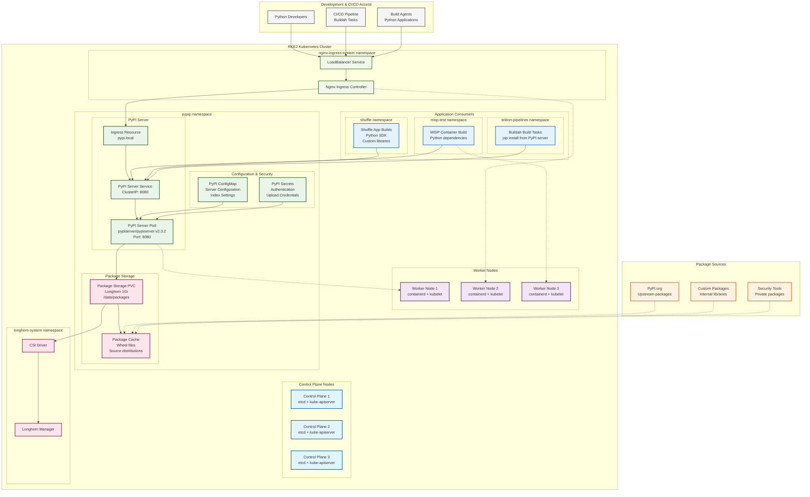
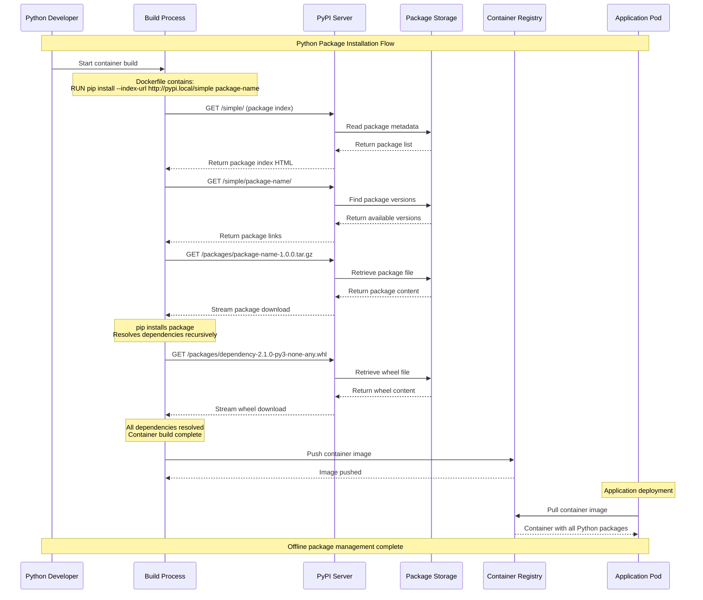

# Python Package Server - PyPI Mirror

## Overview

Private PyPI server deployment for air-gapped environments, providing secure Python package distribution and dependency management for security applications. Enables offline Python development and ensures consistent package versions across the security platform ecosystem.

## Architecture

### PyPI Server in RKE2 Cluster


### Package Installation Flow


## File Structure

### PyPI Server Configuration Structure
```
projekte/k8s-deployments/pypip/
└── piserver.yaml                    # Complete PyPI server deployment
    ├── PersistentVolumeClaim        # Package storage (1Gi)
    ├── Service                      # ClusterIP service (port 8080)
    └── Deployment                   # PyPI server pod specification
```

## Configuration

### Core PyPI Server Deployment
```yaml
# piserver.yaml
---
apiVersion: v1
kind: PersistentVolumeClaim
metadata:
  name: pypiserver-pvc
  labels:
    app.kubernetes.io/name: pypiserver
spec:
  accessModes:
    - ReadWriteOnce
  resources:
    requests:
      storage: 1Gi
  # Note: storageClassName not specified - uses cluster default

---
apiVersion: v1
kind: Service
metadata:
  name: pypiserver
  labels:
    app.kubernetes.io/name: pypiserver
spec:
  type: ClusterIP
  ports:
    - port: 8080
      targetPort: http
      protocol: TCP
      name: http
  selector:
    app.kubernetes.io/name: pypiserver

---
apiVersion: apps/v1
kind: Deployment
metadata:
  name: pypiserver
  labels:
    app.kubernetes.io/name: pypiserver
spec:
  replicas: 1
  selector:
    matchLabels:
      app.kubernetes.io/name: pypiserver
  template:
    metadata:
      labels:
        app.kubernetes.io/name: pypiserver
    spec:
      containers:
        - name: pypiserver
          image: pypiserver/pypiserver:v2.3.2
          imagePullPolicy: IfNotPresent
          args:
            - run
            - -a           # Allow anonymous access for downloads
            - .           # No authentication required
            - -P          # Allow uploads without authentication
            - .           # No password file
            - /data/packages  # Package directory
          env:
            - name: PYPISERVER_PORT
              value: "8080"
          ports:
            - name: http
              containerPort: 8080
              protocol: TCP
          readinessProbe:
            httpGet:
              path: /health
              port: http
          livenessProbe:
            httpGet:
              path: /health
              port: http
          volumeMounts:
            - name: packages
              mountPath: /data/packages
          resources:
            limits:
              cpu: 500m
              memory: 512Mi
            requests:
              cpu: 100m
              memory: 256Mi
      volumes:
        - name: packages
          persistentVolumeClaim:
            claimName: pypiserver-pvc
```

### Enhanced Production Configuration
```yaml
# pypiserver-production.yaml (enhanced version)
apiVersion: v1
kind: ConfigMap
metadata:
  name: pypiserver-config
  namespace: pypip
data:
  pypiserver.conf: |
    # PyPI server configuration
    [server:main]
    use = egg:pypiserver#main
    host = 0.0.0.0
    port = 8080
    
    # Package directory
    packages_directory = /data/packages
    
    # Authentication settings
    authenticate = upload
    passwords = /data/config/.htpasswd
    
    # Cache settings
    cache-control = max-age=3600
    
    # Logging
    log-level = INFO
    log-file = /var/log/pypiserver.log

---
apiVersion: v1
kind: Secret
metadata:
  name: pypiserver-auth
  namespace: pypip
type: Opaque
data:
  # htpasswd format: user:$2b$12$encrypted_password
  .htpasswd: |
    YWRtaW46JDJiJDEyJExNSlFyVTJtbmJWd3UuU0VxLnBZT2V3SU9hLy5rWGJCU1RTTmFrWm5uWjI2
    ZGV2ZWxvcGVyOiQyYiQxMiQuU0VxLnBZT2V3SU9hLy5rWGJCU1RTTmFrWm5uWjI2ZGV2ZWxvcGVy

---
apiVersion: v1
kind: Service  
metadata:
  name: pypiserver-metrics
  namespace: pypip
  labels:
    app.kubernetes.io/name: pypiserver
spec:
  ports:
    - port: 8081
      targetPort: metrics
      name: metrics
  selector:
    app.kubernetes.io/name: pypiserver

---
apiVersion: apps/v1
kind: Deployment
metadata:
  name: pypiserver
  namespace: pypip
  labels:
    app.kubernetes.io/name: pypiserver
spec:
  replicas: 2  # High availability
  strategy:
    type: RollingUpdate
    rollingUpdate:
      maxUnavailable: 1
  selector:
    matchLabels:
      app.kubernetes.io/name: pypiserver
  template:
    metadata:
      labels:
        app.kubernetes.io/name: pypiserver
      annotations:
        prometheus.io/scrape: "true"
        prometheus.io/port: "8081"
        prometheus.io/path: "/metrics"
    spec:
      securityContext:
        runAsUser: 1000
        runAsGroup: 1000
        fsGroup: 1000
      containers:
        - name: pypiserver
          image: pypiserver/pypiserver:v2.3.2
          imagePullPolicy: IfNotPresent
          args:
            - run
            - --interface=0.0.0.0
            - --port=8080
            - --authenticate=upload
            - --passwords=/data/config/.htpasswd
            - --disable-fallback
            - --cache-control=3600
            - --log-level=INFO
            - /data/packages
          ports:
            - name: http
              containerPort: 8080
              protocol: TCP
            - name: metrics
              containerPort: 8081
              protocol: TCP
          env:
            - name: PYPISERVER_PORT
              value: "8080"
            - name: PROMETHEUS_MULTIPROC_DIR
              value: /tmp/prometheus
          livenessProbe:
            httpGet:
              path: /health
              port: http
            initialDelaySeconds: 30
            periodSeconds: 10
          readinessProbe:
            httpGet:
              path: /health
              port: http
            initialDelaySeconds: 10
            periodSeconds: 5
          volumeMounts:
            - name: packages
              mountPath: /data/packages
            - name: auth-config
              mountPath: /data/config
              readOnly: true
            - name: tmp-prometheus
              mountPath: /tmp/prometheus
          resources:
            limits:
              cpu: 1000m
              memory: 1Gi
            requests:
              cpu: 200m
              memory: 512Mi
          securityContext:
            runAsNonRoot: true
            allowPrivilegeEscalation: false
            readOnlyRootFilesystem: true
            capabilities:
              drop: [ALL]
        
        # Metrics exporter sidecar
        - name: metrics-exporter
          image: prom/statsd-exporter:v0.22.3
          ports:
            - containerPort: 8081
              name: metrics
          args:
            - --web.listen-address=:8081
            - --statsd.listen-udp=:9125
          resources:
            limits:
              cpu: 100m
              memory: 128Mi
            requests:
              cpu: 50m
              memory: 64Mi
      
      volumes:
        - name: packages
          persistentVolumeClaim:
            claimName: pypiserver-pvc
        - name: auth-config
          secret:
            secretName: pypiserver-auth
        - name: tmp-prometheus
          emptyDir: {}

---
apiVersion: networking.k8s.io/v1
kind: Ingress
metadata:
  name: pypiserver-ingress
  namespace: pypip
  annotations:
    nginx.ingress.kubernetes.io/proxy-body-size: "100m"
    nginx.ingress.kubernetes.io/proxy-read-timeout: "300"
    nginx.ingress.kubernetes.io/proxy-send-timeout: "300"
spec:
  ingressClassName: nginx
  rules:
    - host: pypi.local
      http:
        paths:
          - path: /
            pathType: Prefix
            backend:
              service:
                name: pypiserver
                port:
                  number: 8080
  tls:
    - hosts:
        - pypi.local
      secretName: pypiserver-tls
```

### Longhorn Storage Class Optimization
```yaml
# pypiserver-storageclass.yaml
apiVersion: v1
kind: PersistentVolumeClaim
metadata:
  name: pypiserver-pvc
  namespace: pypip
  labels:
    app.kubernetes.io/name: pypiserver
spec:
  accessModes:
    - ReadWriteOnce
  storageClassName: longhorn
  resources:
    requests:
      storage: 10Gi  # Increased for production
  selector:
    matchLabels:
      app: pypiserver
      
---
apiVersion: storage.k8s.io/v1
kind: StorageClass
metadata:
  name: pypiserver-storage
provisioner: driver.longhorn.io
allowVolumeExpansion: true
reclaimPolicy: Retain
parameters:
  numberOfReplicas: "3"
  staleReplicaTimeout: "2880"
  fromBackup: ""
  fsType: "ext4"
  dataLocality: "disabled"
```

## Deployment Commands

### Basic Deployment
```bash
# Create pypip namespace
kubectl create namespace pypip

# Deploy PyPI server
cd projekte/k8s-deployments/pypip/
kubectl apply -f piserver.yaml -n pypip

# Verify deployment
kubectl get pods,svc,pvc -n pypip
kubectl logs -f deployment/pypiserver -n pypip

# Check service accessibility
kubectl port-forward -n pypip service/pypiserver 8080:8080
# Visit http://localhost:8080
```

### Production Deployment
```bash
# Apply enhanced configuration
kubectl apply -f pypiserver-production.yaml
kubectl apply -f pypiserver-storageclass.yaml

# Create ingress TLS certificate
kubectl create secret tls pypiserver-tls \
  --cert=pypi-cert.pem \
  --key=pypi-key.pem \
  -n pypip

# Verify ingress
kubectl get ingress -n pypip
curl -I https://pypi.local/
```

### Package Management
```bash
# Upload packages to PyPI server
pip install twine

# Configure .pypirc for uploads
cat > ~/.pypirc << EOF
[distutils]
index-servers = local

[local]
repository: http://pypi.local/
username: admin
password: your-password
EOF

# Upload package
python setup.py sdist bdist_wheel
twine upload --repository local dist/*
```

## Package Management

### Offline Package Preparation
```bash
#!/bin/bash
# prepare-offline-packages.sh

# Package list for security platform
PACKAGES=(
    "requests==2.31.0"
    "flask==2.3.3"
    "sqlalchemy==2.0.21"
    "celery==5.3.2"
    "redis==4.6.0"
    "cryptography==41.0.4"
    "pyjwt==2.8.0"
    "pyyaml==6.0.1"
    "jinja2==3.1.2"
    "click==8.1.7"
    "gunicorn==21.2.0"
    "psycopg2-binary==2.9.7"
    "pymysql==1.1.0"
    "ldap3==2.9.1"
    "python-dateutil==2.8.2"
    "pytz==2023.3"
    "numpy==1.24.4"
    "pandas==2.0.3"
    "lxml==4.9.3"
    "beautifulsoup4==4.12.2"
    "urllib3==2.0.4"
    "certifi==2023.7.22"
    "charset-normalizer==3.2.0"
    "idna==3.4"
)

# MISP-specific packages
MISP_PACKAGES=(
    "pymisp==2.4.183"
    "python-magic==0.4.27"
    "python-stix2==3.0.1"
    "pydeep==0.4"
    "yara-python==4.3.1"
    "maec==4.1.0.17"
    "mixbox==1.0.5"
    "stix==1.2.0.11"
    "taxii2-client==2.3.0"
)

# Shuffle-specific packages  
SHUFFLE_PACKAGES=(
    "docker==6.1.3"
    "kubernetes==27.2.0"
    "prometheus-client==0.17.1"
    "pika==1.3.2"
    "minio==7.1.16"
    "paramiko==3.3.1"
    "ansible-core==2.15.4"
)

OFFLINE_DIR="/tmp/offline-packages"
mkdir -p $OFFLINE_DIR

# Download all packages with dependencies
echo "Downloading core packages..."
pip download -d $OFFLINE_DIR --no-deps ${PACKAGES[@]}

echo "Downloading MISP packages..."
pip download -d $OFFLINE_DIR --no-deps ${MISP_PACKAGES[@]}

echo "Downloading Shuffle packages..."
pip download -d $OFFLINE_DIR --no-deps ${SHUFFLE_PACKAGES[@]}

# Download dependencies
echo "Downloading dependencies..."
for package in "${PACKAGES[@]}" "${MISP_PACKAGES[@]}" "${SHUFFLE_PACKAGES[@]}"; do
    pip download -d $OFFLINE_DIR $package
done

echo "Creating offline package archive..."
tar -czf security-platform-packages.tar.gz -C $OFFLINE_DIR .

echo "Package preparation complete: $(ls -lh security-platform-packages.tar.gz)"
```

### Package Upload Script
```bash
#!/bin/bash
# upload-packages.sh

PYPI_URL="http://pypi.local/"
PACKAGE_DIR="/tmp/offline-packages"
USERNAME="admin"
PASSWORD="your-password"

# Extract packages if archive exists
if [ -f "security-platform-packages.tar.gz" ]; then
    echo "Extracting package archive..."
    mkdir -p $PACKAGE_DIR
    tar -xzf security-platform-packages.tar.gz -C $PACKAGE_DIR
fi

# Upload all packages
echo "Uploading packages to PyPI server..."
cd $PACKAGE_DIR

for package_file in *.whl *.tar.gz; do
    if [ -f "$package_file" ]; then
        echo "Uploading $package_file..."
        curl -X POST \
            -F "content=@$package_file" \
            -F ":action=file_upload" \
            -F "protocol_version=1" \
            -u "$USERNAME:$PASSWORD" \
            "$PYPI_URL"
        
        if [ $? -eq 0 ]; then
            echo "✓ Successfully uploaded $package_file"
        else
            echo "✗ Failed to upload $package_file"
        fi
    fi
done

echo "Package upload complete!"
```

## Usage Examples

### Dockerfile Integration
```dockerfile
# MISP container with PyPI server
FROM python:3.11-slim

# Configure pip to use local PyPI server
RUN pip config set global.index-url http://pypi.local/simple/
RUN pip config set global.trusted-host pypi.local

# Install MISP dependencies
COPY requirements.txt .
RUN pip install --no-cache-dir -r requirements.txt

# Install additional packages from local PyPI
RUN pip install pymisp python-magic pydeep

COPY . /app
WORKDIR /app

CMD ["python", "app.py"]
```

### CI/CD Integration (Tekton)
```yaml
# buildah-task-with-pypi.yaml
apiVersion: tekton.dev/v1
kind: Task
metadata:
  name: buildah-with-pypi
spec:
  params:
    - name: IMAGE
      description: Reference of the image buildah will produce
    - name: PYPI_URL
      description: PyPI server URL
      default: "http://pypiserver.pypip.svc.cluster.local:8080/simple/"
  
  steps:
    - name: build-with-pypi
      image: quay.io/containers/buildah:v1.40.1
      script: |
        # Configure pip for build context
        mkdir -p /workspace/source/.pip
        cat > /workspace/source/.pip/pip.conf << EOF
        [global]
        index-url = $(params.PYPI_URL)
        trusted-host = pypiserver.pypip.svc.cluster.local
        timeout = 60
        retries = 3
        EOF
        
        # Build container with local PyPI
        buildah bud \
          --build-arg PIP_CONFIG_FILE=/workspace/source/.pip/pip.conf \
          --build-arg PIP_INDEX_URL=$(params.PYPI_URL) \
          --build-arg PIP_TRUSTED_HOST=pypiserver.pypip.svc.cluster.local \
          -f $(params.DOCKERFILE) \
          -t $(params.IMAGE) \
          $(params.CONTEXT)
```

### Python Project Configuration
```ini
# pip.conf for development
[global]
index-url = http://pypi.local/simple/
trusted-host = pypi.local
timeout = 60
retries = 3

[install]
find-links = http://pypi.local/packages/
prefer-binary = true
```

### Requirements.txt with Version Pinning
```txt
# Core dependencies
requests==2.31.0
flask==2.3.3
sqlalchemy==2.0.21
celery==5.3.2
redis==4.6.0

# Security libraries
cryptography==41.0.4
pyjwt==2.8.0
ldap3==2.9.1

# MISP-specific
pymisp==2.4.183
python-magic==0.4.27
python-stix2==3.0.1

# Shuffle-specific  
docker==6.1.3
kubernetes==27.2.0
prometheus-client==0.17.1

# Development tools
pytest==7.4.2
black==23.7.0
flake8==6.0.0
mypy==1.5.1

# Documentation
sphinx==7.1.2
sphinx-rtd-theme==1.3.0

# Constraints
--constraint https://pypi.local/constraints/security-platform-constraints.txt
```

## Monitoring and Maintenance

### Health Checks
```bash
#!/bin/bash
# check-pypi-health.sh

PYPI_URL="http://pypi.local"
HEALTH_ENDPOINT="$PYPI_URL/health"

echo "Checking PyPI server health..."

# Basic connectivity
if curl -f -s $HEALTH_ENDPOINT > /dev/null; then
    echo "✓ PyPI server is responding"
else
    echo "✗ PyPI server is not responding"
    exit 1
fi

# Check package index
if curl -f -s "$PYPI_URL/simple/" | grep -q "Links for"; then
    echo "✓ Package index is accessible"
else
    echo "✗ Package index is not accessible"
fi

# Check specific package
if curl -f -s "$PYPI_URL/simple/requests/" | grep -q "requests"; then
    echo "✓ Sample package (requests) is available"
else
    echo "✗ Sample package not found"
fi

# Check storage usage
kubectl exec -n pypip deployment/pypiserver -- df -h /data/packages | tail -1
```

### Package Synchronization
```bash
#!/bin/bash
# sync-packages.sh

PYPI_URL="http://pypi.local"
PACKAGE_DIR="/data/packages"

echo "Synchronizing packages with upstream PyPI..."

# List of critical packages to keep updated
CRITICAL_PACKAGES=(
    "requests"
    "flask"
    "sqlalchemy"
    "cryptography"
    "pymisp"
)

for package in "${CRITICAL_PACKAGES[@]}"; do
    echo "Checking updates for $package..."
    
    # Get latest version from upstream
    LATEST=$(curl -s "https://pypi.org/pypi/$package/json" | \
             python3 -c "import sys, json; print(json.load(sys.stdin)['info']['version'])")
    
    # Check if we have this version locally
    if curl -s "$PYPI_URL/simple/$package/" | grep -q "$package-$LATEST"; then
        echo "✓ $package-$LATEST already available"
    else
        echo "⬇ Downloading $package-$LATEST..."
        pip download --no-deps "$package==$LATEST" -d /tmp/new-packages/
    fi
done

# Upload new packages if any were downloaded
if [ -n "$(ls -A /tmp/new-packages/ 2>/dev/null)" ]; then
    echo "Uploading new packages..."
    ./upload-packages.sh
    rm -rf /tmp/new-packages/
fi
```

### Backup and Recovery
```bash
#!/bin/bash
# backup-pypi-packages.sh

NAMESPACE="pypip"
BACKUP_DIR="/backup/pypi/$(date +%Y%m%d)"
POD_NAME=$(kubectl get pod -n $NAMESPACE -l app.kubernetes.io/name=pypiserver -o jsonpath='{.items[0].metadata.name}')

mkdir -p $BACKUP_DIR

echo "Backing up PyPI packages..."

# Create package archive
kubectl exec -n $NAMESPACE $POD_NAME -- \
    tar -czf /tmp/packages-backup.tar.gz -C /data packages/

# Copy backup from pod
kubectl cp $NAMESPACE/$POD_NAME:/tmp/packages-backup.tar.gz \
    $BACKUP_DIR/packages-backup.tar.gz

# Backup PVC metadata
kubectl get pvc pypiserver-pvc -n $NAMESPACE -o yaml > \
    $BACKUP_DIR/pvc-metadata.yaml

echo "Backup completed: $(ls -lh $BACKUP_DIR/)"
```

## Security Configuration

### Authentication Setup
```bash
# Create htpasswd file for authentication
htpasswd -c .htpasswd admin
htpasswd .htpasswd developer
htpasswd .htpasswd builder

# Create Kubernetes secret
kubectl create secret generic pypiserver-auth \
  --from-file=.htpasswd \
  --namespace pypip
```

### Network Security
```yaml
# Network policy for PyPI server
apiVersion: networking.k8s.io/v1
kind: NetworkPolicy
metadata:
  name: pypiserver-netpol
  namespace: pypip
spec:
  podSelector:
    matchLabels:
      app.kubernetes.io/name: pypiserver
  policyTypes:
    - Ingress
    - Egress
  ingress:
    # Allow access from ingress controller
    - from:
        - namespaceSelector:
            matchLabels:
              name: nginx-ingress-system
      ports:
        - protocol: TCP
          port: 8080
    # Allow access from build namespaces
    - from:
        - namespaceSelector:
            matchLabels:
              name: tekton-pipelines
        - namespaceSelector:
            matchLabels:
              name: misp-test
        - namespaceSelector:
            matchLabels:
              name: shuffle
      ports:
        - protocol: TCP
          port: 8080
  egress:
    # DNS resolution
    - to: []
      ports:
        - protocol: TCP
          port: 53
        - protocol: UDP
          port: 53
```

### RBAC Configuration
```yaml
# ServiceAccount for PyPI server
apiVersion: v1
kind: ServiceAccount
metadata:
  name: pypiserver-sa
  namespace: pypip
---
apiVersion: rbac.authorization.k8s.io/v1
kind: Role
metadata:
  name: pypiserver-role
  namespace: pypip
rules:
  - apiGroups: [""]
    resources: ["pods", "services", "configmaps", "secrets"]
    verbs: ["get", "list", "watch"]
  - apiGroups: [""]
    resources: ["persistentvolumeclaims"]
    verbs: ["get", "list", "watch", "update"]
---
apiVersion: rbac.authorization.k8s.io/v1
kind: RoleBinding
metadata:
  name: pypiserver-binding
  namespace: pypip
subjects:
  - kind: ServiceAccount
    name: pypiserver-sa
    namespace: pypip
roleRef:
  kind: Role
  name: pypiserver-role
  apiGroup: rbac.authorization.k8s.io
```

## Troubleshooting

### Common Issues

#### Package Upload Failures
```bash
# Check PyPI server logs
kubectl logs -f deployment/pypiserver -n pypip

# Test upload endpoint
curl -X POST \
  -F "content=@test-package.whl" \
  -F ":action=file_upload" \
  -F "protocol_version=1" \
  -u "admin:password" \
  http://pypi.local/

# Check disk space
kubectl exec -n pypip deployment/pypiserver -- df -h /data/packages
```

#### Package Installation Issues
```bash
# Debug pip configuration
pip config list
pip config debug

# Test index accessibility
curl -v http://pypi.local/simple/

# Check specific package
curl -v http://pypi.local/simple/requests/

# Test download
pip download --index-url http://pypi.local/simple/ --no-deps requests
```

#### Storage and Performance Issues
```bash
# Check PVC status
kubectl get pvc pypiserver-pvc -n pypip
kubectl describe pvc pypiserver-pvc -n pypip

# Monitor storage usage
kubectl exec -n pypip deployment/pypiserver -- \
  du -sh /data/packages/*

# Check Longhorn volume health
kubectl get volumes -n longhorn-system | grep pypiserver
```

### Performance Optimization

#### Caching Configuration
```yaml
# Enhanced caching settings
apiVersion: v1
kind: ConfigMap
metadata:
  name: pypiserver-nginx-cache
  namespace: pypip
data:
  nginx.conf: |
    events {
        worker_connections 1024;
    }
    
    http {
        proxy_cache_path /tmp/cache levels=1:2 keys_zone=packages:10m max_size=1g inactive=60m;
        
        upstream pypiserver {
            server pypiserver:8080;
        }
        
        server {
            listen 80;
            server_name pypi.local;
            
            location /packages/ {
                proxy_pass http://pypiserver;
                proxy_cache packages;
                proxy_cache_valid 200 302 1h;
                proxy_cache_valid 404 1m;
                add_header X-Cache-Status $upstream_cache_status;
            }
            
            location / {
                proxy_pass http://pypiserver;
                proxy_cache_bypass $http_pragma;
                proxy_cache_revalidate on;
            }
        }
    }
```

#### Resource Optimization
```yaml
# Optimized resource allocation
resources:
  limits:
    cpu: 2000m
    memory: 2Gi
  requests:
    cpu: 500m
    memory: 1Gi

# JVM tuning for better performance
env:
  - name: JAVA_OPTS
    value: "-Xmx1g -Xms512m -XX:+UseG1GC"
```

## Related Documentation
- [[Buildah-CICD]]
- [[Kubernetes-Deployments]]
- [[Longhorn-Storage]]
- [[Security-Hardening]]