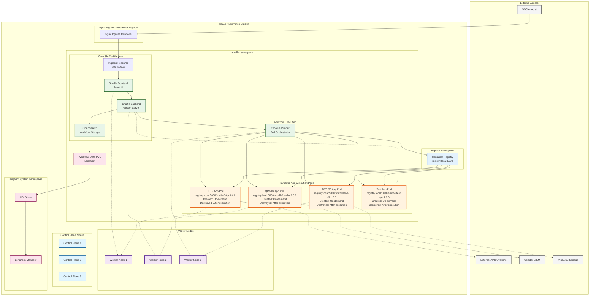
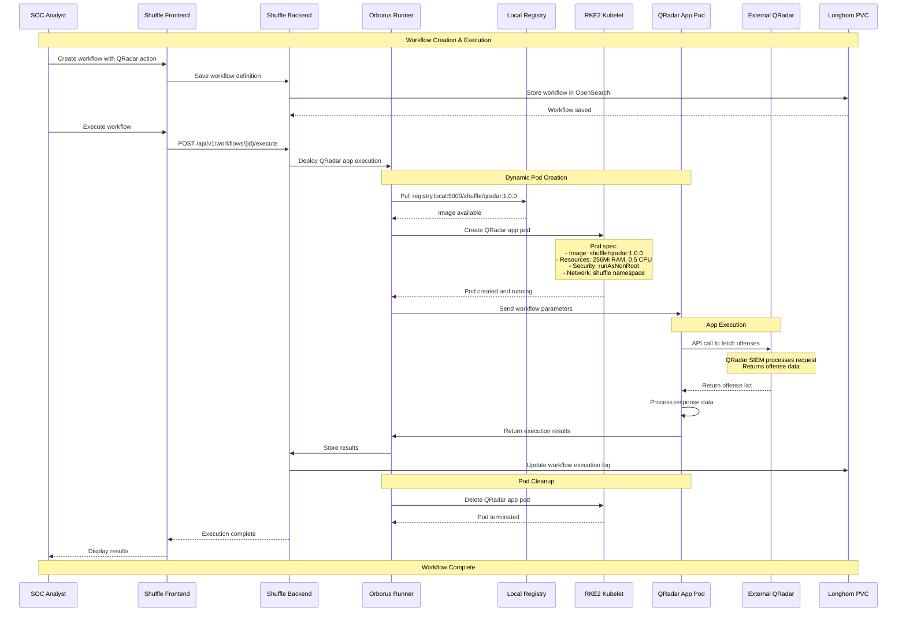

# Shuffle Apps - Security Orchestration Collection

## Overview

Collection of Shuffle apps for Security Orchestration, Automation, and Response (SOAR) workflows. These apps provide integration with various security tools and cloud services in air-gapped Kubernetes environments.

## Architecture

### Shuffle Platform Integration in RKE2 Cluster


### Container Architecture
```
shuffle-app/
├── Dockerfile              # Container definition
├── api.yaml               # App specification
├── requirements.txt       # Python dependencies
└── src/
    ├── app.py            # Main application logic
    └── shuffle_sdk/      # SDK components
```

## Application Portfolio

### HTTP Client App (v1.4.0)
**Purpose**: REST API interactions and web request handling

#### Features
- Complete HTTP method support (GET, POST, PUT, PATCH, DELETE, HEAD, OPTIONS)
- Custom header management
- Authentication handling (Basic Auth)
- SSL/TLS certificate verification control
- HTTP/HTTPS proxy support
- Request timeout configuration
- Response processing and file conversion

#### Configuration
```yaml
# api.yaml excerpt
actions:
  - name: "get_request"
    description: "Execute HTTP GET request"
    parameters:
      - name: "url"
        required: true
        type: "string"
      - name: "headers"
        required: false
        type: "string"
      - name: "verify"
        required: false
        type: "bool"
```

#### Use Cases
- API integration testing
- Webhook payload delivery
- External service health checks
- Data retrieval from web services

### QRadar SIEM Integration App (v1.0.0)
**Purpose**: IBM QRadar SIEM automation and incident response

#### Core Capabilities

##### Offense Management
```python
# Key actions
get_list_offenses()          # List all offenses
get_offense(offense_id)      # Get specific offense
post_update_offense()        # Update offense status
post_close_offense()         # Close with resolution
post_add_offense_note()      # Add investigation notes
```

##### Ariel Search Engine
```python
# Search capabilities
create_ariel_search()        # Create custom queries
get_ariel_search_results()   # Retrieve results
post_new_search()           # Alternative search method
```

##### Rule Management
```python
# Rule operations
get_rules()                 # List all rules
get_rule(rule_id)          # Get rule details
post_update_a_rule()       # Modify rules
delete_the_rule()          # Remove rules
```

#### Authentication
```python
# QRadar connection parameters
qradar_host = "https://qradar.example.com"
authorization_token = "SEC_TOKEN_HERE"
verify_ssl = False  # For internal deployments
```

### AWS S3 Storage App (v1.0.0)
**Purpose**: Cloud and on-premises object storage operations

#### MinIO Compatibility
```python
# MinIO configuration for Kubernetes
endpoint_url = "http://minio.minio-namespace.svc.cluster.local:9000"
region = "us-east-1"  # Standard for MinIO
```

#### Operations
- **Bucket Operations**: List, create, manage buckets
- **Object Operations**: Upload, download, delete files
- **Security**: Block IP access, manage policies
- **Monitoring**: Logging configuration, replication status
- **Cost Management**: Request payment configuration

#### Air-Gap Considerations
```python
# Local MinIO deployment
s3_client = boto3.client(
    's3',
    endpoint_url='http://minio.minio:9000',
    aws_access_key_id=access_key,
    aws_secret_access_key=secret_key,
    region_name='us-east-1',
    verify=False  # Internal CA
)
```

### Test App (v1.0.0)
**Purpose**: Shuffle SDK testing and development validation

#### SDK Features Testing
- Hello world functionality
- Execution isolation verification
- Datastore operations
- Parameter passing validation
- Error handling patterns

## File Structure Analysis

### Standard App Structure
```
projekte/shuffle-apps/app-name/
├── Dockerfile              # Multi-stage build for security
├── api.yaml               # Shuffle app definition
├── requirements.txt       # Python dependencies
└── src/
    ├── app.py            # Main Flask application
    └── shuffle_sdk/      # Local SDK if needed
        └── __init__.py
```

### HTTP App Versions
```
projekte/shuffle-apps/http-versions/
├── 1.0.0/                # Legacy: Basic HTTP functionality
├── 1.1.0/                # Legacy: Enhanced HTTP features
├── 1.2.0/                # Legacy: Improved header handling
├── 1.3.0/                # Legacy: Additional HTTP methods
└── current -> ../http/    # v1.4.0: Complete REST API support
```

### Complete App Collection
```
projekte/shuffle-apps/
├── README.md
├── aws_s3/                    # AWS S3 & MinIO integration
│   ├── Dockerfile
│   ├── requirements.txt
│   ├── api.yaml
│   └── src/
│       └── app.py
├── http/                      # HTTP client (current v1.4.0)
│   ├── Dockerfile
│   ├── requirements.txt
│   ├── api.yaml
│   └── src/
│       └── app.py
├── qradar_app/               # IBM QRadar SIEM integration
│   └── 1.0.0/
│       ├── Dockerfile
│       ├── requirements.txt
│       ├── api.yml
│       └── src/
│           └── app.py
├── test-app/                 # SDK testing and development
│   ├── Dockerfile
│   ├── requirements.txt
│   ├── api.yaml
│   └── src/
│       ├── app.py
│       └── shuffle_sdk/
│           └── __init__.py
└── http-versions/            # Legacy HTTP app versions
    ├── 1.0.0/
    ├── 1.1.0/
    ├── 1.2.0/
    └── 1.3.0/
```

## Container Configuration

### Dockerfile Pattern
```dockerfile
# Multi-stage build for security
FROM python:3.11-slim as builder
COPY requirements.txt .
RUN pip wheel --no-cache-dir --no-deps --wheel-dir /wheels -r requirements.txt

FROM python:3.11-slim
COPY --from=builder /wheels /wheels
RUN pip install --no-cache /wheels/*

WORKDIR /app
COPY src/ .
EXPOSE 5001
CMD ["python", "app.py"]
```

### Security Considerations
```yaml
# Kubernetes pod security context
securityContext:
  runAsUser: 1000
  runAsGroup: 1000
  runAsNonRoot: true
  readOnlyRootFilesystem: true
  allowPrivilegeEscalation: false
  capabilities:
    drop: [ALL]
```

## Deployment Patterns

### Docker Build & Push
```bash
# Navigate to shuffle apps directory
cd projekte/shuffle-apps/

# Build HTTP app (current version)
cd http/
docker build -t registry.local:5000/shuffle/http:1.4.0 .
docker push registry.local:5000/shuffle/http:1.4.0

# Build QRadar app
cd ../qradar_app/1.0.0/
docker build -t registry.local:5000/shuffle/qradar:1.0.0 .
docker push registry.local:5000/shuffle/qradar:1.0.0

# Build AWS S3 app
cd ../../aws_s3/
docker build -t registry.local:5000/shuffle/aws-s3:1.0.0 .
docker push registry.local:5000/shuffle/aws-s3:1.0.0

# Build test app
cd ../test-app/
docker build -t registry.local:5000/shuffle/test-app:1.0.0 .
docker push registry.local:5000/shuffle/test-app:1.0.0
```

### Shuffle Upload
```bash
# Navigate to specific app directory
cd projekte/shuffle-apps/http/

# Create app package
zip -r http-app.zip . -x "*.git*" "*.DS_Store*"

# Upload via UI or API
curl -X POST "https://shuffle.example.com/api/v1/apps/upload" \
  -H "Authorization: Bearer $SHUFFLE_TOKEN" \
  -F "file=@http-app.zip"

# Bulk upload script
cd projekte/shuffle-apps/
for app_dir in http qradar_app/1.0.0 aws_s3 test-app; do
    echo "Packaging $app_dir..."
    cd $app_dir
    app_name=$(basename $app_dir)
    zip -r ${app_name}-app.zip . -x "*.git*" "*.DS_Store*"
    # Upload to Shuffle
    curl -X POST "https://shuffle.example.com/api/v1/apps/upload" \
      -H "Authorization: Bearer $SHUFFLE_TOKEN" \
      -F "file=@${app_name}-app.zip"
    cd ..
done
```

### Air-Gap Deployment
```bash
# Navigate to apps directory
cd projekte/shuffle-apps/

# Save images for offline transport
docker save registry.local:5000/shuffle/http:1.4.0 > http-app.tar
docker save registry.local:5000/shuffle/qradar:1.0.0 > qradar-app.tar
docker save registry.local:5000/shuffle/aws-s3:1.0.0 > aws-s3-app.tar
docker save registry.local:5000/shuffle/test-app:1.0.0 > test-app.tar

# Create offline bundle
tar -czf shuffle-apps-offline.tar.gz *.tar

# Load on air-gapped system
tar -xzf shuffle-apps-offline.tar.gz
docker load < http-app.tar
docker load < qradar-app.tar
docker load < aws-s3-app.tar
docker load < test-app.tar
```

## Integration Points

### Workflow Integration
```yaml
# Example workflow step
- app_name: "http"
  app_version: "1.4.0"
  action: "get_request"
  parameters:
    url: "$webhook.url"
    headers: '{"Authorization": "Bearer $auth_token"}'
    verify: false
```

### Shuffle Workflow Execution Sequence in RKE2


### App Container Lifecycle in RKE2

```mermaid
graph TB
    subgraph "Workflow Trigger"
        WF_START[Workflow Start]
        APP_ACTION[App Action Required]
    end
    
    subgraph "Orborus Runner Decision"
        CHECK_IMAGE[Check Required Image]
        IMAGE_AVAILABLE{Image Available<br/>Locally?}
        PULL_IMAGE[Pull from Registry<br/>registry.local:5000]
    end
    
    subgraph "Pod Creation (RKE2 Kubelet)"
        CREATE_POD[Create Pod Spec]
        ASSIGN_NODE[Assign to Worker Node]
        MOUNT_VOLUMES[Mount Temp Volumes]
        START_CONTAINER[Start App Container]
    end
    
    subgraph "App Execution"
        INIT_APP[Initialize App SDK]
        RECEIVE_PARAMS[Receive Action Parameters]
        EXECUTE_LOGIC[Execute Business Logic]
        EXTERNAL_CALL[Call External Systems]
        PROCESS_RESPONSE[Process Response]
        RETURN_RESULT[Return to Orborus]
    end
    
    subgraph "Pod Cleanup"
        CONTAINER_EXIT[Container Exits]
        ORBORUS_CLEANUP[Orborus Cleanup]
        DELETE_POD[Delete Pod]
        CLEANUP_VOLUMES[Cleanup Volumes]
    end
    
    WF_START --> APP_ACTION
    APP_ACTION --> CHECK_IMAGE
    CHECK_IMAGE --> IMAGE_AVAILABLE
    
    IMAGE_AVAILABLE -->|No| PULL_IMAGE
    IMAGE_AVAILABLE -->|Yes| CREATE_POD
    PULL_IMAGE --> CREATE_POD
    
    CREATE_POD --> ASSIGN_NODE
    ASSIGN_NODE --> MOUNT_VOLUMES
    MOUNT_VOLUMES --> START_CONTAINER
    
    START_CONTAINER --> INIT_APP
    INIT_APP --> RECEIVE_PARAMS
    RECEIVE_PARAMS --> EXECUTE_LOGIC
    EXECUTE_LOGIC --> EXTERNAL_CALL
    EXTERNAL_CALL --> PROCESS_RESPONSE
    PROCESS_RESPONSE --> RETURN_RESULT
    
    RETURN_RESULT --> CONTAINER_EXIT
    CONTAINER_EXIT --> ORBORUS_CLEANUP
    ORBORUS_CLEANUP --> DELETE_POD
    DELETE_POD --> CLEANUP_VOLUMES
    
    classDef trigger fill:#e8f5e8,stroke:#1b5e20,stroke-width:2px
    classDef orchestration fill:#fff3e0,stroke:#e65100,stroke-width:2px
    classDef execution fill:#e3f2fd,stroke:#1565c0,stroke-width:2px
    classDef cleanup fill:#fce4ec,stroke:#880e4f,stroke-width:2px
    
    class WF_START,APP_ACTION trigger
    class CHECK_IMAGE,IMAGE_AVAILABLE,PULL_IMAGE,CREATE_POD,ASSIGN_NODE orchestration
    class MOUNT_VOLUMES,START_CONTAINER,INIT_APP,RECEIVE_PARAMS,EXECUTE_LOGIC,EXTERNAL_CALL,PROCESS_RESPONSE,RETURN_RESULT execution
    class CONTAINER_EXIT,ORBORUS_CLEANUP,DELETE_POD,CLEANUP_VOLUMES cleanup
```


## Monitoring & Debugging

### Health Checks
```python
# Flask health endpoint
@app.route('/health', methods=['GET'])
def health_check():
    return jsonify({"status": "healthy"}), 200
```

### Logging
```python
import logging

logging.basicConfig(
    level=logging.INFO,
    format='%(asctime)s - %(name)s - %(levelname)s - %(message)s'
)
```

### Debug Commands
```bash
# Check app pods
kubectl get pods -l app=shuffle-app -n shuffle

# View app logs
kubectl logs -f deployment/shuffle-app -n shuffle

# Execute into app container
kubectl exec -it pod/shuffle-app-xxx -n shuffle -- /bin/bash
```

## Development Guidelines

### App Development Checklist
- [ ] Follow Shuffle SDK patterns
- [ ] Implement proper error handling
- [ ] Add input validation
- [ ] Include health endpoints
- [ ] Use multi-stage Dockerfiles
- [ ] Document all parameters
- [ ] Test in isolated environment

### Version Management
```bash
# Create new version
cp -r http/ http-versions/1.5.0/
# Update api.yaml version
sed -i 's/app_version: .*/app_version: "1.5.0"/' http/api.yaml
```

### Testing Framework
```python
# Unit test pattern
def test_http_get():
    response = http_app.get_request(
        url="https://httpbin.org/get",
        verify=False
    )
    assert response.status_code == 200
```

## Security Hardening

### Input Validation
```python
def validate_input(data, schema):
    """Validate input against schema"""
    try:
        jsonschema.validate(data, schema)
        return True
    except ValidationError:
        return False
```

### Secret Management
```yaml
# Kubernetes secret reference
env:
  - name: QRADAR_TOKEN
    valueFrom:
      secretKeyRef:
        name: qradar-secrets
        key: auth-token
```

### Network Policies
```yaml
apiVersion: networking.k8s.io/v1
kind: NetworkPolicy
metadata:
  name: shuffle-apps-policy
spec:
  podSelector:
    matchLabels:
      app: shuffle-app
  policyTypes:
  - Ingress
  - Egress
  ingress:
  - from:
    - namespaceSelector:
        matchLabels:
          name: shuffle
  egress:
  - to: []  # Define specific egress rules
```

## Troubleshooting

### Common Issues
1. **Import errors**: Check Python dependencies
2. **Connection timeouts**: Verify network policies
3. **Authentication failures**: Validate secrets and tokens
4. **Resource limits**: Check pod resource allocation

### Debug Procedures
```bash
# Test app functionality
curl -X POST http://app-service:5001/api/v1/test \
  -H "Content-Type: application/json" \
  -d '{"test": "data"}'

# Check resource usage
kubectl top pods -n shuffle

# Verify network connectivity
kubectl exec -it pod/shuffle-app-xxx -- nslookup external-service
```

## Related Documentation
- [[Kubernetes-Deployments]]
- [[Security-Hardening]]
- [[Air-Gap-Deployment-Guide]]